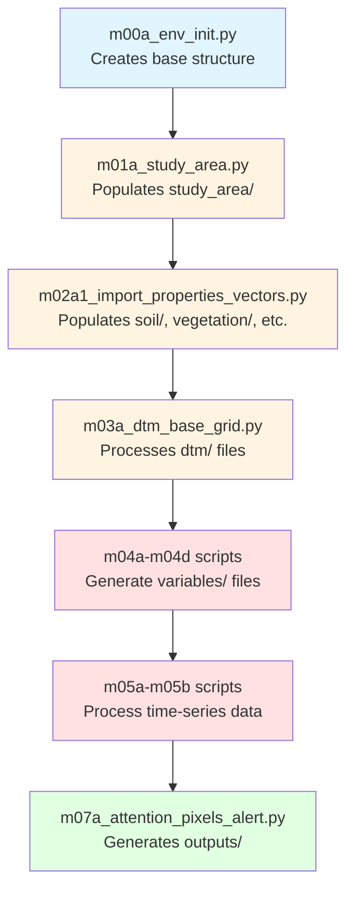

# Analysis Folder Structure

An analysis in P-SLIP is structured as a self-contained directory tree, created via `m00a_env_init.py` using `AnalysisEnvironment.create_folder_structure()` and `default_params.py`'s `ANALYSIS_FOLDER_STRUCTURE`. It stores inputs, outputs, variables, and logs for a case (e.g., "/path/to/MyStudyArea"). 

## Complete Directory Tree Structure

Based on `default_params.py`'s `ANALYSIS_FOLDER_STRUCTURE`, here's the exact folder hierarchy you'll see in your analysis directory:

```
MyStudyArea/
├── analysis_environment.json          # JSON serialization of AnalysisEnvironment object
├── inputs/                            # Raw input data storage
│   ├── study_area/                    # Required: Study area boundary files
│   ├── dtm/                           # Required: Digital Terrain Model files
│   ├── landslides/                    # Optional: Landslide inventory data
│   ├── soil/                          # Optional: Soil properties data
│   ├── vegetation/                    # Optional: Vegetation data
│   ├── infrastructures/               # Optional: Infrastructure data
│   ├── land_use/                      # Optional: Land use classification data
│   ├── rain/                          # Dynamic: Rainfall data
│   │   ├── recordings/                # Historical rainfall recordings
│   │   └── forecast/                  # Rainfall forecast data
│   ├── temperature/                   # Dynamic: Temperature data
│   │   ├── recordings/                # Historical temperature recordings
│   │   └── forecast/                  # Temperature forecast data
│   ├── miscellaneous/                 # Generic: Other input files
│   └── input_files.csv                # Manifest tracking all input files
├── variables/                         # Processed intermediate data (PKL files)
│   ├── study_area_vars.pkl           # From m01a: Study area processing
│   ├── morphology_vars.pkl           # From m04b: Slope, curvature grids
│   ├── paths.pkl                     # From m04d: Flow paths and routing
│   └── ...                           # Other script-specific variables
├── modeling/                          # Modeling and simulation outputs
│   ├── safety_factors/               # Safety factor calculations
│   ├── machine_learning/             # ML model outputs
│   └── evolution/                    # Temporal evolution analysis
├── user_control/                      # User-editable configuration files
│   ├── parameter_classes.csv         # Physical parameter classes
│   ├── standard_classes.csv          # Standardized classification schema
│   └── reference_points.csv          # Reference monitoring points
├── outputs/                           # Final processed outputs
│   ├── figures/                      # Visualizations and plots
│   │   └── susceptibility_maps/      # Susceptibility map visualizations
│   └── tables/                       # Tabular data exports
└── logs/                             # Session and error logs
    └── user_MyStudyArea_session_YYYY-MM-DD_HH-MM-SS.log
```

## Detailed Folder Purposes and Content

### Root Level Files

#### `analysis_environment.json`
- **Purpose**: Complete serialization of the `AnalysisEnvironment` object
- **Content**: All folder paths, configuration settings, input tracking, variable metadata
- **Usage**: Loaded by `get_analysis_environment()` to restore analysis state
- **Format**: JSON with nested structure matching `AnalysisEnvironment` attributes

### Inputs Directory (`inputs/`)

#### Purpose
Centralizes all raw geospatial and temporal data for processing. Organized by input type for easy management and script access.

#### Structure by Input Type

**Required Static Inputs** (Must be provided):
- `study_area/`: Study area boundary definition (shapefile, GeoPackage, GeoJSON)
- `dtm/`: Digital Terrain Model raster files (GeoTIFF)

**Optional Static Inputs** (Enhance analysis if available):
- `landslides/`: Landslide inventory data (points, polygons, attributes)
- `soil/`: Soil properties and classification data
- `vegetation/`: Vegetation classification and properties
- `infrastructures/`: Infrastructure locations and types
- `land_use/`: Land use classification rasters or vectors

**Dynamic Inputs** (Time-series data with subfolders):
- `rain/recordings/`: Historical rainfall measurements
- `rain/forecast/`: Rainfall forecast/prediction data
- `temperature/recordings/`: Historical temperature measurements
- `temperature/forecast/`: Temperature forecast/prediction data

**Generic Inputs**:
- `miscellaneous/`: Any other supporting data files

#### `input_files.csv` - The Input Manifest

**Purpose**: Tracks all input files with metadata for easy management and sharing.

**Columns** (from `RAW_INPUT_CSV_COLUMNS`):
- `custom_id`: User-defined identifier for the file
- `path`: Absolute or relative path to the file
- `type`: Input type (e.g., 'dtm', 'soil', 'rain')
- `subtype`: Further classification (e.g., 'recordings', 'forecast')
- `internal`: Internal usage flag (True/False)

**Practical Uses**:

1. **Modify File Paths Without Rerunning Initialization**:
   ```csv
   custom_id,path,type,subtype,internal
   my_dtm,/old/path/dtm.tif,dtm,,False
   ```
   Edit the path column to update locations:
   ```csv
   custom_id,path,type,subtype,internal
   my_dtm,/new/path/dtm.tif,dtm,,False
   ```
   Then reload via `m02a1_import_properties_vectors.py` using `add_input_file(force_add=True)`

2. **Analysis Sharing and Dependency Checking**:
   - Share the entire analysis folder
   - Recipient reviews `input_files.csv` to verify required files exist
   - Missing files prompt user to provide paths via `add_input_file()`
   - Acts as a complete manifest for analysis dependencies

3. **Input File Validation**:
   - Scripts like `m03a_dtm_base_grid.py` check 'dtm' entries for valid paths
   - Invalid paths trigger errors with specific file information
   - Use `force_add=True` to overwrite incorrect entries

### Variables Directory (`variables/`)

#### Purpose
Stores processed intermediate results as PKL files, enabling sequential script execution without recomputation.

#### Common Variable Files

| File | Source Script | Content | Used By |
|------|---------------|---------|---------|
| `study_area_vars.pkl` | `m01a_study_area.py` | Study area geometry, bounds, CRS | All subsequent scripts |
| `morphology_vars.pkl` | `m04b_morphological_grids.py` | Slope, aspect, curvature grids | `m05b`, `m07a` |
| `paths.pkl` | `m04d_landslides_paths.py` | Flow routing, upstream/downstream | `m07a` |
| `time_sensitive_vars.pkl` | `m05b_time_sensitive_analysis.py` | Temporal data interpolations | `m07a` |

#### Usage Pattern
```python
# Save variables (in processing script)
from src.config.analysis_init import save_variable
save_variable(env, 'morphology_vars.pkl', slopes=slopes, curvatures=curvatures)

# Load variables (in subsequent script)
from src.config.analysis_init import load_variable
data = load_variable(env, 'morphology_vars.pkl')
slopes = data['slopes']
```

#### Compression
Large datasets are automatically compressed using gzip (`.pkl.gz` extension) to save disk space.

### Modeling Directory (`modeling/`)

#### Purpose
Stores advanced modeling outputs and simulations.

#### Subdirectories
- `safety_factors/`: Physical model safety factor calculations
- `machine_learning/`: ML model training data, models, predictions
- `evolution/`: Temporal evolution and scenario analysis results

### User Control Directory (`user_control/`)

#### Purpose
User-editable configuration files for customizing analysis without code changes.

#### Key Files

**`parameter_classes.csv`**:
- Physical parameter classes for soil and vegetation
- Columns: `type`, `class_id`, `class_num`, `GS`, `gd`, `c`, `cr`, `phi`, `kt`, `beta`, `A`, `lambda`, `n`, `E`, `ni`, `info`
- Used by: `m04a_parameter_indexing.py` for parameter attribution

**`standard_classes.csv`**:
- Standardized classification schema
- Columns: `type`, `class_name`, `class_id`, `class_num`, `info`
- Used by: ML models and classification workflows

**`reference_points.csv`**:
- Monitoring and reference point locations
- Columns: `lon`, `lat`, `id`, `date`, `info`
- Used by: `m05a_reference_points_info.py` for point-based analysis

### Outputs Directory (`outputs/`)

#### Purpose
Final processed data ready for visualization, reporting, and external analysis.

#### Structure

**`figures/`**:
- Visualizations generated by `psliptools.plot_*` functions
- `susceptibility_maps/`: Specialized folder for susceptibility visualizations
- Formats: PNG, PDF, SVG based on configuration

**`tables/`**:
- Tabular data exports (CSV, Excel)
- Analysis summaries, statistics, alert tables

### Logs Directory (`logs/`)

#### Purpose
Session logging and error tracking for debugging and audit trails.

#### File Naming Convention
`user_{case_name}_session_{timestamp}.log`

#### Log Configuration
- **Level**: INFO (configurable via `LOG_CONFIG`)
- **Format**: `%(asctime)s - %(name)s - %(levelname)s - %(message)s`
- **Usage**: Automatic logging via `setup_logger()` in all scripts

## Sequential Folder Population

The folder structure evolves through the sequential execution of P-SLIP scripts:



**Color Legend**:
- Blue: Structure initialization
- Yellow: Input data population
- Red: Variable processing
- Green: Final outputs

## Best Practices and Tips

### 1. Folder Structure Validation
```python
# Check if required folders exist
from src.config.analysis_init import get_analysis_environment
env = get_analysis_environment('/path/to/MyStudyArea')
required_folders = ['inputs/study_area', 'inputs/dtm']
for folder in required_folders:
    if not env.folders.get(folder):
        print(f"Warning: Missing required folder {folder}")
```

### 2. Input File Management
- Keep original files separate from analysis folder when possible
- Use relative paths in `input_files.csv` for portable analyses
- Regularly validate file paths with `collect_input_files()`

### 3. Variable File Naming
- Use descriptive names indicating content and source script
- Follow convention: `{script_name}_{content}.pkl`
- Document variable contents in script documentation

### 4. Sharing Analyses
```bash
# Package for sharing
zip -r MyStudyArea.zip MyStudyArea/

# Recipient unpacks and validates
unzip MyStudyArea.zip
# Review input_files.csv for required files
# Update paths if needed
# Run scripts sequentially
```

### 5. Disk Space Management
- Monitor `variables/` size - PKL files can be large
- Use compression for large datasets (automatic in `save_variable()`)
- Archive completed analyses with only essential outputs

### 6. Version Control Considerations
- Include in `.gitignore`: `variables/*.pkl`, `outputs/`, `logs/`
- Track: `analysis_environment.json`, `input_files.csv`, `user_control/*.csv`
- Document folder structure changes in commit messages

## Troubleshooting Common Issues

### Missing Required Inputs
**Error**: "Required input type 'dtm' not found"
**Solution**: Add DTM file using `add_input_file()` or place in `inputs/dtm/` directory

### Invalid File Paths
**Error**: "File not found" when running scripts
**Solution**: Check `input_files.csv` for correct paths, use absolute paths if needed

### Corrupted Variable Files
**Error**: "Unable to load variable file"
**Solution**: Delete corrupted `.pkl` file, rerun source script to regenerate

### Permission Issues
**Error**: "Permission denied" when creating folders
**Solution**: Check write permissions on parent directory, run with appropriate privileges
- **Manual Edits**: Possible (e.g., edit CSVs), but validate with scripts to avoid desync (e.g., run `collect_input_files()` after CSV changes).
- **Expansion**: Structure is configurable in `default_params.py`—add custom subfolders if needed.

For object details, see [analysis_environment.md](analysis_environment.md).
