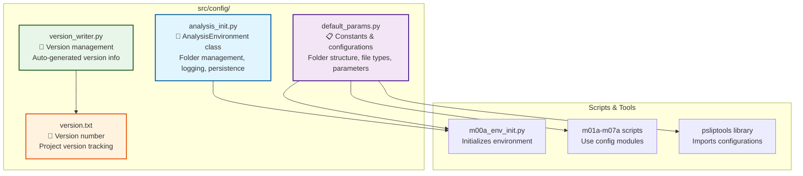
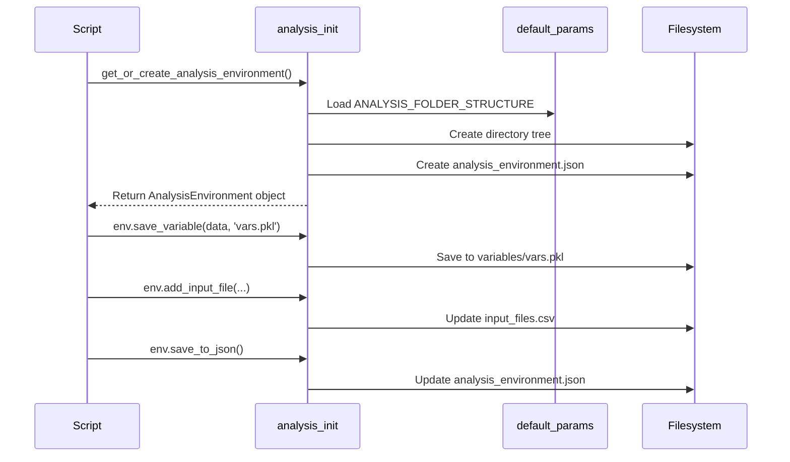

# ⚙️ Configuration Guide

The `src/config/` directory contains core modules for environment management, default parameters, and versioning. These modules provide the foundation for consistent settings across all P-SLIP scripts and the `psliptools` library.

## 🏗️ Architecture Overview



## 📦 Key Modules

### 🔧 analysis_init.py

**Purpose**: Defines the `AnalysisEnvironment` dataclass - the core object for managing analysis folders, logging, system specifications, and data persistence.

#### 🏗️ AnalysisEnvironment Structure

```python
@dataclass
class AnalysisEnvironment:
    # Core properties
    base_dir: str                    # Root analysis directory
    case_name: str                   # Analysis case identifier
    folders: dict                    # Folder path dictionary
    logger: logging.Logger           # Logging instance
    
    # System & Configuration
    system_specs: dict               # RAM/CPU info (via psutil)
    config: dict                     # Analysis configuration
    version: str                     # P-SLIP version
    
    # State tracking
    _initialized: bool = False       # Initialization status
```

#### 💻 Usage Examples

**Basic Initialization**:
```python
from src.config.analysis_init import get_or_create_analysis_environment

# Create or load analysis environment
base_dir = '/path/to/your/analysis/case'
env = get_or_create_analysis_environment(base_dir=base_dir)

# Access folder paths
print(env.folders['inputs'])        # inputs/ directory
print(env.folders['variables'])     # variables/ directory

# Save processed data
env.save_variable(your_data, 'morphology_vars.pkl')

# Log messages
env.logger.info("Analysis started successfully")
```

**Advanced Usage**:
```python
# Check system resources
print(f"Available RAM: {env.system_specs['ram_gb']} GB")
print(f"CPU Cores: {env.system_specs['cpu_count']}")

# Access configuration
study_area_config = env.config['inputs']['study_area']
print(f"Study area settings: {study_area_config}")

# Save environment state
env.save_to_json()  # Creates analysis_environment.json
```

#### 🔗 Key Methods

| Method | Description | Returns |
|--------|-------------|---------|
| `create_folder_structure()` | Creates analysis directory tree | `None` |
| `save_variable(data, filename)` | Save data to variables/ as PKL | `None` |
| `load_variable(filename)` | Load data from variables/ PKL | `dict` |
| `save_to_json()` | Serialize environment to JSON | `None` |
| `collect_input_files()` | Scan inputs/ for files, update CSV | `DataFrame` |
| `add_input_file(...)` | Register file in input_files.csv | `None` |

### 📋 default_params.py

**Purpose**: Centralized constants and configurations for folder structure, file types, parameter classes, and analysis settings.

#### 🗂️ Folder Structure Configuration

```python
# Complete folder structure definition
ANALYSIS_FOLDER_STRUCTURE = {
    'inputs': [
        # Required static inputs
        'study_area',           # Study area boundaries
        'dtm',                  # Digital Terrain Model
        
        # Optional static inputs  
        'landslides',           # Landslide inventory
        'soil',                 # Soil properties
        'vegetation',           # Vegetation data
        'infrastructures',      # Infrastructure
        'land_use',             # Land use classification
        
        # Dynamic inputs (time-series)
        {'rain': ['recordings', 'forecast']},
        {'temperature': ['recordings', 'forecast']},
        
        # Generic inputs
        'miscellaneous'
    ],
    'variables': [],            # PKL files (auto-populated)
    'modeling': [
        'safety_factors',       # Safety factor calculations
        'machine_learning',     # ML model outputs  
        'evolution'             # Temporal evolution
    ],
    'user_control': [],         # CSV templates (auto-populated)
    'outputs': [
        {'figures': ['susceptibility_maps']},
        'tables'
    ],
    'logs': []                  # Log files (auto-populated)
}
```

#### 📄 File Type Support

```python
SUPPORTED_FILE_TYPES = {
    'vectorial': ['.shp', '.gpkg', '.geojson', '.sqlite'], 
    'table': ['.csv'],
    'raster': ['.tif', '.tiff'],
    'climate': ['.nc']
}
```

#### 🏷️ Parameter Classes

**Soil Parameter Classes** (for physical modeling):
```python
PARAMETER_CLASS_NAME_MAPPER = {
    'soil': [
        'slp',
        {
            1: {'GS': 2.65, 'gd': 16.5, 'c': 0, 'phi': 32, ...},  # Loose sand
            2: {'GS': 2.67, 'gd': 18.0, 'c': 0, 'phi': 38, ...},  # Dense sand
            # ... 8 soil types total
        }
    ],
    'vegetation': [
        'vgp', 
        {
            1: {'cr': 2, 'beta': 0.5, ...},   # Grass
            2: {'cr': 5, 'beta': 0.6, ...},   # Bushes
            # ... 5 vegetation types
        }
    ]
}
```

**Standard Classes** (for ML models):
```python
STANDARD_CLASS_NAME_MAPPER = {
    'soil_sub': [
        'ssl',
        {
            0: ['Unknown', 'Class not defined'],
            1: ['Cohesive soil', 'Fine-grained soils, mainly clays'],
            # ... 6 subsurface soil types
        }
    ],
    'land_use': [
        'lnd',
        {
            0: ['Unknown', 'Class not defined'],
            1: ['Bare soil', 'Exposed soil, no vegetation'],
            # ... 8 land use types
        }
    ]
}
```

#### 💻 Usage Examples

```python
from src.config.default_params import (
    ANALYSIS_FOLDER_STRUCTURE,
    SUPPORTED_FILE_TYPES,
    KNOWN_REQUIRED_STATIC_INPUT_TYPES,
    PARAMETER_CLASS_NAME_MAPPER,
    STANDARD_CLASS_NAME_MAPPER
)

# Access folder structure
input_folders = ANALYSIS_FOLDER_STRUCTURE['inputs']
print(f"Input folders: {input_folders}")

# Check supported file types
vector_types = SUPPORTED_FILE_TYPES['vectorial']
print(f"Supported vector formats: {vector_types}")

# Access parameter classes
soil_classes = PARAMETER_CLASS_NAME_MAPPER['soil'][1]
loose_sand = soil_classes[1]
print(f"Loose sand properties: {loose_sand}")

# Get standard classes
land_use_classes = STANDARD_CLASS_NAME_MAPPER['land_use'][1]
bare_soil_info = land_use_classes[1]
print(f"Bare soil: {bare_use_info}")
```

### 📌 Other Files

#### version_writer.py / version.txt
- **Purpose**: Automatic version management
- **version.txt**: Contains current P-SLIP version number
- **version_writer.py**: Auto-generates version information during build
- **Usage**: Imported by scripts to log version information

```python
from src.config.version_writer import get_version

version = get_version()
print(f"P-SLIP Version: {version}")
```

## 🔄 Integration in Scripts

### Typical Script Pattern

```python
# 1. Import configuration modules
from src.config.analysis_init import get_or_create_analysis_environment
from src.config.default_params import (
    REFERENCE_POINTS_FILENAME,
    SUPPORTED_FILE_TYPES
)

# 2. Initialize environment (usually in main())
base_dir = '/path/to/analysis'  # From CLI args or GUI
env = get_or_create_analysis_environment(base_dir=base_dir)

# 3. Use environment throughout script
study_area_folder = env.folders['inputs']['study_area']
env.logger.info(f"Processing study area from {study_area_folder}")

# 4. Save results
results = {'slopes': slopes, 'curvatures': curvatures}
env.save_variable(results, 'morphology_vars.pkl')

# 5. Update configuration if needed
env.config['morphology'] = {'computation_method': 'd8'}
env.save_to_json()
```

### Configuration Flow



## 🎯 Configuration Best Practices

### 1. Environment Management
- ✅ **Do**: Use `get_or_create_analysis_environment()` to handle both new and existing analyses
- ✅ **Do**: Check `env._initialized` before performing operations
- ❌ **Don't**: Manually modify `analysis_environment.json` - use environment methods

### 2. Parameter Classes
- ✅ **Do**: Edit `user_control/parameter_classes.csv` to customize soil/vegetation parameters
- ✅ **Do**: Use standard class IDs (e.g., 'slp01', 'vgp02') for consistency
- ❌ **Don't**: Modify `default_params.py` directly - override via CSV

### 3. Folder Structure
- ✅ **Do**: Let scripts populate folders automatically
- ✅ **Do**: Use `env.folders` dict to access paths programmatically
- ❌ **Don't**: Create folders manually - use `create_folder_structure()`

### 4. File Management
- ✅ **Do**: Use `collect_input_files()` to scan and register inputs
- ✅ **Do**: Update `input_files.csv` for path changes
- ❌ **Don't**: Place files directly in folders without registration

## 🚀 Advanced Configuration

### Custom Parameter Classes

Create custom parameter classes by editing `user_control/parameter_classes.csv`:

```csv
type,class_id,class_num,GS,gd,c,cr,phi,kt,beta,A,lambda,n,E,ni,info
soil,slp09,9,2.68,19.5,50,0,28,1e-4,0,120,0.4,0.42,50,0.28,"Custom clayey soil"
vegetation,vgp06,6,0,0,0,25,0,0,0.7,0,0,0,0,0,"Custom deep-rooted vegetation"
```

### Extending Folder Structure

Modify `ANALYSIS_FOLDER_STRUCTURE` in `default_params.py` for custom workflows:

```python
CUSTOM_SUBFOLDERS = ['custom_analysis', 'validation_data']

ANALYSIS_FOLDER_STRUCTURE = {
    'inputs': [...],  # Keep existing
    'variables': [],
    'modeling': MODELING_SUBFOLDERS + CUSTOM_SUBFOLDERS,  # Extend
    # ... rest unchanged
}
```

### System Resource Configuration

Adjust resource limits in `analysis_init.py`:

```python
# Memory limits (default: 20GB for paths computation)
MAX_PATH_MEMORY_GB = 20

# CPU usage (default: all cores)
MAX_CPU_CORES = os.cpu_count()
```

## 🐛 Troubleshooting Configuration Issues

| Issue | Solution |
|-------|----------|
| **Missing required inputs** | Check `KNOWN_REQUIRED_STATIC_INPUT_TYPES` in `default_params.py` |
| **Invalid file paths** | Verify `input_files.csv` or use `collect_input_files()` |
| **Parameter class errors** | Validate CSV format in `user_control/parameter_classes.csv` |
| **Folder creation fails** | Check write permissions on `base_dir` |
| **Version conflicts** | Compare `version.txt` with imported modules |

---

**📖 Next Steps**: 
- [Analysis Structure Guide](analysis_structure/) - Detailed folder and environment documentation
- [Scripts Guide](scripts_guide.md) - How scripts use configuration modules
- [Troubleshooting](troubleshooting.md) - Common configuration issues and solutions

[← Back to Index](../index.md) | [🚀 Next: Installation Guide →](installation.md)