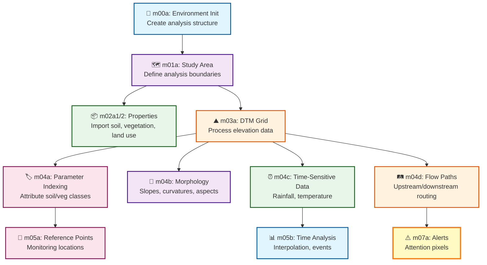

# 📚 P-SLIP Documentation

Welcome to the comprehensive documentation for **P-SLIP** (Python-based Landslide Susceptibility Tool)! This documentation follows a matryoshka structure: start with high-level overviews and guides, then drill down into detailed script references and examples.

## 🎯 Quick Navigation

| I Want To... | Start Here |
|--------------|------------|
| **Get started quickly** | [README](../README.md) → [Installation Guide](installation.md) |
| **Understand the workflow** | [Scripts Guide](scripts_guide.md) → [Main Scripts](scripts/mains/) |
| **Configure an analysis** | [Configuration Guide](config_guide.md) → [Analysis Structure](analysis_structure/) |
| **Use core libraries** | [psliptools Library Guide](psliptools_guide.md) |
| **Fix problems** | [Troubleshooting Guide](troubleshooting.md) |

## 🗺️ Documentation Structure

### 🚀 Getting Started
- **[README](../README.md)** ⭐ - Project overview, features, and quick start
- **[Installation Guide](installation.md)** 🔧 - Step-by-step setup, dependencies, and hardware requirements
- **[Quick Start Tutorial](#)** 🎓 - Coming soon: hands-on tutorial for first analysis

### 📊 Workflow & Scripts
- **[Scripts Guide](scripts_guide.md)** 🔄 - Complete workflow overview, dependency graphs, and execution order
- **[Main Scripts](scripts/mains/)** 📝 - Core sequential workflow (m00a to m07a) with detailed documentation
- **[Optional Scripts](scripts/optional/)** 🛠️ - Additional utilities (landslide datasets, area refinement)

### ⚙️ Configuration & Structure
- **[Configuration Guide](config_guide.md)** ⚙️ - Using `src/config/` modules (environment, parameters, defaults)
- **[Analysis Structure](analysis_structure/)** 📁 - Folder structure, AnalysisEnvironment object, and data organization
  - [Folder Structure](analysis_structure/folder_structure.md) 🗂️ - Complete directory tree and file purposes
  - [Analysis Environment](analysis_structure/analysis_environment.md) 🏗️ - Object structure, methods, and usage

### 📚 Library Reference
- **[psliptools Library Guide](psliptools_guide.md)** 🧰 - Core modules (geometries, rasters, scattered, utilities) with examples
  - **Geometries Module** - Vector operations, shapefile handling
  - **Rasters Module** - Grid processing, morphological analysis
  - **Scattered Module** - Point cloud interpolation, time-series data
  - **Utilities Module** - Helper functions, data conversion

### 🔧 Support
- **[Troubleshooting Guide](troubleshooting.md)** 🐛 - Common issues, error solutions, and debugging tips
- **[FAQ](#)** ❓ - Coming soon: frequently asked questions

## 🎯 Understanding P-SLIP

### 🏔️ What is P-SLIP?
P-SLIP is a **Python-based Landslide Susceptibility Tool** that processes geospatial data to assess landslide risks. It evolved from the [M-SLIP MATLAB app](https://github.com/sasa-misia/M-SLIP) with enhanced performance, modularity, and Python ecosystem integration.

### 🔄 Workflow Overview



### 💡 Key Features

| Feature | Description | Scripts |
|---------|-------------|---------|
| **🖥️ Modular Processing** | Handle rasters, vectors, scattered data | `psliptools` library |
| **🔄 Sequential Workflow** | PKL-based persistence, incremental processing | m00a → m07a |
| **🌐 CRS Handling** | Projected/geographic EPSG codes, transformations | All scripts |
| **⏰ Time Analysis** | Rainfall interpolation, mobile averages, events | m04c, m05b |
| **📊 Multiple Outputs** | GeoDataFrames, rasters, PKL vars, CSVs, alerts | All scripts |
| **💻 Hardware-Aware** | RAM/CPU monitoring, computation limits | Built-in |
| **🎨 Interactive/CLI** | Prompt-based or argparse flexibility | All scripts |

### 📖 Documentation Conventions

- **🎨 Mermaid Diagrams**: Visual workflow and dependency graphs
- **💻 Code Blocks**: CLI examples, Python snippets, configuration templates
- **📋 Tables**: Feature summaries, parameter options, input/output mappings
- **⚠️ Notes**: Important warnings, best practices, and caveats
- **💡 Tips**: Pro tips for efficient usage and troubleshooting

### 🔍 Finding What You Need

#### By User Role

| Role | Recommended Path |
|------|------------------|
| **👨‍🔬 Researcher** | Installation → Scripts Guide → Main Scripts → Troubleshooting |
| **👨‍💻 Developer** | README → psliptools Guide → Configuration Guide → Script Details |
| **👨‍🏫 Instructor** | README → Installation → Scripts Guide → Analysis Structure |
| **🔧 System Admin** | Installation → Troubleshooting → Configuration Guide |

#### By Task

| Task | Documentation |
|------|---------------|
| **First-time setup** | [Installation Guide](installation.md) |
| **Run an analysis** | [Scripts Guide](scripts_guide.md) → [Main Scripts](scripts/mains/) |
| **Configure parameters** | [Configuration Guide](config_guide.md) |
| **Understand outputs** | [Analysis Structure](analysis_structure/folder_structure.md) |
| **Extend functionality** | [psliptools Guide](psliptools_guide.md) |
| **Debug errors** | [Troubleshooting Guide](troubleshooting.md) |

## 🚀 Quick Start Preview

```bash
# 1. Install P-SLIP
git clone https://github.com/sasa-misia/P-SLIP.git
cd P-SLIP
conda create -n pslip python=3.10
conda activate pslip
pip install -r requirements.txt

# 2. Initialize analysis
cd src/scripts
python m00a_env_init.py --base_dir /path/to/your/analysis

# 3. Define study area
python m01a_study_area.py --base_dir /path/to/your/analysis --source_mode reference_points

# 4. Continue sequential workflow...
# See Scripts Guide for complete workflow
```

## 📞 Getting Help

- **📖 Documentation Issues**: Check [Troubleshooting](troubleshooting.md) first
- **🐛 Bug Reports**: Open an issue on GitHub
- **💡 Feature Requests**: Contact the development team
- **🤝 Contributions**: See [README](../README.md) for contribution guidelines

---

**🎉 Welcome to P-SLIP! Start your landslide susceptibility analysis journey with the [README](../README.md) or [Installation Guide](installation.md).**

[← Back to README](../README.md) | [🚀 Next: Installation Guide →](installation.md)