# 🧰 psliptools Library Guide

`psliptools` is the core library under `src/psliptools/` for geospatial operations in P-SLIP. It provides modular, well-tested tools for handling geometries, rasters, scattered data, and utilities that power all P-SLIP scripts.

## 🏗️ Library Architecture

```mermaid
graph TB
    subgraph "psliptools Modules"
        A[🧩 geometries<br/>Vector operations & polygons]
        B[🗺️ rasters<br/>Grid processing & morphology]
        C[📊 scattered<br/>Time-series & interpolation]
        D[🛠️ utilities<br/>Helpers & convenience functions]
    end
    
    subgraph "Script Usage"
        E[m01a_study_area.py<br/>Uses geometries]
        F[m03a_dtm_base_grid.py<br/>Uses rasters]
        G[m04c_time_sensitive.py<br/>Uses scattered]
        H[All scripts<br/>Use utilities]
    end
    
    A --> E
    B --> F
    C --> G
    D --> H
    
    style A fill:#e1f5fe,stroke:#01579b,stroke-width:2px
    style B fill:#f3e5f5,stroke:#4a148c,stroke-width:2px
    style C fill:#e8f5e9,stroke:#1b5e20,stroke-width:2px
    style D fill:#fff3e0,stroke:#e65100,stroke-width:2px
```



## 🧩 Geometries Module

**Purpose**: Handle vector data, polygon operations, and geometric computations for study areas, landslides, and spatial boundaries.

### 📦 Submodules

| Submodule | Purpose | Key Functions |
|-----------|---------|---------------|
| **generate_geom.py** | Create geometric objects | `create_polygons_from_points()`, `create_rectangle_polygons()` |
| **import_geom.py** | Load vector files | `load_vectorial_file_geometry()`, `convert_gdf_to_geo()` |
| **manipulate_geom.py** | Geometric operations | `intersect_polygons()`, `buffer_polygons()`, `convert_crs()` |
| **info_geom.py** | Geometry inspection | `get_polygon_extremes()`, `get_geo_file_fields()` |
| **plot_geometries.py** | Visualization | `plot_polygons()`, `plot_geometry_overlay()` |

### 💻 Core Functions

#### 🏗️ Geometry Generation

```python
from psliptools.geometries import (
    create_polygons_from_points,
    create_rectangle_polygons,
    get_rectangle_parameters
)

# Create circular polygons from reference points
points_df = pd.read_csv('reference_points.csv')
polygons = create_polygons_from_points(
    x=points_df['lon'].values,
    y=points_df['lat'].values,
    buffer=50,  # 50m radius
    shape='circle'
)

# Create rectangular study areas
rect_coords = get_rectangle_parameters(n_rectangles=5)
rectangles = create_rectangle_polygons(rect_coords)
```

#### 📂 Geometry Import

```python
from psliptools.geometries import (
    load_vectorial_file_geometry,
    load_vectorial_file_geometry_simple,
    get_geo_file_fields
)

# Load shapefile with all attributes
gdf, crs = load_vectorial_file_geometry('inputs/study_area/boundary.shp')

# Inspect available fields
fields = get_geo_file_fields('inputs/study_area/boundary.shp')
print(f"Available attributes: {fields}")

# Load simplified (geometry only)
geometries = load_vectorial_file_geometry_simple('inputs/landslides/polygons.shp')
```

#### 🔧 Geometry Manipulation

```python
from psliptools.geometries import (
    intersect_polygons,
    union_polygons,
    subtract_polygons,
    add_buffer_to_polygons,
    convert_polygons_crs
)

# Buffer operations
buffered_polygons = add_buffer_to_polygons(polygons, buffer_distance=100)

# Spatial operations
intersection = intersect_polygons(polygon1, polygon2)
union = union_polygons([polygon1, polygon2, polygon3])
difference = subtract_polygons(main_polygon, exclusion_zone)

# CRS transformation
polygons_projected = convert_polygons_crs(
    polygons, 
    crs_in=4326,  # WGS84
    crs_out=32633  # UTM Zone 33N
)
```

#### 🔍 Geometry Inspection

```python
from psliptools.geometries import (
    get_polygon_extremes,
    check_and_report_polygons_alignment,
    detect_intersections_between_polygons
)

# Get bounding box
min_x, max_x, min_y, max_y = get_polygon_extremes(polygon)

# Validate geometry quality
issues = check_and_report_polygons_alignment([polygon1, polygon2])
if issues:
    print(f"Geometry issues found: {issues}")

# Detect overlaps
intersections = detect_intersections_between_polygons(polygons_list)
```

### 🎯 Complete Workflow Example

```python
# Complete geometry processing pipeline
from psliptools.geometries import *

# 1. Load study area boundary
study_area, crs = load_vectorial_file_geometry('inputs/study_area/boundary.shp')

# 2. Load landslide points
landslide_points = load_vectorial_file_geometry_simple('inputs/landslides/points.shp')

# 3. Create landslide polygons (buffer points)
landslide_polygons = create_polygons_from_points(
    x=[p.x for p in landslide_points],
    y=[p.y for p in landslide_points],
    buffer=25,  # 25m radius
    shape='circle'
)

# 4. Clip landslides to study area
landslides_clipped = intersect_polygons(landslide_polygons, study_area)

# 5. Validate results
extremes = get_polygon_extremes(study_area)
print(f"Study area bounds: {extremes}")
print(f"Number of landslides: {len(landslides_clipped)}")
```

## 🗺️ Rasters Module

**Purpose**: Process raster data, compute morphological parameters, handle coordinate systems, and generate analysis grids.

### 📦 Submodules

| Submodule | Purpose | Key Functions |
|-----------|---------|---------------|
| **coordinates.py** | CRS & coordinate ops | `convert_coords()`, `get_pixels_inside_polygon()` |
| **import_raster.py** | Load raster files | `load_georaster()`, `get_georaster_info()` |
| **generate_raster.py** | Morphological grids | `generate_slope_and_aspect_rasters()`, `generate_curvature_rasters()` |
| **manage_raster.py** | Raster operations | `mask_raster_with_1d_idx()`, `get_d8_neighbors_slope()` |
| **manipulate_raster.py** | Grid manipulation | `resample_raster()`, `replace_values()` |
| **plot_raster.py** | Visualization | `plot_elevation_2d()`, `plot_elevation_3d()` |

### 💻 Core Functions

#### 📍 Coordinate Operations

```python
from psliptools.rasters import (
    convert_coords,
    get_projected_epsg_code_from_bbox,
    get_pixels_inside_polygon,
    create_grid_from_bbox
)

# Coordinate transformation
lon, lat = [12.5, 13.2], [45.8, 46.1]
x_proj, y_proj = convert_coords(
    crs_in=4326,      # WGS84 geographic
    crs_out=32633,    # UTM Zone 33N projected
    in_coords_x=lon,
    in_coords_y=lat
)

# Create analysis grid
bbox = [min_x, max_x, min_y, max_y]
resolution = [10, 10]  # 10m resolution
x_grid, y_grid, profile = create_grid_from_bbox(bbox, resolution)

# Get pixels within polygon
mask = get_pixels_inside_polygon(study_area_polygon, raster_profile=profile)
```

#### 📊 Raster Import & Information

```python
from psliptools.rasters import (
    load_georaster,
    get_georaster_info,
    get_xy_grids_from_profile
)

# Load DTM
elevation, profile, x_grid, y_grid = load_georaster('inputs/dtm/elevation.tif')

# Get raster metadata
info = get_georaster_info('inputs/dtm/elevation.tif')
print(f"CRS: {info['crs']}")
print(f"Resolution: {info['resolution']}")
print(f"Bounds: {info['bounds']}")

# Extract coordinate grids from profile
x_grid, y_grid = get_xy_grids_from_profile(profile)
```

#### ⛰️ Morphological Analysis

```python
from psliptools.rasters import (
    generate_slope_and_aspect_rasters,
    generate_curvature_rasters,
    generate_gradient_rasters
)

# Compute slope and aspect
slope, aspect = generate_slope_and_aspect_rasters(
    elevation, 
    x_grid, 
    y_grid,
    method='d8'  # D8 flow routing
)

# Compute curvatures
plan_curvature, profile_curvature = generate_curvature_rasters(
    elevation,
    x_grid,
    y_grid
)

# Compute gradients
grad_x, grad_y = generate_gradient_rasters(elevation, x_grid, y_grid)
```

#### 🔧 Raster Management

```python
from psliptools.rasters import (
    mask_raster_with_1d_idx,
    get_2d_mask_from_1d_idx,
    pick_point_from_1d_idx,
    get_d8_neighbors_slope
)

# Mask raster with polygon
mask_1d = get_pixels_inside_polygon(study_area, raster_profile=profile)
masked_elevation = mask_raster_with_1d_idx(elevation, mask_1d)

# Extract values at specific locations
values = pick_point_from_1d_idx(elevation, point_indices)

# Analyze D8 neighbors
neighbor_slopes = get_d8_neighbors_slope(
    row=100, col=200,
    z_grid=elevation,
    x_grid=x_grid,
    y_grid=y_grid,
    output_format='pandas'
)
```

#### 🎨 Raster Visualization

```python
from psliptools.rasters import (
    plot_elevation_2d,
    plot_elevation_isometric,
    plot_elevation_3d
)

# 2D elevation map
fig, ax = plot_elevation_2d(
    elevation=elevation,
    x_grid=x_grid,
    y_grid=y_grid,
    polygon=study_area,
    show=True
)

# 3D isometric plot
fig, ax = plot_elevation_isometric(
    elevation=elevation,
    x_grid=x_grid,
    y_grid=y_grid,
    polygon=study_area,
    show=True
)

# Interactive 3D visualization (requires mayavi)
fig = plot_elevation_3d(
    elevation=elevation,
    x_grid=x_grid,
    y_grid=y_grid,
    show=True
)
```

### 🎯 Complete Workflow Example

```python
# Complete raster processing pipeline
from psliptools.rasters import *

# 1. Load DTM
elevation, profile, x_grid, y_grid = load_georaster('inputs/dtm/elevation.tif')

# 2. Create analysis mask
mask = get_pixels_inside_polygon(study_area, raster_profile=profile)
elevation_masked = mask_raster_with_1d_idx(elevation, mask)

# 3. Compute morphological parameters
slope, aspect = generate_slope_and_aspect_rasters(elevation_masked, x_grid, y_grid)
plan_curv, prof_curv = generate_curvature_rasters(elevation_masked, x_grid, y_grid)

# 4. Visualize results
fig, ax = plot_elevation_2d(elevation_masked, x_grid, y_grid, show=True)

# 5. Save processed rasters (via environment)
env.save_variable({
    'elevation': elevation_masked,
    'slope': slope,
    'aspect': aspect,
    'plan_curvature': plan_curv,
    'profile_curvature': prof_curv
}, 'morphology_vars.pkl')
```

## 📊 Scattered Module

**Purpose**: Handle time-series data from scattered points (rainfall stations, temperature sensors), perform interpolation, and manage temporal analysis.

### 📦 Submodules

| Submodule | Purpose | Key Functions |
|-----------|---------|---------------|
| **import_time_sensitive.py** | Load temporal data | `load_time_sensitive_data_from_csv()`, `load_time_sensitive_stations_from_csv()` |
| **points.py** | Point operations | `get_closest_point_id()`, `interpolate_scatter_to_scatter()` |

### 💻 Core Functions

#### 📅 Time-Sensitive Data Import

```python
from psliptools.scattered import (
    load_time_sensitive_data_from_csv,
    load_time_sensitive_stations_from_csv,
    merge_time_sensitive_data_and_stations,
    create_stations_distance_matrix
)

# Load rainfall data
rainfall_data = load_time_sensitive_data_from_csv(
    'inputs/rain/recordings/data.csv',
    datetime_format='%Y-%m-%d %H:%M:%S'
)

# Load station metadata
stations = load_time_sensitive_stations_from_csv(
    'inputs/rain/recordings/stations.csv'
)

# Merge data with station info
merged_data = merge_time_sensitive_data_and_stations(
    rainfall_data,
    stations
)

# Create distance matrix for interpolation
distance_matrix = create_stations_distance_matrix(stations)
```

#### 🔍 Point Operations

```python
from psliptools.scattered import (
    get_closest_point_id,
    interpolate_scatter_to_scatter
)

# Find nearest station
target_point = (12.5, 45.8)
station_coords = [(s.lon, s.lat) for s in stations]
nearest_idx = get_closest_point_id(
    x=target_point[0],
    y=target_point[1],
    x_ref=[c[0] for c in station_coords],
    y_ref=[c[1] for c in station_coords]
)

# Interpolate to target points
interpolated_values = interpolate_scatter_to_scatter(
    x_in=stations['lon'].values,
    y_in=stations['lat'].values,
    data_in=rainfall_data['value'].values,
    x_out=target_points['lon'].values,
    y_out=target_points['lat'].values,
    interpolation_method='idw'  # Inverse Distance Weighting
)
```

### 🎯 Complete Workflow Example

```python
# Complete time-series analysis pipeline
from psliptools.scattered import *

# 1. Load rainfall data and stations
rainfall = load_time_sensitive_data_from_csv('inputs/rain/recordings/data.csv')
stations = load_time_sensitive_stations_from_csv('inputs/rain/recordings/stations.csv')

# 2. Merge and organize data
merged = merge_time_sensitive_data_and_stations(rainfall, stations)

# 3. Create spatial reference
distance_matrix = create_stations_distance_matrix(stations)

# 4. Interpolate to analysis grid
interpolated_rainfall = interpolate_scatter_to_scatter(
    x_in=stations['lon'].values,
    y_in=stations['lat'].values,
    data_in=rainfall['value'].values,
    x_out=analysis_grid_x.flatten(),
    y_out=analysis_grid_y.flatten(),
    interpolation_method='nearest'
)

# 5. Reshape to grid format
rainfall_grid = interpolated_rainfall.reshape(analysis_grid_x.shape)
```

## 🛠️ Utilities Module

**Purpose**: Provide helper functions for user interaction, file management, data processing, and common operations used across all modules.

### 📦 Submodules

| Submodule | Purpose | Key Functions |
|-----------|---------|---------------|
| **csv_file_utils.py** | CSV operations | `read_generic_csv()`, `add_row_to_csv()`, `parse_csv_internal_path_field()` |
| **pandas_utils.py** | DataFrame ops | `compare_dataframes()`, `filter_numeric_series()`, `fill_missing_values()` |
| **user_prompts.py** | Interactive UI | `select_from_list_prompt()`, `select_file_prompt()`, `print_enumerated_list()` |
| **path_utils.py** | Path management | `get_raw_fold()`, `get_fold_from_csv()` |
| **datetimes.py** | Time handling | `parse_datetime()`, `infer_datetime_format()`, `delta_to_string()` |
| **web_sources.py** | Web data | `download_wms_raster()` |

### 💻 Core Functions

#### 📄 CSV Operations

```python
from psliptools.utilities import (
    read_generic_csv,
    add_row_to_csv,
    get_csv_column_names,
    check_raw_path
)

# Read CSV with automatic encoding detection
data = read_generic_csv('inputs/data.csv')

# Add new entry to input_files.csv
add_row_to_csv(
    'inputs/input_files.csv',
    {
        'custom_id': 'landslides_2023',
        'path': '/path/to/landslides.shp',
        'type': 'landslides',
        'subtype': '',
        'internal': 'False'
    }
)

# Validate file paths
is_valid = check_raw_path('/path/to/file.shp')
```

#### 🐼 Pandas Utilities

```python
from psliptools.utilities import (
    compare_dataframes,
    get_list_of_values_from_dataframe,
    filter_numeric_series,
    fill_missing_values_of_numeric_series
)

# Compare datasets
differences = compare_dataframes(df1, df2)

# Extract unique values
unique_classes = get_list_of_values_from_dataframe(df, 'soil_type')

# Clean numeric data
clean_series = filter_numeric_series(df['elevation'])
filled_series = fill_missing_values_of_numeric_series(clean_series, method='linear')
```

#### 💬 User Interaction

```python
from psliptools.utilities import (
    select_from_list_prompt,
    select_file_prompt,
    print_enumerated_list
)

# Interactive list selection
options = ['Option A', 'Option B', 'Option C']
selected = select_from_list_prompt(options, prompt="Choose analysis method:")

# File selection dialog
file_path = select_file_prompt(
    initial_dir='inputs/',
    file_types=[('Shapefiles', '*.shp'), ('All files', '*.*')]
)

# Display numbered list
print_enumerated_list(['Item 1', 'Item 2', 'Item 3'])
```

#### 📅 DateTime Handling

```python
from psliptools.utilities import (
    parse_datetime,
    infer_datetime_format,
    delta_to_string
)

# Parse various datetime formats
dt = parse_datetime('2023-06-15 14:30:00')
dt2 = parse_datetime('15/06/2023 2:30 PM', format='%d/%m/%Y %I:%M %p')

# Auto-detect format
format_detected = infer_datetime_format('2023-06-15 14:30:00')

# Format time deltas
duration = delta_to_string(dt2 - dt)
print(f"Duration: {duration}")
```

### 🎯 Complete Workflow Example

```python
# Complete utility usage pipeline
from psliptools.utilities import *

# 1. Load and validate input files
input_files = read_generic_csv('inputs/input_files.csv')
for idx, row in input_files.iterrows():
    if not check_raw_path(row['path']):
        print(f"Warning: Invalid path for {row['custom_id']}")

# 2. Interactive parameter selection
methods = ['D8', 'D∞', 'MFD']
selected_method = select_from_list_prompt(methods, prompt="Select flow routing method:")

# 3. Process time-series data
rainfall_data = read_generic_csv('inputs/rain/data.csv')
rainfall_data['datetime'] = rainfall_data['timestamp'].apply(parse_datetime)

# 4. Clean and validate data
numeric_cols = ['value', 'quality']
for col in numeric_cols:
    rainfall_data[col] = filter_numeric_series(rainfall_data[col])
    rainfall_data[col] = fill_missing_values_of_numeric_series(rainfall_data[col])

# 5. Save processed data
rainfall_data.to_csv('outputs/cleaned_rainfall.csv', index=False)
```

## 🔄 Integrated Workflow Example

```python
# Complete P-SLIP analysis using all modules
from psliptools.geometries import *
from psliptools.rasters import *
from psliptools.scattered import *
from psliptools.utilities import *

# 1. Load study area
study_area, crs = load_vectorial_file_geometry('inputs/study_area/boundary.shp')

# 2. Load and process DTM
elevation, profile, x_grid, y_grid = load_georaster('inputs/dtm/elevation.tif')
mask = get_pixels_inside_polygon(study_area, raster_profile=profile)
elevation_masked = mask_raster_with_1d_idx(elevation, mask)

# 3. Compute morphology
slope, aspect = generate_slope_and_aspect_rasters(elevation_masked, x_grid, y_grid)

# 4. Load and interpolate rainfall
rainfall_data = load_time_sensitive_data_from_csv('inputs/rain/data.csv')
stations = load_time_sensitive_stations_from_csv('inputs/rain/stations.csv')
interpolated_rain = interpolate_scatter_to_scatter(
    x_in=stations['lon'].values,
    y_in=stations['lat'].values,
    data_in=rainfall_data['value'].values,
    x_out=x_grid.flatten(),
    y_out=y_grid.flatten()
)

# 5. Visualize results
fig, ax = plot_elevation_2d(elevation_masked, x_grid, y_grid, show=True)

print("✅ Analysis complete!")
```

## 📚 Function Reference Tables

### Geometries Module Functions

| Function | Purpose | Input | Output |
|----------|---------|-------|--------|
| `create_polygons_from_points()` | Buffer points to polygons | x, y coords, buffer distance | List[Polygon] |
| `load_vectorial_file_geometry()` | Load shapefile/GeoPackage | File path | GeoDataFrame, CRS |
| `intersect_polygons()` | Spatial intersection | 2+ polygons | Polygon/MultiPolygon |
| `convert_polygons_crs()` | CRS transformation | Polygons, CRS codes | Transformed polygons |

### Rasters Module Functions

| Function | Purpose | Input | Output |
|----------|---------|-------|--------|
| `load_georaster()` | Load GeoTIFF | File path | Data array, profile, grids |
| `generate_slope_and_aspect_rasters()` | Compute morphology | Elevation grid | Slope, aspect arrays |
| `get_pixels_inside_polygon()` | Spatial masking | Polygon, profile | Boolean mask |
| `convert_coords()` | Coordinate transform | Coords, CRS codes | Transformed coords |

### Scattered Module Functions

| Function | Purpose | Input | Output |
|----------|---------|-------|--------|
| `load_time_sensitive_data_from_csv()` | Load temporal data | CSV path | DataFrame |
| `interpolate_scatter_to_scatter()` | Spatial interpolation | Source/target coords | Interpolated values |
| `get_closest_point_id()` | Nearest neighbor | Query point, ref points | Index |

### Utilities Module Functions

| Function | Purpose | Input | Output |
|----------|---------|-------|--------|
| `read_generic_csv()` | Smart CSV reader | File path | DataFrame |
| `select_from_list_prompt()` | Interactive choice | Options list | Selected option |
| `parse_datetime()` | Flexible date parsing | Date string | Datetime object |

---

**🎯 Next Steps**:
- 📖 Explore [Scripts Guide](scripts_guide.md) to see how psliptools is used in workflows
- 🔧 Check [Configuration Guide](config_guide.md) for integration patterns
- 🚀 Try [Installation Guide](installation.md) for setup instructions

[← Back to Index](../index.md) | [🚀 Next: Scripts Guide →](scripts_guide.md)

Install via `pip install -r requirements.txt` (geopandas, rasterio, etc.).

For full API, check source docstrings in `src/psliptools/`.

[← Back to Index](../index.md) | [Scripts Guide](../scripts_guide.md)