# m00a_env_init.py

## Overview

This script initializes or loads the analysis environment for P-SLIP. It creates the folder structure, sets up logging, and saves the environment configuration. This is the **entry point** for any P-SLIP analysis workflow.

## Purpose

The script serves as the foundational initialization module that:
- Creates or loads the complete folder structure for analysis
- Sets up logging infrastructure (console and file-based)
- Initializes the `AnalysisEnvironment` object that manages all configuration
- Reports system hardware and memory information
- Provides utility functions for configuration management

## Prerequisites

- None (this is the starting script for any P-SLIP workflow)
- Optional: `psutil` package for system monitoring (falls back gracefully if not available)

## Key Inputs

- **Base directory**: Where the analysis environment will be created or loaded from
- **Case study name**: Optional name for the analysis case (defaults to "Not Defined - Standalone")
- **Environment filename**: Optional custom name for the environment JSON file

## Outputs

- **Folder structure**: Complete directory tree in the base directory
- **Environment configuration**: Saved as `environment.json` (or custom filename)
- **Session log file**: Created in `logs/` folder with timestamp
- **Hardware report**: Logged system information (if psutil available)

## CLI Usage

```bash
# Create new environment with custom name
python m00a_env_init.py --base_dir /path/to/analysis --case_name MyCase --allow_creation

# Load existing environment
python m00a_env_init.py --base_dir /path/to/analysis

# Use custom environment filename
python m00a_env_init.py --base_dir /path/to/analysis --env_filename custom_env.json --allow_creation
```

## Detailed Description

The script checks if an environment already exists in the base directory. If not, it prompts for creation (or uses CLI flags). It uses `config/analysis_init.py` to build the `AnalysisEnvironment` object and create folders based on `default_params.py`.

For more on the environment object, see [Analysis Structure Guide](../../analysis_structure/).

[← Back to Scripts Guide](../../scripts_guide.md)

## Script Logic

### Main Function: `get_or_create_analysis_environment()`

This is the core function that orchestrates environment initialization:

1. **Input Processing**: 
   - If `gui_mode=False` and no `base_dir` provided, prompts user interactively
   - Validates `env_filename` if provided (must be JSON, handles absolute/relative paths)
   - Uses default `ENVIRONMENT_FILENAME` from `default_params.py` if not specified

2. **Environment Detection**:
   - Checks if `environment.json` exists in `base_dir`
   - If exists: Calls `get_analysis_environment()` to load existing configuration
   - If not exists and `allow_creation=True`: Proceeds with environment creation

3. **Environment Creation**:
   - Prompts for `case_name` if not provided (defaults to "Not Defined - Standalone")
   - Calls `create_analysis_environment()` from `config/analysis_init.py`
   - Creates complete folder structure based on `FOLDER_STRUCTURE` in `default_params.py`
   - Generates default configuration CSVs in `user_control/` folder
   - Saves environment to JSON file
   - Sets up session logger with timestamp

4. **Environment Loading**:
   - Loads configuration from JSON file
   - Updates paths if `base_dir` has changed
   - Checks and creates `input_files.csv` if missing
   - Sets up logger for the session

5. **System Reporting**:
   - Logs hardware information (CPU cores, RAM, disk space)
   - Reports memory usage (if psutil available)
   - Returns the `AnalysisEnvironment` object

### Utility Functions

#### `setup_logger(module_name=None)`
- Configures logging with format from `LOG_CONFIG`
- Returns logger object for the specified module
- Used throughout the P-SLIP workflow for consistent logging

#### `log_and_warning(warning_msg, stacklevel=2, logger=None)`
- Logs warning message and raises Python warning
- Ensures warnings are both logged and displayed to user

#### `log_and_error(error_msg, exception_type=ValueError, logger=None)`
- Logs error message and raises specified exception
- Centralizes error handling with logging

#### `memory_report(logger=None)`
- Reports current memory usage (if psutil available)
- Logs memory percentage and GB used

#### `get_hardware_info()`
- Returns dictionary with system hardware information:
  - `cores`: Number of physical CPU cores
  - `threads`: Number of logical CPU threads
  - `ram`: Total RAM in GB
  - `disk`: Total disk space in GB
  - `free_disk`: Available disk space in GB
  - `free_ram`: Available RAM in GB
- Returns zeros if psutil not available

#### `hardware_report(logger=None)`
- Logs hardware information dictionary

#### `obtain_config_idx_and_rel_filename(env, source_type, source_subtype=None)`
- **Critical utility function** used throughout P-SLIP workflow
- Returns tuple: (modified env, config index, relative filename)
- Handles configuration indexing for input sources:
  - If `source_subtype` provided, searches existing config for matching subtype
  - If found: returns existing index
  - If not found: appends new config entry and returns new index
  - If no `source_subtype`: uses first config entry (index 0)
- Used by subsequent scripts to manage multiple data sources

### Error Handling

- **FileNotFoundError**: Raised if environment doesn't exist and `allow_creation=False`
- **ValueError**: Raised for invalid `env_filename` (not JSON or invalid format)
- **NotImplementedError**: Raised if `gui_mode=True` (GUI not yet supported)

### Flow Diagram

```mermaid
graph TD
    %% Initialization Flow
    A["Start m00a_env_init<br/>🏗️ Environment Setup"] --> B{CLI args provided?}
    B -->|Yes| C["Parse arguments<br/>📝 Load base_dir, env_filename"]
    B -->|No| D["Interactive prompts<br/>💬 Ask user for inputs"]
    C --> E{env_filename provided?}
    D --> E
    E -->|Custom| F["Validate JSON format<br/>✅ Check file structure"]
    E -->|Default| G["Use ENVIRONMENT_FILENAME<br/>📄 Default: environment.json"]
    F --> H{Environment exists?}
    G --> H
    H -->|Yes| I["Load with get_analysis_environment()<br/>📂 Restore existing state"]
    H -->|No| J{allow_creation?}
    J -->|Yes| K["Prompt for case_name if needed<br/>🏷️ Set analysis name"]
    J -->|No| L["Raise FileNotFoundError<br/>❌ Stop execution"]
    K --> M["Create with create_analysis_environment()<br/>🏗️ Build new environment"]
    M --> N["Build folder structure<br/>📁 Create inputs/, outputs/, etc."]
    M --> O["Generate default CSVs<br/>📋 parameter_classes.csv, etc."]
    M --> P["Save to JSON<br/>💾 Write environment.json"]
    I --> Q["Update paths if needed<br/>🔄 Refresh folder locations"]
    Q --> R["Setup logger<br/>📝 Initialize logging system"]
    
    %% Styling
    style A fill:#e1f5fe,stroke:#01579b,stroke-width:3px
    style M fill:#e8f5e9,stroke:#1b5e20,stroke-width:2px
    style I fill:#fff3e0,stroke:#e65100,stroke-width:2px
    style R fill:#f3e5f5,stroke:#4a148c,stroke-width:2px
    P --> R
    R --> S[Report hardware/memory]
    S --> T[Return AnalysisEnvironment]
    L --> T
```



## Inputs and Parameters

This script supports both CLI arguments and interactive prompts. Below is a detailed list of inputs/parameters, available options, their effects, and defaults.

### CLI Arguments (via argparse)
- `--base_dir` (type: str, default: None):
  - **Options/Available Values**: Any valid directory path (absolute or relative).
  - **Effect**: Specifies the base directory for the analysis. If None, prompts interactively (uses cwd if empty input). Creates/loads env there.
  - **Logic Influence**: Sets the root for all folders; if changed on load, updates all paths recursively via `_update_paths()`.

- `--gui_mode` (action: store_true, default: False):
  - **Options/Available Values**: True (flag present) or False.
  - **Effect**: Intended for GUI integration (not implemented; raises NotImplementedError). If True, would use GUI for inputs.
  - **Logic Influence**: Currently skips to CLI prompts; future: enables non-interactive mode.

- `--case_name` (type: str, default: None):
  - **Options/Available Values**: Any string (cleaned to replace invalid chars with '_').
  - **Effect**: Names the analysis case. If None, prompts or uses default "Not_Defined_Standalone".
  - **Logic Influence**: Used in folder naming, log files, and object metadata. Affects uniqueness when sharing analyses.

- `--allow_creation` (action: store_true, default: False in CLI but True in function):
  - **Options/Available Values**: True (flag) or False.
  - **Effect**: If True and no env exists, creates one. If False, raises error.
  - **Logic Influence**: Controls whether to init new or require existing; safe for new analyses.

- `--env_filename` (type: str, default: None):
  - **Options/Available Values**: JSON filename (e.g., "custom_env.json").
  - **Effect**: Overrides default "environment.json". Must be JSON.
  - **Logic Influence**: Changes the env file name/path; ensures it's in base_dir.

### Interactive Prompts (if not provided via CLI)
- "Enter the base directory..." (if base_dir None):
  - **Choices/Options**: Enter path or press Enter for cwd.
  - **Effect**: Same as --base_dir. Choose wisely to avoid path conflicts.

- "Specify the analysis name..." (if case_name None and creation needed):
  - **Choices/Options**: Enter name or press Enter for default.
  - **Effect**: Sets case_name; influences log filenames and metadata.

## Effects of Choices and Parameters
- Choosing a new base_dir creates fresh folders/logs; existing one loads and potentially updates paths (e.g., if moved analysis folder).
- allow_creation=False ensures no accidental overwrites—useful for read-only ops.
- Prompts allow flexibility without CLI; e.g., default case_name keeps things simple but less descriptive.
- All choices update the AnalysisEnvironment object, which persists to JSON—subsequent scripts load this for consistency.

This deepened documentation ensures users understand how inputs drive env setup, integrating with config modules and psliptools utilities for path handling.

[m01a →](m01a_study_area.md)