# m01a_study_area.py

## Purpose
Define the study area polygon by importing from vector files, creating from user-defined bounding boxes, or generating from reference points with automatic convex hull and buffering.

## Detailed Script Logic

### Core Workflow
1. **Environment Loading**: Loads the analysis environment created by m00a, which contains folder paths and configuration
2. **Source Mode Selection**: Determines how the study area will be defined based on `--source_mode` parameter
3. **Geometry Generation**: Creates study area polygon using one of three methods
4. **CRS Handling**: Automatically detects and converts to appropriate projected CRS for analysis
5. **Data Structure Creation**: Generates standardized output structure with cleaned polygons

### Three Source Modes with Detailed Logic

#### Mode 1: `user_bbox` - Manual Bounding Box
- **Logic Flow**:
  1. Prompts user for longitude/latitude boundaries (min/max)
  2. Creates rectangular polygon from coordinates
  3. Validates coordinate ranges (lon: -180 to 180, lat: -90 to 90)
  4. Generates study area from single or multiple rectangles
- **Use Case**: Quick testing, well-defined rectangular study areas
- **Effect**: Simple, fast generation with explicit user control

#### Mode 2: `geo_file` - Vector File Import
- **Logic Flow**:
  1. Prompts user to select vector file (shapefile, GeoPackage, etc.)
  2. Optionally selects attribute field for multi-polygon classification
  3. Loads geometries and clips to study area if needed
  4. Unions all polygons into single multi-polygon
  5. Extracts bounding box extremes for grid generation
- **Use Case**: Complex study areas from existing GIS data
- **Effect**: Preserves original geometry complexity, supports attribute-based filtering

#### Mode 3: `reference_points` - Point-based Generation
- **Logic Flow**:
  1. Loads reference points CSV with lon/lat coordinates
  2. Computes convex hull around all points (minimum bounding polygon)
  3. Applies buffer (default 2000m) to expand hull
  4. Converts buffer to square or circular shape
  5. Projects to UTM or appropriate local CRS
- **Use Case**: Landslide inventory points, scattered monitoring stations
- **Effect**: Automatic fitting to data distribution with safety margin

### CRS and Projection Handling
- **Automatic EPSG Detection**: Uses `get_projected_epsg_code_from_bbox()` to find optimal UTM zone
- **Unit Awareness**: Detects projected CRS units (meters/feet) for buffer calculations
- **Coordinate Conversion**: Handles geographic to projected transformations
- **Effect**: Ensures consistent units for all downstream analysis

## Prerequisites
- **Required**: `m00a_env_init.py` must be run first to create analysis environment
- **Files**: Environment must exist in base directory

## Inputs / Parameters

### CLI Arguments
- `--base_dir` (string, required):
  - **Options**: Any valid directory path
  - **Effect**: Specifies where to load/save analysis environment
  - **Default**: None (prompts interactively)
  
- `--gui_mode` (boolean flag):
  - **Options**: True/False
  - **Effect**: Reserved for future GUI integration (currently not implemented)
  - **Default**: False

- `--source_mode` (string):
  - **Options**: `user_bbox`, `geo_file`, `reference_points`
  - **Effect**: Determines study area generation method
  - **Default**: `geo_file`
  - **Logic Influence**:
    - `user_bbox`: Enables manual coordinate input
    - `geo_file`: Triggers file selection dialog
    - `reference_points`: Requires reference_points.csv

- `--point_buffer` (float):
  - **Options**: Any positive number
  - **Effect**: Expansion distance for reference points (in projected units, typically meters)
  - **Default**: 2000.0
  - **Logic Influence**: Larger values = larger study area, more computation time
  - **Considerations**: Should encompass uncertainty in point locations

- `--point_buffer_type` (string):
  - **Options**: `square`, `circle`
  - **Effect**: Shape of buffer around convex hull
  - **Default**: `square`
  - **Logic Influence**: Square is faster for grid operations, circle is more natural

### Input Files
**Reference Points CSV** (`inputs/reference_points.csv`):
```
lon,lat,id,src_file,date,group
-5.123,40.456,LS001,landslides.shp,2020-01-15,group1
```
- **Required Columns**: `lon`, `lat`, `id`
- **Optional Columns**: `src_file`, `date`, `group`
- **Effect**: Points used for convex hull generation
- **Format**: Geographic coordinates (WGS84, EPSG:4326)

**Vector Files** (for `geo_file` mode):
- **Supported Formats**: Shapefile (.shp), GeoPackage (.gpkg), GeoJSON (.geojson)
- **Geometry Type**: Polygons only
- **Effect**: Direct import of study area boundaries

### Interactive Prompts
When CLI arguments are not provided:

- **Source Mode Selection**:
  - **Prompt**: "Select source mode: user_bbox, geo_file, reference_points"
  - **Effect**: Determines subsequent prompts and processing logic

- **Bounding Box Coordinates** (for `user_bbox`):
  - **Prompts**: "Enter min longitude:", "Enter max longitude:", "Enter min latitude:", "Enter max latitude:"
  - **Validation**: Ensures valid geographic ranges
  - **Effect**: Defines rectangular study area

- **File Selection** (for `geo_file`):
  - **Prompt**: "Select vector file"
  - **Effect**: Loads geometry from selected file
  - **Follow-up**: Attribute field selection for multi-polygon datasets

## Outputs

### Primary Output
**`study_area_vars.pkl`** - Dictionary containing:
- `study_area_polygon`: Unioned polygon geometry (Shapely)
- `study_area_cls_poly`: GeoDataFrame with individual polygon classes
- `study_area_cln_poly`: Cleaned union polygon for masking
- `study_area_rem_poly`: Empty DataFrame (reserved for removed areas)
- `study_area_extremes`: Bounding box coordinates (min/max lon/lat)
- `study_area_proj_epsg`: Projected CRS EPSG code
- `study_area_proj_unit`: Unit of measurement (meters/feet)

### Effect on Downstream Scripts
- **m02a1**: Uses polygon for clipping property vectors
- **m03a**: Provides bounds for DTM grid generation
- **m04c**: Defines spatial extent for time-series data
- **m05a**: Constrains reference point analysis area

## Sample CLI Usage

### Using Reference Points
```bash
python m01a_study_area.py --base_dir /path/to/case1 --source_mode reference_points --point_buffer 3000
```

### Using Vector File
```bash
python m01a_study_area.py --base_dir /path/to/case1 --source_mode geo_file
```

### Using Manual Bounding Box
```bash
python m01a_study_area.py --base_dir /path/to/case1 --source_mode user_bbox
```

## Detailed Effects of Parameter Choices

### Source Mode Impact
- **user_bbox**: 
  - ✅ Fastest for simple rectangular areas
  - ✅ Full user control over extent
  - ❌ May include irrelevant areas
  - ❌ Doesn't adapt to data distribution

- **geo_file**:
  - ✅ Preserves complex boundaries
  - ✅ Uses existing GIS data
  - ✅ Supports attribute filtering
  - ❌ Requires pre-existing vector data
  - ❌ File format compatibility considerations

- **reference_points**:
  - ✅ Automatically fits data distribution
  - ✅ Includes safety buffer
  - ✅ Good for scattered observations
  - ❌ Depends on point density and distribution
  - ❌ May miss important areas without points

### Buffer Size Effects
- **Small Buffer (< 1000m)**:
  - Effect: Tight fit around points
  - Use Case: Dense point networks, limited computational resources
  - Risk: May exclude relevant areas

- **Medium Buffer (1000-3000m)**:
  - Effect: Balanced coverage
  - Use Case: General landslide studies
  - Risk: Minimal with good point coverage

- **Large Buffer (> 3000m)**:
  - Effect: Extensive coverage, safety margin
  - Use Case: Sparse data, uncertain point locations
  - Risk: Increased computation time, may include irrelevant terrain

### CRS Selection Impact
- **Automatic UTM Selection**:
  - Effect: Optimal for local analysis, preserves distances/areas
  - Unit: Meters (standard for UTM)
  - Accuracy: High within UTM zone

- **Geographic CRS (if forced)**:
  - Effect: Degrees as units, distorted distances
  - Impact: Buffer sizes in degrees (inconsistent)
  - Use Case: Global studies only

## Code Architecture

### Key Functions
- `define_study_area_from_user_bbox()`: Handles manual bbox input
- `define_study_area_from_geo_file()`: Processes vector file import
- `define_study_area_from_reference_points()`: Manages point-based generation
- `get_proj_epsg_and_add_prj_coords_to_df()`: CRS detection and conversion

### Data Flow

```mermaid
graph TD
    %% Study Area Definition Flow
    A["User Input<br/>🗺️ Source Selection"] --> B{Source Mode}
    B -->|user_bbox| C["Manual Coordinates<br/>📍 Enter bbox corners"]
    B -->|geo_file| D["Vector File<br/>📦 Load shapefile/GeoJSON"]
    B -->|reference_points| E["Points CSV<br/>📊 Reference locations"]
    C --> F["Rectangle Polygon<br/>⬜ Create from bbox"]
    D --> G["Union Polygons<br/>🔗 Merge geometries"]
    E --> H["Convex Hull + Buffer<br/>🛡️ Generate boundary"]
    F --> I["CRS Detection<br/>🎯 Identify projection"]
    G --> I
    H --> I
    I --> J["Project to UTM<br/>🔄 Convert to meters"]
    J --> K["Extract Extremes<br/>📏 Get bounds, center"]
    K --> L["study_area_vars.pkl<br/>💾 Save geometry, metadata"]
    
    %% Styling
    style A fill:#f3e5f5,stroke:#4a148c,stroke-width:2px
    style L fill:#e8f5e9,stroke:#1b5e20,stroke-width:2px
```


### Error Handling
- **Invalid Coordinates**: Validates lon/lat ranges, raises ValueError
- **Missing Files**: Checks file existence, provides clear error messages
- **CRS Issues**: Handles projection errors, suggests alternatives
- **Empty Geometries**: Detects and reports invalid spatial data

## Integration with P-SLIP Workflow

### Dependencies
- **Requires**: m00a (environment setup)
- **Required by**: All subsequent scripts (m02a1, m03a, m04 series)

### Data Persistence
- Saves to `variables/study_area_vars.pkl`
- Loaded by downstream scripts via `env.load_variable()`
- Persistent across analysis sessions

### Configuration Updates
- Updates environment with spatial extent information
- Sets projected CRS for all subsequent operations
- Establishes analysis boundaries

[← m00a_env_init](m00a_env_init.md) | [m02a1 →](m02a1_import_properties_vectors.md)