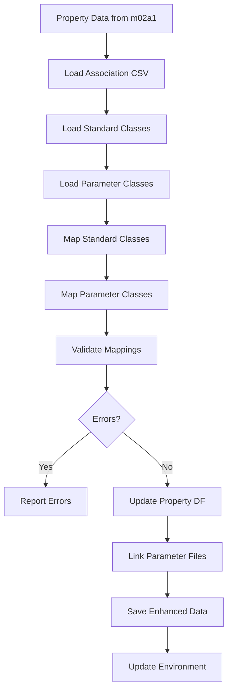

# m02a2_read_properties_association.py

## Purpose
Map imported property classes (land use, soil, etc.) to standardized parameter classes through CSV-based association tables, enabling consistent parameter assignment across different input datasets and classification schemes.

## Detailed Script Logic

### Core Workflow
1. **Environment and Property Data Loading**: Loads analysis environment and previously imported property data
2. **Association File Selection**: Prompts user to select standard and parameter class association files
3. **Subtype Handling**: Manages multiple datasets of the same source type if present
4. **Class Mapping**: Applies user-defined mappings from CSV files to property data
5. **Validation**: Verifies class consistency and parameter file existence
6. **Data Enhancement**: Updates property DataFrames with mapped classes
7. **Parameter File Linking**: Establishes connections to parameter value files
8. **Data Persistence**: Saves enhanced property data for grid indexing

### Detailed Processing Steps

#### Step 1: Environment and Property Loading
- **Logic**: Loads environment and retrieves property data from m02a1
- **Input**: `{source_type}_vars.pkl` containing property polygons
- **Validation**: Checks if property data exists and is properly formatted
- **Effect**: Provides foundation for class association

#### Step 2: Association File Selection
- **Standard Classes File**:
  - **Purpose**: Maps local class names to standardized classification scheme
  - **Default**: `standard_classes.csv`
  - **Location**: `user_control/` directory
  - **Format**: `class_id, class_name, description`
  - **Effect**: Enables consistent naming across different data sources

- **Parameter Classes File**:
  - **Purpose**: Maps standard classes to parameter value classes
  - **Default**: `parameter_classes.csv`
  - **Location**: `user_control/` directory
  - **Format**: `class_id, class_name, parameter_file`
  - **Effect**: Links classes to specific parameter value files

#### Step 3: Subtype Management
- **Logic**: Handles multiple datasets of same source type
- **Detection**: Automatically detects if multiple subtypes exist
- **Prompt**: If multiple subtypes, prompts user to select which to process
- **Effect**: Enables sequential processing of related datasets

#### Step 4: Class Association Processing
- **Function**: `class_association()` performs the mapping logic
- **Standard Class Mapping**:
  - Reads association CSV
  - Maps property `class_name` to `standard_class`
  - Validates against standard classes file
  - Updates property DataFrame

- **Parameter Class Mapping**:
  - Reads parameter association CSV
  - Maps `standard_class` to `parameter_class`
  - Validates against parameter classes file
  - Updates property DataFrame

#### Step 5: Cross-Validation
- **Logic**: Ensures consistency across all mappings
- **Checks**:
  - All class names in association CSV exist in property data
  - All standard classes exist in standard classes file
  - All parameter classes exist in parameter classes file
  - No duplicate class names within same type
- **Effect**: Prevents parameter assignment errors in downstream steps

#### Step 6: Parameter File Registration
- **Function**: Updates environment configuration with parameter file links
- **Storage**: Adds `parameter_filename` to environment settings
- **Effect**: Enables parameter value lookup in m04a

#### Step 7: Data Persistence
- **Logic**: Saves enhanced property DataFrame
- **Output**: Updates existing `{source_type}_vars.pkl`
- **Effect**: Preserves class mappings for grid indexing

## Prerequisites
- **Required**: `m02a1_import_properties_vectors.py` (provides property polygons and association CSV template)
- **Files**: 
  - Association CSV files in `user_control/`
  - Standard classes and parameter classes files
- **Environment**: Analysis environment must be initialized

## Inputs / Parameters

### CLI Arguments
- `--base_dir` (string, required):
  - **Options**: Valid directory path containing analysis environment
  - **Effect**: Loads environment and determines input/output paths
  - **Default**: None (prompts interactively)

- `--gui_mode` (boolean flag):
  - **Options**: True/False
  - **Effect**: Reserved for future GUI integration
  - **Default**: False

- `--source_type` (string, optional):
  - **Options**: `land_use`, `soil`, `vegetation`, `infrastructures`, `landslides`
  - **Effect**: Specifies which property type to process
  - **Default**: None (prompts or auto-detects from environment)
  - **Logic Influence**: Determines which property data to load and update

- `--source_subtype` (string, optional):
  - **Options**: Any subtype defined in m02a1
  - **Effect**: Specifies which subtype to process
  - **Default**: None (prompts if multiple subtypes exist)
  - **Logic Influence**: Enables targeted processing of specific datasets

- `--standard_classes_filepath` (string, optional):
  - **Options**: Path to standard classes CSV file
  - **Effect**: Overrides default standard classes file
  - **Default**: `user_control/standard_classes.csv`
  - **Logic Influence**: Allows custom classification schemes

- `--parameter_classes_filepath` (string, optional):
  - **Options**: Path to parameter classes CSV file
  - **Effect**: Overrides default parameter classes file
  - **Default**: `user_control/parameter_classes.csv`
  - **Logic Influence**: Enables custom parameter mappings

### Input Files

**Association CSV** (`user_control/{source_type}_{subtype}_association.csv`):
```csv
class_name,label,standard_class,parameter_class,info
forest,forest,FOREST,VEG_TYPE_A,High vegetation cover
urban,urban,URBAN,INFRA_TYPE_B,Residential areas
agriculture,agriculture,AGRICULTURE,VEG_TYPE_C,Cropland
```
- **Required Columns**: `class_name`, `label`
- **Optional Columns**: `standard_class`, `parameter_class`, `info`
- **Effect**: User-defined mapping from original classes to standardized system
- **Usage**: Fill in `standard_class` and `parameter_class` columns manually

**Standard Classes File** (`user_control/standard_classes.csv`):
```csv
class_id,class_name,description
FOREST,Forest,All forest types
URBAN,Urban,Urban and built-up areas
AGRICULTURE,Agriculture,Agricultural land
WATER,Water,Water bodies
BARE,Bare Soil,Exposed soil and rock
```
- **Required Columns**: `class_id`, `class_name`
- **Optional Columns**: `description`
- **Effect**: Defines standardized classification scheme
- **Validation**: Used to validate association CSV entries

**Parameter Classes File** (`user_control/parameter_classes.csv`):
```csv
class_id,class_name,parameter_filename
VEG_TYPE_A,Vegetation Type A,vegetation_parameters.csv
VEG_TYPE_B,Vegetation Type B,vegetation_parameters.csv
INFRA_TYPE_B,Infrastructure Type B,infrastructure_parameters.csv
SOIL_TYPE_C,Soil Type C,soil_parameters.csv
```
- **Required Columns**: `class_id`, `class_name`, `parameter_filename`
- **Effect**: Links classes to parameter value files
- **Validation**: Ensures parameter files exist

### Interactive Prompts
- **Standard Classes File Selection**:
  - **Prompt**: "Name or full path of the standard classes association file"
  - **Default**: `standard_classes.csv`
  - **Effect**: Determines standard classification scheme

- **Parameter Classes File Selection**:
  - **Prompt**: "Name or full path of the parameter classes association file"
  - **Default**: `parameter_classes.csv`
  - **Effect**: Determines parameter file mappings

- **Subtype Selection** (if multiple exist):
  - **Prompt**: "Select a subtype"
  - **Options**: Lists available subtypes from environment
  - **Effect**: Determines which dataset to process

## Outputs

### Primary Output
**Updated `{source_type}_vars.pkl`** - Enhanced property dictionary:
```python
{
    'prop_df': gpd.GeoDataFrame  # Property polygons with mapped classes
}
```

**Enhanced GeoDataFrame Structure**:
- `class_name`: Original attribute values (unchanged)
- `label`: User-friendly labels (unchanged)
- `standard_class`: Mapped standard class ID (updated)
- `parameter_class`: Mapped parameter class ID (updated)
- `info`: Additional metadata (updated if provided)
- `geometry`: Shapely polygon geometries (unchanged)

### Configuration Updates
- **Parameter File Links**: Adds `parameter_filename` to environment settings
- **Association Tracking**: Records which association files were used
- **Validation Status**: Marks property data as validated

### Effect on Downstream Scripts
- **m04a**: Uses parameter_class to index properties to grid
- **m05a**: Provides mapped classes for reference point analysis
- **m07a**: Enables parameter-based alert calculations

## Sample CLI Usage

### Basic Association
```bash
python m02a2_read_properties_association.py --base_dir /path/to/case1
```

### Specific Source Type
```bash
python m02a2_read_properties_association.py --base_dir /path/to/case1 --source_type land_use
```

### With Custom Classification Files
```bash
python m02a2_read_properties_association.py --base_dir /path/to/case1 --standard_classes_filepath custom_standard.csv --parameter_classes_filepath custom_parameter.csv
```

### Specific Subtype
```bash
python m02a2_read_properties_association.py --base_dir /path/to/case1 --source_type soil --source_subtype top
```

## Detailed Effects of Parameter Choices

### Association Strategy Impact

#### Complete Mapping
- **Effect**: All property classes mapped to standard and parameter classes
- **Use Case**: Comprehensive analysis, all areas classified
- **Benefit**: Maximum information utilization
- **Requirement**: Complete association CSV

#### Partial Mapping
- **Effect**: Only selected classes mapped, others remain unclassified
- **Use Case**: Focused analysis on specific land types
- **Benefit**: Simplified parameter assignment
- **Risk**: May miss important areas

#### One-to-One Mapping
- **Effect**: Each property class maps to unique standard class
- **Use Case**: Detailed classification, high precision
- **Benefit**: Precise parameter assignment
- **Challenge**: Complex association tables

#### Many-to-One Mapping
- **Effect**: Multiple property classes map to same standard class
- **Use Case**: Generalization, simplifying complex schemes
- **Benefit**: Reduced parameter complexity
- **Example**: "Oak Forest", "Pine Forest" → "FOREST"

### Standard Classes Design Impact

#### Comprehensive Scheme
- **Effect**: Many standard classes, detailed classification
- **Use Case**: Research studies, detailed analysis
- **Benefit**: High precision parameter assignment
- **Challenge**: Complex management, many parameter files

#### Simplified Scheme
- **Effect**: Few standard classes, generalized classification
- **Use Case**: Regional studies, preliminary analysis
- **Benefit**: Easy management, fewer parameter files
- **Risk**: Loss of detail, generalization errors

#### Hierarchical Scheme
- **Effect**: Nested classification levels
- **Use Case**: Multi-scale analysis
- **Benefit**: Flexibility in detail level
- **Example**: FOREST → DECIDUOUS_FOREST → OAK_FOREST

### Parameter Classes Strategy

#### Single Parameter File
- **Effect**: All classes reference same parameter file
- **Use Case**: Homogeneous parameter sets
- **Benefit**: Simple management
- **Example**: All vegetation types in `vegetation_params.csv`

#### Multiple Parameter Files
- **Effect**: Different parameter files for different class groups
- **Use Case**: Heterogeneous parameter sets
- **Benefit**: Organized parameter management
- **Example**: `soil_params.csv`, `vegetation_params.csv`, `infrastructure_params.csv`

#### Class-Specific Files
- **Effect**: Each class has dedicated parameter file
- **Use Case**: Highly customized parameters
- **Benefit**: Maximum flexibility
- **Challenge**: Many files to manage

## Code Architecture

### Key Functions
- `main()`: Primary execution function
  - Loads environment and property data
  - Manages file selection and validation
  - Coordinates association processing
  - Updates and saves enhanced data

- `class_association()`: Core mapping logic
  - Processes association CSV
  - Validates class references
  - Updates property DataFrame
  - Returns processing status

### Data Flow


### Error Handling
- **Missing Association CSV**: Clear error with file location
- **Invalid Class Names**: Reports specific class name errors
- **Missing Standard Classes**: Lists valid options
- **Missing Parameter Files**: Checks file existence
- **Duplicate Classes**: Detects and reports conflicts

## Integration with P-SLIP Workflow

### Dependencies
- **Requires**: m02a1 (property data import)
- **Required by**: m04a (parameter indexing)
- **Feeds into**: m05a (reference points), m07a (alerts)

### Data Flow Chain
1. m02a1: Import property polygons → Association CSV template
2. m02a2: Fill CSV template → Map classes → Enhanced property data
3. m04a: Use mapped classes → Index to grid → Parameter grids
4. m05a: Extract parameters at reference points
5. m07a: Use parameters for alert calculations

### Configuration Updates
- **Input Registry**: Updates environment with parameter file links
- **Validation Flags**: Marks property data as validated
- **Association Tracking**: Records association file usage

## Workflow Examples

### Complete Land Use Association
```bash
# Step 1: Import land use data
python m02a1_import_properties_vectors.py --base_dir ./case1 --source_type land_use

# Step 2: Edit association CSV in user_control/land_use_association.csv
# Add standard_class and parameter_class columns

# Step 3: Run association
python m02a2_read_properties_association.py --base_dir ./case1 --source_type land_use
```

### Multi-Layer Soil Analysis
```bash
# Import topsoil and subsoil
python m02a1_import_properties_vectors.py --base_dir ./case1 --source_type soil --source_subtype top
python m02a1_import_properties_vectors.py --base_dir ./case1 --source_type soil --source_subtype bottom

# Associate topsoil
python m02a2_read_properties_association.py --base_dir ./case1 --source_type soil --source_subtype top

# Associate subsoil
python m02a2_read_properties_association.py --base_dir ./case1 --source_type soil --source_subtype bottom
```

### Custom Classification Scheme
```bash
# Create custom standard classes
nano user_control/my_standard_classes.csv

# Create custom parameter classes
nano user_control/my_parameter_classes.csv

# Run with custom files
python m02a2_read_properties_association.py --base_dir ./case1 --standard_classes_filepath user_control/my_standard_classes.csv --parameter_classes_filepath user_control/my_parameter_classes.csv
```

## Performance Considerations

### Processing Time
- **Small Datasets** (< 100 classes): < 5 seconds
- **Medium Datasets** (100-1000 classes): 5-30 seconds
- **Large Datasets** (> 1000 classes): 30+ seconds

### Memory Usage
- **Minimal**: Only loads association CSVs and updates property DataFrames
- **Scalability**: Efficient even for large classification schemes

### Optimization Tips
1. Use consistent class naming across datasets
2. Pre-validate association CSVs before running script
3. Process subtypes sequentially to avoid confusion
4. Use standard classification schemes when possible

## Common Issues and Solutions

### Issue: "Multiple rows with the same class name"
- **Cause**: Duplicate class names in property data
- **Solution**: Check property data for duplicates, ensure unique class names

### Issue: "No rows with the class name: X"
- **Cause**: Class name in association CSV not found in property data
- **Solution**: Verify class names match exactly (case-sensitive)

### Issue: "Invalid standard_class: X"
- **Cause**: Standard class in association CSV not defined in standard classes file
- **Solution**: Add missing class to standard classes file or correct association CSV

### Issue: "Missing parameter file"
- **Cause**: Parameter file referenced in parameter classes not found
- **Solution**: Create parameter file or correct parameter classes CSV

[← m02a1_import_properties_vectors](m02a1_import_properties_vectors.md) | [m03a_dtm_base_grid →](m03a_dtm_base_grid.md)