# m03a_dtm_base_grid.py

## Purpose
Import and process Digital Terrain Model (DTM) raster data to create the foundational elevation grid and aligned base grid (ABG) structure used by all subsequent analysis scripts.

## Detailed Script Logic

### Core Workflow
1. **Environment and Study Area Loading**: Loads analysis environment and study area boundaries from previous scripts
2. **DTM File Selection**: Prompts user to select DTM raster files from input directory
3. **Raster Loading and Processing**: Imports raster data with proper georeferencing and masking
4. **Resampling (Optional)**: Allows resampling to different resolutions if needed
5. **Coordinate System Handling**: Manages geographic to projected coordinate conversions
6. **Mask Generation**: Creates spatial masks for study area boundaries
7. **Data Structure Assembly**: Organizes DTM and ABG data into pandas DataFrames
8. **Persistence**: Saves structured data for downstream scripts

### Detailed Processing Steps

#### Step 1: File Selection and Loading
- **Logic**: Uses `select_files_in_folder_prompt()` to let user choose DTM files
- **Supported Formats**: GeoTIFF (.tif), other GDAL-supported raster formats
- **File Organization**: Searches in `inputs/dtm/` subdirectory
- **Effect**: Can load single or multiple DTM files for mosaic/analysis

#### Step 2: Raster Import with Masking
- **Function**: `load_georaster()` from psliptools
- **Parameters**:
  - `filepath`: Path to raster file
  - `set_dtype`: Data type specification (e.g., 'float32')
  - `convert_to_geo`: Boolean for coordinate conversion
  - `poly_mask`: Study area polygon for clipping
  - `squeeze`: Remove singleton dimensions
  - `set_coord_dtype`: Coordinate data type ('float32')
- **Output**: Raster data array, profile (metadata), x/y coordinates, mask matrix
- **Effect**: Loads only data within study area, reduces memory usage

#### Step 3: Resampling (Conditional)
- **Logic**: If `resample_size` specified, applies resampling
- **Methods**: 
  - `average`: Mean aggregation (smooth surfaces)
  - `bilinear`: Linear interpolation
  - `cubic`: Cubic convolution
- **Effect**: Changes raster resolution, affects computation time and precision
- **Use Cases**: 
  - Downsampling for faster analysis
  - Upsampling for detailed studies
  - Standardizing multiple DTMs

#### Step 4: Coordinate Conversion
- **Function**: `convert_coords_to_geo()`
- **Input**: Projected coordinates from raster
- **Output**: Geographic coordinates (longitude/latitude)
- **Effect**: Enables geographic referencing and CRS transformations

#### Step 5: Mask Index Generation
- **Function**: `get_1d_idx_from_2d_mask()`
- **Logic**: Converts 2D boolean mask to 1D indices
- **Order**: 'C' (row-major) for efficient memory access
- **Effect**: Enables fast indexing of valid pixels

#### Step 6: Data Frame Assembly
- **DTM DataFrame**: Contains elevation data, profiles, file IDs
- **ABG DataFrame**: Contains coordinates, mask indices, spatial references
- **Structure**: Row per DTM file, organized for batch processing

## Prerequisites
- **Required**: `m01a_study_area.py` (provides study area polygon for masking)
- **Files**: DTM raster files in `inputs/dtm/` directory
- **Environment**: Analysis environment must be initialized

## Inputs / Parameters

### CLI Arguments
- `--base_dir` (string, required):
  - **Options**: Valid directory path containing analysis environment
  - **Effect**: Loads environment and determines input/output paths
  - **Default**: None (prompts interactively)

- `--gui_mode` (boolean flag):
  - **Options**: True/False
  - **Effect**: Reserved for GUI integration
  - **Default**: False

- `--resample_size` (tuple of integers, optional):
  - **Format**: `(width, height)` in pixels
  - **Effect**: Resamples all DTM rasters to specified dimensions
  - **Example**: `--resample_size 1000 800`
  - **Logic Influence**: Larger = more detail but slower, smaller = faster but less precise
  - **Default**: None (uses original resolution)

- `--resample_method` (string, optional):
  - **Options**: `average`, `bilinear`, `cubic`, `nearest`
  - **Effect**: Determines interpolation method for resampling
  - **Logic Influence**:
    - `average`: Best for categorical/smooth data
    - `bilinear`: Good balance of speed/quality
    - `cubic`: Highest quality, slower
    - `nearest`: Preserves original values
  - **Default**: `average`

- `--data_dtype` (string, optional):
  - **Options**: `float32`, `float64`, `int16`, `uint8`
  - **Effect**: Controls data type for elevation values
  - **Logic Influence**:
    - `float32`: Good precision, reasonable memory (recommended)
    - `float64`: High precision, more memory
    - `int16`: Less memory, may lose precision
  - **Default**: None (uses raster's native dtype)

- `--coord_dtype` (string, optional):
  - **Options**: `float32`, `float64`
  - **Effect**: Data type for coordinate arrays
  - **Default**: `float32`
  - **Logic Influence**: float32 saves memory for large rasters

- `--apply_mask_to_raster` (boolean flag):
  - **Options**: True/False
  - **Effect**: If True, sets pixels outside study area to NoData
  - **Default**: False
  - **Logic Influence**: True reduces file size but loses context

### Input Files
**DTM Raster Files** (in `inputs/dtm/`):
- **Required Format**: GeoTIFF (.tif) or GDAL-supported format
- **Coordinate System**: Should match or be convertible to study area CRS
- **Resolution**: Any (will be resampled if specified)
- **NoData Values**: Should be properly set in raster
- **Effect**: Provides elevation data for terrain analysis

### Interactive Prompts
- **DTM File Selection**:
  - **Prompt**: "Select DTM raster files"
  - **Options**: Lists all supported raster files in input directory
  - **Effect**: Determines which elevation datasets to process
  - **Multiple Selection**: Supported for mosaic/analysis

## Outputs

### Primary Output
**`dtm_vars.pkl`** - Dictionary containing two main DataFrames:

#### DTM DataFrame (`dtm_df`)
Contains elevation data and metadata:
```python
{
    'file_id': str,           # Unique identifier for each DTM
    'elevation': np.ndarray,  # 2D elevation array
    'profile': dict           # Rasterio profile with CRS, transform, etc.
}
```

#### ABG DataFrame (`abg_df`)
Contains spatial referencing:
```python
{
    'longitude': np.ndarray,   # 2D longitude coordinates
    'latitude': np.ndarray,    # 2D latitude coordinates  
    'mask_idx_1d': np.ndarray  # 1D indices of valid pixels
}
```

### Effect on Downstream Scripts
- **m04a**: Provides elevation grid for parameter indexing
- **m04b**: Base data for slope/aspect/curvature calculations
- **m04d**: Elevation data for landslide path routing
- **m05a**: Spatial grid for reference point analysis
- **m07a**: Elevation context for alert calculations

### Memory Considerations
- **Report**: Script calls `memory_report()` to log RAM usage
- **Scaling**: Memory usage proportional to raster size and data type
- **Optimization**: Masking reduces memory by excluding NoData pixels

## Sample CLI Usage

### Basic Usage
```bash
python m03a_dtm_base_grid.py --base_dir /path/to/case1
```

### With Resampling
```bash
python m03a_dtm_base_grid.py --base_dir /path/to/case1 --resample_size 2000 1500 --resample_method cubic
```

### Memory Optimized
```bash
python m03a_dtm_base_grid.py --base_dir /path/to/case1 --data_dtype float32 --coord_dtype float32
```

### With Masking
```bash
python m03a_dtm_base_grid.py --base_dir /path/to/case1 --apply_mask_to_raster
```

## Detailed Effects of Parameter Choices

### Resolution Impact
- **Original Resolution**:
  - Effect: Maximum detail preserved
  - Use Case: High-precision studies, detailed terrain
  - Trade-off: Higher memory and computation time

- **Downsampled** (e.g., 50% reduction):
  - Effect: Faster processing, reduced memory
  - Use Case: Large area studies, preliminary analysis
  - Trade-off: Loss of fine terrain features
  - Impact: May miss small-scale landslide features

- **Upsampled** (rare):
  - Effect: Interpolated detail, smoother surfaces
  - Use Case: Matching other high-res datasets
  - Trade-off: No real information gain, artifacts possible

### Resampling Method Effects
- **Average**:
  - Effect: Smooths terrain, reduces noise
  - Best For: General purpose, hydrological analysis
  - Risk: May smooth important micro-topography

- **Bilinear**:
  - Effect: Balanced interpolation
  - Best For: Most applications
  - Risk: Minimal, good default choice

- **Cubic**:
  - Effect: Sharpens features, preserves edges
  - Best For: Terrain with sharp breaks (cliffs, ridges)
  - Risk: May create artifacts in noisy data

- **Nearest**:
  - Effect: Preserves original pixel values
  - Best For: Categorical data, preserving NoData
  - Risk: Blocky appearance in continuous data

### Data Type Impact
- **float32** (Recommended):
  - Precision: ~6-7 decimal digits
  - Memory: 4 bytes per pixel
  - Range: ±3.4×10³⁸
  - Effect: Good for most elevation data

- **float64**:
  - Precision: ~15-16 decimal digits
  - Memory: 8 bytes per pixel (2×)
  - Use Case: High-precision surveys, critical calculations
  - Effect: Minimal precision gain for typical DTM data

- **int16**:
  - Precision: Integer values only
  - Memory: 2 bytes per pixel (0.5×)
  - Range: -32,768 to 32,767
  - Effect: May lose precision if elevation range large

### Masking Strategy Effects
- **Without Masking** (default):
  - Effect: Retains full raster extent
  - Use Case: Context preservation, edge analysis
  - Memory: Higher (includes NoData areas)

- **With Masking** (`--apply_mask_to_raster`):
  - Effect: Crops to study area only
  - Use Case: Memory-constrained systems
  - Memory: Lower (excludes external pixels)
  - Risk: Loses context for edge effects

## Code Architecture

### Key Functions
- `import_dtm_files()`: Main processing function
  - Iterates through selected DTM files
  - Applies loading, resampling, masking
  - Assembles DataFrames

### Data Flow

```mermaid
graph TD
    %% DTM Processing Flow
    A["Study Area Polygon<br/>🗺️ From m01a"] --> B["Select DTM Files<br/>⛰️ Choose elevation rasters"]
    B --> C["Load Georaster<br/>📐 Read GeoTIFF/ASC"]
    C --> D{Resample?}
    D -->|Yes| E["Resample Raster<br/>🔄 Adjust resolution"]
    D -->|No| F["Original Resolution<br/>✅ Keep native grid"]
    E --> G["Convert Coordinates<br/>🎯 To study area CRS"]
    F --> G
    G --> H["Generate Mask Indices<br/>🎭 Create study area mask"]
    H --> I{Apply Mask?}
    I -->|Yes| J["Mask Raster Data<br/>✂️ Crop to study area"]
    I -->|No| K["Keep Full Extent<br/>🌐 Preserve context"]
    J --> L["Assemble DTM DF<br/>📊 Elevation arrays"]
    K --> L
    L --> M["Assemble ABG DF<br/>📊 Base grid metadata"]
    M --> N["Save dtm_vars.pkl<br/>💾 Grids, profile, mask"]
    
    %% Styling
    style A fill:#fff3e0,stroke:#e65100,stroke-width:2px
    style N fill:#fff3e0,stroke:#e65100,stroke-width:2px
```


### Error Handling
- **Missing Files**: Clear error messages with file suggestions
- **CRS Mismatch**: Automatic conversion when possible
- **Memory Issues**: Early detection and warnings
- **Invalid Data**: NoData handling and validation

## Integration with P-SLIP Workflow

### Dependencies
- **Requires**: m01a (study area definition)
- **Required by**: m04a, m04b, m04d (all grid-based analysis)

### Data Persistence
- Saves to `variables/dtm_vars.pkl`
- Persistent across sessions
- Loaded by downstream scripts

### Configuration Updates
- Updates environment with DTM file references
- Stores file IDs for tracking
- Records processing parameters

## Performance Considerations

### Memory Usage
- **Baseline**: ~4 bytes per pixel (float32)
- **With Coordinates**: ~12 bytes per pixel (elevation + lon + lat)
- **Typical 1000×1000 raster**: ~12 MB memory
- **Scaling**: Linear with pixel count

### Computation Time
- **Loading**: Fast (disk I/O limited)
- **Resampling**: Moderate (interpolation calculations)
- **Masking**: Fast (index operations)
- **Typical 1000×1000 raster**: < 1 minute

### Optimization Tips
1. Use `float32` for elevation and coordinates
2. Apply masking to reduce memory footprint
3. Resample large rasters for preliminary analysis
4. Process multiple DTMs sequentially if memory constrained

[← m02a2_read_properties_association](m02a2_read_properties_association.md) | [m04a_parameter_indexing →](m04a_parameter_indexing.md)