# m04a_parameter_indexing.py

## Purpose
Spatially index property polygons (land use, soil, vegetation) to the Digital Terrain Model grid by determining which grid cells fall within each property polygon, resolving spatial conflicts, and creating efficient lookup structures for parameter assignment in downstream analysis.

## Detailed Script Logic

### Core Workflow
1. **Environment and Data Loading**: Loads analysis environment, DTM grids, and associated property data
2. **Property Aggregation**: Collects all property polygons with parameter class assignments
3. **Spatial Grouping**: Groups polygons by parameter class, type, and subtype
4. **Intersection Detection**: Identifies overlapping polygons that may cause conflicts
5. **Conflict Resolution**: Handles polygon intersections through user prioritization
6. **Grid Indexing**: Maps each property polygon to DTM grid cells
7. **Data Structure Creation**: Builds efficient spatial indexing system
8. **Persistence**: Saves indexed parameter data for fast lookup

### Detailed Processing Steps

#### Step 1: Raw Data Collection
- **Function**: `get_raw_associated_df()` scans all property types
- **Logic**: Iterates through `KNOWN_OPTIONAL_STATIC_INPUT_TYPES` (land_use, soil, vegetation, etc.)
- **Filtering**: Selects only polygons with parameter class assignments
- **Data Assembly**: Combines all property polygons into unified DataFrame
- **Effect**: Creates comprehensive property dataset for indexing

#### Step 2: Spatial Grouping and Merging
- **Function**: `group_associated_df()` consolidates related polygons
- **Grouping Strategy**:
  - **With Subtype**: Groups by `parameter_class`, `type`, AND `subtype`
  - **Without Subtype**: Groups by `parameter_class` and `type` only
- **Geometry Union**: Merges polygons within each group using `union_polygons()`
- **Class Name Aggregation**: Collects all original class names in lists
- **Effect**: Reduces complexity by merging adjacent/overlapping polygons of same class

#### Step 3: Spatial Conflict Detection
- **Function**: `check_and_report_polygons_alignment()`
- **Intersection Detection**: Uses `detect_intersections_between_polygons()`
- **Logic**: Identifies polygons that overlap spatially
- **Conflict Types**:
  - **Complete Overlap**: One polygon completely covers another
  - **Partial Overlap**: Polygons intersect but don't fully overlap
  - **Edge Touching**: Polygons share boundaries without area overlap
- **Effect**: Flags areas where parameter assignment is ambiguous

#### Step 4: Interactive Conflict Resolution
- **User Prompt**: `reorder_list_prompt()` when intersections detected
- **Information Display**:
  - Polygon index and identification
  - Property type and subtype
  - Class names involved
  - List of intersecting polygons
- **Priority Assignment**: User specifies processing order (higher priority = processed first)
- **Logic**: First polygon in priority order "wins" in overlapping areas
- **Effect**: Ensures consistent parameter assignment in conflict zones

#### Step 5: Grid Cell Indexing
- **Function**: `align_and_index_associated_df()` performs spatial indexing
- **Process**: For each property polygon and each DTM grid:
  1. **Spatial Query**: `raster_within_polygon()` tests grid cells against polygon
  2. **Mask Generation**: Creates boolean mask of cells inside polygon
  3. **Index Conversion**: `get_1d_idx_from_2d_mask()` converts to 1D indices
  4. **Storage**: Stores indices for efficient lookup
- **Optimization**: Only processes cells that actually intersect polygons
- **Effect**: Creates direct mapping from property polygons to grid cells

#### Step 6: Data Structure Assembly
- **Output Structure**: DataFrame with spatial indexing
- **Columns**:
  - `parameter_class`: Assigned parameter class ID
  - `type`: Property type (land_use, soil, etc.)
  - `subtype`: Property subtype if applicable
  - `class_name`: List of original class names
  - `geometry`: Unioned polygon geometry
  - `abg_idx_1d`: List of 1D indices for each DTM grid
- **Effect**: Enables fast parameter lookup by grid cell

## Prerequisites
- **Required**: 
  - `m03a_dtm_base_grid.py` (provides DTM and ABG grids)
  - `m02a2_read_properties_association.py` (provides property-parameter mappings)
- **Files**: 
  - `dtm_vars.pkl` with ABG DataFrame
  - `{source_type}_vars.pkl` for each property type
  - Association CSVs with parameter class assignments
- **Environment**: Analysis environment must be initialized

## Inputs / Parameters

### CLI Arguments
- `--base_dir` (string, required):
  - **Options**: Valid directory path containing analysis environment
  - **Effect**: Loads environment and all required data files
  - **Default**: None (prompts interactively)

- `--gui_mode` (boolean flag):
  - **Options**: True/False
  - **Effect**: Reserved for future GUI integration
  - **Default**: False

### Input Data (from previous scripts)
**DTM Variables** (`dtm_vars.pkl`):
- **abg_df**: Aligned base grid with coordinate arrays
- **Effect**: Provides spatial framework for indexing

**Property Variables** (`{source_type}_vars.pkl`):
- **prop_df**: Property polygons with parameter class assignments
- **Effect**: Provides property geometries and classifications

**Association Data** (from CSVs):
- **parameter_class**: Mapped parameter classes for each property
- **Effect**: Determines parameter assignment priorities

### Interactive Prompts
- **Polygon Priority Selection** (when conflicts detected):
  - **Prompt**: "Select processing order for conflicting polygons"
  - **Options**: Lists all intersecting polygon groups
  - **Effect**: Determines which polygon "wins" in overlap areas
  - **Considerations**: Typically prioritize more specific/detailed polygons first

## Outputs

### Primary Output
**`parameter_vars.pkl`** - Dictionary containing:

#### Association DataFrame (`association_df`)
```python
{
    'parameter_class': str,           # Parameter class identifier
    'type': str,                      # Property type (land_use, soil, etc.)
    'subtype': str,                   # Property subtype (optional)
    'class_name': list,               # Original class names
    'geometry': shapely.Polygon,      # Unioned polygon geometry
    'abg_idx_1d': list[np.ndarray]    # 1D indices for each DTM grid
}
```

#### Alignment Status (`originally_aligned`)
- **Type**: Boolean
- **Meaning**: 
  - `True`: No polygon intersections detected
  - `False`: Intersections were found and resolved
- **Effect**: Indicates data quality and processing complexity

### Effect on Downstream Scripts
- **m05a**: Provides indexed parameters for reference point extraction
- **m07a**: Enables parameter-based susceptibility calculations
- **Analysis**: Foundation for spatial parameter assignment in all subsequent steps

### Spatial Indexing Benefits
- **Fast Lookup**: Direct mapping from grid cells to parameter classes
- **Memory Efficient**: Only stores indices for relevant cells
- **Scalable**: Works with large grids and many property polygons
- **Flexible**: Handles multiple DTM grids seamlessly

## Sample CLI Usage

### Basic Parameter Indexing
```bash
python m04a_parameter_indexing.py --base_dir /path/to/case1
```

### With GUI Mode (if implemented)
```bash
python m04a_parameter_indexing.py --base_dir /path/to/case1 --gui_mode
```

## Detailed Effects of Parameter Choices

### Property Type Priority Impact

#### High Priority Properties (Processed First)
- **Effect**: "Win" in overlapping areas
- **Use Case**: Critical infrastructure, detailed soil mapping
- **Example**: Buildings override vegetation in overlap areas
- **Consideration**: May mask important natural features

#### Low Priority Properties (Processed Last)
- **Effect**: Overridden by higher priority properties
- **Use Case**: Generalized land cover, background vegetation
- **Example**: General forest overridden by specific soil types
- **Consideration**: May lose detail in conflict zones

### Spatial Conflict Resolution Strategies

#### Detailed-First Strategy
- **Order**: Most detailed → Least detailed
- **Effect**: Preserves fine-scale features
- **Use Case**: High-resolution studies
- **Example**: Soil types override land use in overlaps

#### General-First Strategy
- **Order**: Most general → Most specific
- **Effect**: Maintains broad patterns
- **Use Case**: Regional analysis
- **Example**: Land use overrides soil types

#### Critical-First Strategy
- **Order**: Most critical → Least critical
- **Effect**: Prioritizes important features
- **Use Case**: Risk assessment
- **Example**: Infrastructure overrides all natural features

### Property Subtype Impact

#### With Subtype Differentiation
- **Effect**: Separate indexing for each subtype
- **Use Case**: Multi-layer analysis (e.g., topsoil vs subsoil)
- **Benefit**: Preserves vertical stratification
- **Complexity**: More parameter classes to manage

#### Without Subtype Differentiation
- **Effect**: Combined indexing across subtypes
- **Use Case**: Single-layer analysis
- **Benefit**: Simplified parameter structure
- **Risk**: May lose important vertical variations

### Grid Resolution Impact

#### High Resolution Grids (small cells)
- **Effect**: Precise boundary representation
- **Benefit**: Accurate parameter assignment
- **Cost**: More memory, longer processing
- **Use Case**: Site-specific studies

#### Low Resolution Grids (large cells)
- **Effect**: Generalized boundaries
- **Benefit**: Faster processing, less memory
- **Cost**: Loss of boundary precision
- **Use Case**: Regional studies

## Code Architecture

### Key Functions
- `main()`: Primary execution function
  - Coordinates data loading and processing
  - Manages conflict resolution
  - Saves final indexed data

- `get_raw_associated_df()`: Data collection
  - Scans all property types
  - Filters by parameter class assignment
  - Assembles unified dataset

- `group_associated_df()`: Spatial consolidation
  - Groups related polygons
  - Unions geometries
  - Simplifies structure

- `align_and_index_associated_df()`: Core indexing
  - Maps polygons to grid cells
  - Creates spatial indices
  - Optimizes for lookup

### Data Flow

```mermaid
graph TD
    %% Parameter Indexing Flow
    A["DTM Grids<br/>⛰️ From m03a"] --> B["Load Property Data<br/>📦 soil/vegetation/land_use vars"]
    B --> C["Collect All Properties<br/>📊 Merge GeoDataFrames"]
    C --> D["Group by Class/Type<br/>🏷️ Organize by parameter class"]
    D --> E{Intersections?}
    E -->|Yes| F["User Priority Selection<br/>⚙️ Resolve overlaps"]
    E -->|No| G["Proceed to Indexing<br/>✅ No conflicts"]
    F --> G
    G --> H["Index to Grid Cells<br/>🎯 Map polygons to pixels"]
    H --> I["Create Lookup Structure<br/>📇 Fast spatial queries"]
    I --> J["Save parameter_vars.pkl<br/>💾 Class per pixel"]
    
    %% Styling
    style A fill:#fce4ec,stroke:#880e4f,stroke-width:2px
    style J fill:#fce4ec,stroke:#880e4f,stroke-width:2px
```


### Spatial Indexing Algorithm
```python
# For each property polygon
for polygon in property_polygons:
    # For each DTM grid
    for grid in dtm_grids:
        # Test grid cells against polygon
        mask = raster_within_polygon(polygon, grid.lon, grid.lat)
        
        # Convert 2D mask to 1D indices
        indices = get_1d_idx_from_2d_mask(mask)
        
        # Store for fast lookup
        polygon.abg_idx_1d[grid.id] = indices
```

### Error Handling
- **Missing Property Data**: Validates all required property files exist
- **Invalid Parameter Classes**: Checks parameter class consistency
- **Spatial Errors**: Handles invalid geometries gracefully
- **Memory Issues**: Monitors and reports RAM usage

## Integration with P-SLIP Workflow

### Dependencies
- **Requires**: m03a (DTM grids), m02a2 (parameter associations)
- **Required by**: m05a (reference points), m07a (susceptibility analysis)

### Data Flow Chain
1. m02a1: Import property polygons
2. m02a2: Map properties to parameter classes
3. m03a: Create DTM grids
4. m04a: Index properties to grids ← **This script**
5. m05a: Extract parameters at reference points
6. m07a: Use parameters for susceptibility calculations

### Configuration Updates
- **None**: This script doesn't update environment configuration
- **Data Only**: Creates spatial indexing structure

## Performance Considerations

### Computation Time
- **Property Loading**: Fast (already processed)
- **Grouping**: Moderate (geometry unions)
- **Intersection Detection**: Fast (bounding box checks)
- **Grid Indexing**: Variable (depends on polygon complexity and grid size)
- **Typical 1000×1000 Grid**: 5-15 minutes with 100 polygons

### Memory Usage
- **Property Data**: Moderate (polygon geometries)
- **Index Storage**: Efficient (only stores relevant indices)
- **Peak Usage**: During intersection detection and grid indexing
- **Optimization**: Processes one polygon-grid pair at a time

### Scalability
- **Grid Size**: Linear scaling with number of grid cells
- **Polygon Count**: Linear scaling with number of polygons
- **Polygon Complexity**: Exponential scaling with vertex count
- **Optimization Tips**:
  1. Simplify complex polygons before indexing
  2. Process large datasets in batches
  3. Use appropriate grid resolution for study needs

## Spatial Conflict Examples

### Example 1: Soil vs Land Use Overlap
```
Polygon A: Soil Type X (parameter_class: SOIL_A)
Polygon B: Land Use Forest (parameter_class: VEG_FOREST)
Overlap Area: 500 m²

User Priority: Soil Type X → Land Use Forest
Result: Overlap area assigned to SOIL_A
```

### Example 2: Multi-Layer Vegetation
```
Polygon A: Dense Forest (parameter_class: VEG_DENSE)
Polygon B: Sparse Vegetation (parameter_class: VEG_SPARSE)
Polygon C: Grassland (parameter_class: VEG_GRASS)
All three overlap in same area

User Priority: Dense Forest → Sparse Vegetation → Grassland
Result: Entire overlap area assigned to VEG_DENSE
```

### Example 3: Infrastructure vs Natural Features
```
Polygon A: Building (parameter_class: INFRA_BUILDING)
Polygon B: Urban Land Use (parameter_class: LU_URBAN)
Polygon C: Soil Type Y (parameter_class: SOIL_B)
All overlap in development area

User Priority: Building → Urban Land Use → Soil Type
Result: Overlap hierarchy preserves infrastructure data
```

## Quality Control

### Validation Methods
- **Visual Inspection**: Plot indexed grids vs original polygons
- **Area Comparison**: Check total indexed area matches polygon area
- **Boundary Accuracy**: Verify grid cell assignment at boundaries
- **Conflict Resolution**: Confirm priority order produces expected results

### Common Issues
- **Incomplete Coverage**: Some grid cells not assigned to any polygon
- **Double Assignment**: Grid cells assigned to multiple polygons (should not occur after conflict resolution)
- **Boundary Artifacts**: Stair-step patterns at polygon edges
- **Small Polygon Loss**: Very small polygons may not index to any grid cells

### Quality Indicators
- **Complete Coverage**: All relevant grid cells assigned
- **Consistent Priorities**: Conflict resolution produces logical results
- **Efficient Indexing**: Fast parameter lookup in downstream scripts
- **Memory Efficiency**: Reasonable file sizes for indexed data

## Advanced Usage

### Multi-Scale Analysis
```bash
# Index to multiple grid resolutions
python m04a_parameter_indexing.py --base_dir ./high_res_case
python m04a_parameter_indexing.py --base_dir ./low_res_case
```

### Temporal Parameter Analysis
```bash
# Index different time periods
python m04a_parameter_indexing.py --base_dir ./case_2018
python m04a_parameter_indexing.py --base_dir ./case_2023
```

### Scenario-Based Prioritization
```bash
# Different conflict resolution strategies
# Edit priorities interactively based on analysis goals
python m04a_parameter_indexing.py --base_dir /path/to/case1
# Follow prompts for custom priority ordering
```

[← m03a_dtm_base_grid](m03a_dtm_base_grid.md) | [m04b_morphological_grids →](m04b_morphological_grids.md)