# m04b_morphological_grids.py

## Purpose
Calculate terrain morphological parameters including slope gradients, aspect directions, and various curvature measures from Digital Terrain Model (DTM) data, providing essential inputs for landslide susceptibility analysis and hydrological modeling.

## Detailed Script Logic

### Core Workflow
1. **Environment and DTM Loading**: Loads analysis environment and DTM/ABG data from m03a
2. **Morphological Parameter Calculation**: Computes slope, aspect, and curvature grids
3. **Iterative Processing**: Processes each DTM file in the dataset
4. **Data Organization**: Structures results into pandas DataFrames
5. **Memory Management**: Monitors and reports memory usage
6. **Data Persistence**: Saves morphological grids for downstream analysis

### Detailed Processing Steps

#### Step 1: Data Loading and Validation
- **Logic**: Loads DTM variables from `dtm_vars.pkl`
- **Input Validation**: Ensures DTM and ABG DataFrames are properly structured
- **Data Extraction**: Retrieves elevation grids and coordinate arrays
- **Effect**: Provides foundation for morphological calculations

#### Step 2: Slope and Aspect Calculation
- **Function**: `generate_slope_and_aspect_rasters()` from psliptools
- **Algorithm**: Finite difference method using 3×3 kernel
- **Slope Calculation**:
  - Computes gradients in x and y directions
  - Calculates slope angle: `slope = arctan(sqrt(dz/dx² + dz/dy²))`
  - Converts to degrees: `slope_degrees = slope * (180/π)`
  - Output type: `float32` for memory efficiency
  
- **Aspect Calculation**:
  - Determines direction of maximum slope
  - Calculates: `aspect = arctan2(dz/dy, -dz/dx)`
  - Converts to degrees (0° = North, 90° = East)
  - Handles flat areas (aspect = -1 or NaN)
  - Output type: `float32`

- **Edge Handling**: Uses padding or reduced kernel at boundaries
- **NoData Propagation**: Preserves NoData values from input DTM

#### Step 3: Curvature Calculation
- **Function**: `generate_curvature_rasters()` from psliptools
- **Algorithm**: Second derivative calculation using finite differences
- **Profile Curvature** (parallel to slope direction):
  - Measures convergence/divergence of flow
  - Positive: Convex (diverging flow)
  - Negative: Concave (converging flow)
  - Zero: Planar surface
  
- **Planform Curvature** (perpendicular to slope direction):
  - Measures flow acceleration/deceleration
  - Positive: Convex (flow deceleration)
  - Negative: Concave (flow acceleration)
  - Zero: Straight flow lines

- **Twisting Curvature** (torsion):
  - Measures change in aspect direction
  - Indicates flow path complexity
  - Important for 3D terrain analysis

- **Output Types**: All curvatures as `float32`
- **Units**: Curvature in m⁻¹ (1/meters)

#### Step 4: Data Frame Assembly
- **Angles DataFrame**:
  ```python
  {
      'file_id': str,      # DTM file identifier
      'slope': np.ndarray,  # Slope grid (degrees)
      'aspect': np.ndarray  # Aspect grid (degrees)
  }
  ```

- **Curvatures DataFrame**:
  ```python
  {
      'file_id': str,           # DTM file identifier
      'profile': np.ndarray,    # Profile curvature (m⁻¹)
      'planform': np.ndarray,   # Planform curvature (m⁻¹)
      'twisting': np.ndarray    # Twisting curvature (m⁻¹)
  }
  ```

#### Step 5: Memory Monitoring
- **Function**: `memory_report()` tracks RAM usage
- **Purpose**: Ensures efficient memory management
- **Effect**: Warns if memory usage approaches limits

## Prerequisites
- **Required**: `m03a_dtm_base_grid.py` (provides DTM and ABG grids)
- **Files**: `dtm_vars.pkl` must exist in variables directory
- **Environment**: Analysis environment must be initialized

## Inputs / Parameters

### CLI Arguments
- `--base_dir` (string, required):
  - **Options**: Valid directory path containing analysis environment
  - **Effect**: Loads environment and DTM data
  - **Default**: None (prompts interactively)

- `--gui_mode` (boolean flag):
  - **Options**: True/False
  - **Effect**: Reserved for future GUI integration
  - **Default**: False

### Input Data (from m03a)
**DTM Variables** (`dtm_vars.pkl`):
- **dtm_df**: Elevation grids and metadata
- **abg_df**: Coordinate arrays and mask indices
- **Effect**: Provides elevation data and spatial referencing

## Outputs

### Primary Output
**`morphology_vars.pkl`** - Dictionary containing:

#### Angles DataFrame (`angles_df`)
- **Structure**: One row per DTM file
- **Columns**:
  - `file_id`: Unique DTM identifier
  - `slope`: 2D array of slope angles (degrees, float32)
  - `aspect`: 2D array of aspect directions (degrees, float32)
- **Dimensions**: Matches input DTM grids
- **NoData Handling**: Preserves NoData from input DTM

#### Curvatures DataFrame (`curvatures_df`)
- **Structure**: One row per DTM file
- **Columns**:
  - `file_id`: Unique DTM identifier
  - `profile`: 2D array of profile curvature (m⁻¹, float32)
  - `planform`: 2D array of planform curvature (m⁻¹, float32)
  - `twisting`: 2D array of twisting curvature (m⁻¹, float32)
- **Dimensions**: Matches input DTM grids
- **NoData Handling**: Preserves NoData from input DTM

### Effect on Downstream Scripts
- **m04d**: Slope data for landslide path routing algorithms
- **m05a**: Morphological parameters at reference points
- **m07a**: Slope and curvature for susceptibility calculations
- **Analysis**: Critical inputs for stability modeling

### Memory Usage Report
- **Logged Information**: Current RAM usage after calculations
- **Purpose**: Helps identify memory-intensive operations
- **Typical Usage**: Moderate increase over DTM size

## Sample CLI Usage

### Basic Morphology Generation
```bash
python m04b_morphological_grids.py --base_dir /path/to/case1
```

### With GUI Mode (if implemented)
```bash
python m04b_morphological_grids.py --base_dir /path/to/case1 --gui_mode
```

## Detailed Effects of Parameter Choices

### DTM Resolution Impact

#### High Resolution DTM (e.g., 1m)
- **Slope Accuracy**: Very high, captures micro-topography
- **Curvature Detail**: Excellent, resolves small features
- **Computation Time**: Long (large grids)
- **Memory Usage**: High
- **Use Case**: Detailed site investigations, small study areas
- **Effect**: May capture noise, requires filtering

#### Medium Resolution DTM (e.g., 10-30m)
- **Slope Accuracy**: Good, balances detail and noise
- **Curvature Detail**: Good, meaningful terrain features
- **Computation Time**: Moderate
- **Memory Usage**: Moderate
- **Use Case**: Most landslide studies, regional analysis
- **Effect**: Optimal balance for most applications

#### Low Resolution DTM (e.g., > 30m)
- **Slope Accuracy**: Reduced, generalized terrain
- **Curvature Detail**: Limited, misses small features
- **Computation Time**: Fast
- **Memory Usage**: Low
- **Use Case**: Large area screening, preliminary analysis
- **Effect**: May miss important terrain details

### Slope Calculation Effects

#### Steep Slopes (> 30°)
- **Calculation**: Accurate, well-defined gradients
- **Importance**: Critical for landslide analysis
- **Effect**: High slope values drive instability
- **Consideration**: May need clipping for extreme values

#### Moderate Slopes (10-30°)
- **Calculation**: Very accurate
- **Importance**: Common landslide occurrence range
- **Effect**: Primary focus for most analyses
- **Consideration**: Optimal range for detailed study

#### Gentle Slopes (< 10°)
- **Calculation**: Accurate but may be affected by noise
- **Importance**: Less critical for landslides
- **Effect**: Generally stable except for specific conditions
- **Consideration**: May benefit from smoothing

### Aspect Calculation Effects

#### North-Facing Slopes (0-45°, 315-360°)
- **Effect**: Less solar radiation, higher soil moisture
- **Impact**: May influence vegetation, soil properties
- **Consideration**: Important for ecological factors

#### South-Facing Slopes (135-225°)
- **Effect**: More solar radiation, drier conditions
- **Impact**: Different vegetation, soil development
- **Consideration**: Affects evapotranspiration

#### East/West-Facing Slopes (45-135°, 225-315°)
- **Effect**: Moderate solar exposure
- **Impact**: Intermediate conditions
- **Consideration**: Balanced environmental factors

### Curvature Calculation Effects

#### Profile Curvature Impact
- **Positive (Convex)**: 
  - Effect: Flow divergence, sediment deposition
  - Impact: Generally more stable
  - Use: Identifies ridge lines, convex breaks

- **Negative (Concave)**:
  - Effect: Flow convergence, erosion
  - Impact: Potential instability
  - Use: Identifies hollows, channels

- **Zero (Planar)**:
  - Effect: Uniform flow
  - Impact: Neutral stability
  - Use: Identifies planar slopes

#### Planform Curvature Impact
- **Positive (Convex)**:
  - Effect: Flow deceleration, deposition
  - Impact: Reduced erosion potential
  - Use: Identifies convex slope elements

- **Negative (Concave)**:
  - Effect: Flow acceleration, erosion
  - Impact: Increased erosion potential
  - Use: Identifies concavities, gullies

- **Zero (Straight)**:
  - Effect: Uniform flow velocity
  - Impact: Neutral erosion
  - Use: Identifies straight slopes

#### Twisting Curvature Impact
- **High Values**:
  - Effect: Complex flow paths, turbulence
  - Impact: Variable erosion patterns
  - Use: Identifies terrain complexity

- **Low Values**:
  - Effect: Simple flow paths
  - Impact: Predictable erosion
  - Use: Identifies simple slopes

## Code Architecture

### Key Functions
- `main()`: Primary execution function
  - Loads environment and DTM data
  - Coordinates morphological calculations
  - Saves results and reports memory

- `get_angles_and_curvatures()`: Core processing function
  - Iterates through DTM files
  - Calculates slope, aspect, and curvatures
  - Assembles results into DataFrames

### Data Flow

```mermaid
graph TD
    %% Morphological Analysis Flow
    A["DTM from m03a<br/>⛰️ Elevation grids"] --> B["Load Elevation Grids<br/>📐 Read raster arrays"]
    B --> C["Calculate Slope<br/>📈 Gradient magnitude"]
    B --> D["Calculate Aspect<br/>🧭 Direction (degrees)"]
    B --> E["Calculate Profile Curvature<br/>📉 Parallel to slope"]
    B --> F["Calculate Planform Curvature<br/>📊 Perpendicular to slope"]
    B --> G["Calculate Twisting Curvature<br/>🌀 Terrain complexity"]
    C --> H["Assemble Angles DF<br/>📊 Slope + Aspect arrays"]
    D --> H
    E --> I["Assemble Curvatures DF<br/>📊 Profile + Planform + Twist"]
    F --> I
    G --> I
    H --> J["Memory Report<br/>💾 RAM usage summary"]
    I --> J
    J --> K["Save morphology_vars.pkl<br/>💾 Grids, metadata"]
    
    %% Styling
    style A fill:#f3e5f5,stroke:#4a148c,stroke-width:2px
    style K fill:#f3e5f5,stroke:#4a148c,stroke-width:2px
```


### Algorithm Details

#### Slope Calculation Algorithm
```python
# Finite difference gradients
dz_dx = (elevation[i, j+1] - elevation[i, j-1]) / (2 * cell_size_x)
dz_dy = (elevation[i+1, j] - elevation[i-1, j]) / (2 * cell_size_y)

# Slope angle
slope_radians = np.arctan(np.sqrt(dz_dx**2 + dz_dy**2))
slope_degrees = slope_radians * (180 / np.pi)
```

#### Aspect Calculation Algorithm
```python
# Aspect direction
aspect_radians = np.arctan2(dz_dy, -dz_dx)

# Convert to degrees and adjust for North = 0°
aspect_degrees = aspect_radians * (180 / np.pi)
aspect_degrees = (90 - aspect_degrees) % 360

# Handle flat areas
aspect_degrees[slope_degrees < 0.1] = -1  # or np.nan
```

#### Curvature Calculation Algorithm
```python
# Second derivatives
d2z_dx2 = (elevation[i, j+1] - 2*elevation[i, j] + elevation[i, j-1]) / cell_size_x**2
d2z_dy2 = (elevation[i+1, j] - 2*elevation[i, j] + elevation[i-1, j]) / cell_size_y**2
d2z_dxdy = (elevation[i+1, j+1] - elevation[i+1, j-1] - elevation[i-1, j+1] + elevation[i-1, j-1]) / (4 * cell_size_x * cell_size_y)

# Profile curvature
profile_curvature = -(d2z_dx2 * dz_dx**2 + 2 * d2z_dxdy * dz_dx * dz_dy + d2z_dy2 * dz_dy**2) / (slope**2 * (1 + slope**2)**1.5)

# Planform curvature
planform_curvature = -(d2z_dx2 * dz_dy**2 - 2 * d2z_dxdy * dz_dx * dz_dy + d2z_dy2 * dz_dx**2) / (slope**2 * (1 + slope**2)**1.5)
```

### Error Handling
- **Missing DTM Data**: Validates DTM variables exist
- **Memory Issues**: Monitors and reports RAM usage
- **Invalid Grids**: Checks grid dimensions and validity
- **NoData Propagation**: Properly handles missing values

## Integration with P-SLIP Workflow

### Dependencies
- **Requires**: m03a (DTM and ABG grids)
- **Required by**: m04d, m05a, m07a (morphological analysis)

### Data Flow Chain
1. m03a: Import DTM → Elevation grids
2. m04b: Calculate morphology → Slope, aspect, curvatures
3. m04d: Use slope for path routing
4. m05a: Extract morphology at reference points
5. m07a: Use morphology for susceptibility analysis

### Configuration Updates
- **None**: This script doesn't update environment configuration
- **Data Only**: Adds morphological variables to analysis

## Performance Considerations

### Computation Time
- **Slope/Aspect**: Fast (single pass through grid)
- **Curvatures**: Moderate (second derivative calculations)
- **Typical 1000×1000 Grid**: 1-5 minutes
- **Scaling**: Linear with grid size

### Memory Usage
- **Input**: DTM size (4 bytes per pixel for float32)
- **Output**: 5× input size (slope, aspect, 3 curvatures)
- **Typical 1000×1000 Grid**: ~20 MB output
- **Peak Usage**: During curvature calculations

### Optimization Tips
1. Process large study areas as multiple smaller DTMs
2. Use float32 for all outputs (sufficient precision)
3. Consider resampling very high-resolution DTMs
4. Monitor memory usage for large grids

## Scientific Significance

### Slope in Landslide Analysis
- **Critical Factor**: Primary control on stability
- **Threshold Effects**: Often > 25-30° for landslides
- **Use**: Direct input to stability models
- **Interpretation**: Higher slopes = higher susceptibility

### Aspect in Environmental Analysis
- **Microclimate**: Controls solar radiation, moisture
- **Vegetation**: Influences root reinforcement
- **Soil Development**: Affects soil properties
- **Use**: Environmental context for landslides

### Curvature in Hydrological Analysis
- **Flow Concentration**: Concave areas collect water
- **Erosion Potential**: High curvature = high erosion
- **Deposition Zones**: Convex areas deposit sediment
- **Use**: Identifies potential failure locations

## Quality Control

### Validation Methods
- **Visual Inspection**: Compare with hillshade maps
- **Statistical Checks**: Reasonable value ranges
- **Cross-Validation**: Compare with known terrain features
- **Slope Distribution**: Should match terrain character

### Common Issues
- **Edge Effects**: Boundary pixels may have artifacts
- **Noise Amplification**: Curvature amplifies DTM noise
- **Flat Area Handling**: Special consideration for zero slopes
- **NoData Propagation**: Ensure proper handling

### Quality Indicators
- **Smooth Gradients**: No sudden jumps (except at breaks)
- **Consistent Values**: Within expected ranges
- **Terrain Correspondence**: Matches known features
- **Memory Efficiency**: Reasonable file sizes

[← m04a_parameter_indexing](m04a_parameter_indexing.md) | [m04c_import_time_sensitive_data →](m04c_import_time_sensitive_data.md)