# m04d_landslides_paths.py

## Purpose
Generate potential landslide flow paths using various routing algorithms (gradient descent, D8 flow direction, slope-compatible) from user-specified starting points to model runout behavior, deposition zones, and flow trajectories for landslide hazard assessment.

## Detailed Script Logic

### Core Workflow
1. **Environment and Data Loading**: Loads analysis environment, DTM grids, and starting point data
2. **Starting Point Selection**: Identifies path origins from reference points, landslide datasets, or potential landslide locations
3. **Routing Method Application**: Applies selected routing algorithm to generate flow paths
4. **Path Quality Assessment**: Evaluates path realism and validity
5. **Path Management**: Handles path limits and memory constraints
6. **Data Organization**: Structures path data for analysis and visualization
7. **Persistence**: Saves comprehensive path dataset

### Detailed Processing Steps

#### Step 1: Starting Point Determination
- **Function**: `get_starting_points()` loads path origin data
- **Source Options**:
  - `reference_points`: User-defined points from CSV
  - `landslides_dataset`: Historical landslide locations
  - `potential_landslides`: Susceptibility-based potential locations
- **Data Structure**: DataFrame with id, longitude, latitude
- **Effect**: Establishes where paths will originate

#### Step 2: Coordinate System Preparation
- **Function**: `convert_abg_and_ref_points_to_prj()` handles coordinate transformations
- **Process**: Converts geographic coordinates to projected CRS
- **Necessity**: Required for accurate distance and slope calculations
- **Effect**: Ensures consistent spatial referencing

#### Step 3: Path Generation Algorithm Selection

##### Method 1: Gradient Descent (`--method gradient`)
- **Algorithm**: Continuous gradient following
- **Process**:
  1. Compute terrain gradient at current position
  2. Determine flow direction (downstream = negative gradient, upstream = positive)
  3. Move in gradient direction with adaptive step size
  4. Snap to nearest grid cell
  5. Calculate deviation from ideal gradient path
  6. Validate step based on minimum slope threshold
- **Advantages**: Smooth paths, natural flow behavior
- **Disadvantages**: Computationally intensive, may overshoot in steep terrain
- **Use Case**: Detailed flow path analysis, debris flow modeling

##### Method 2: D8 Flow Direction (`--method d8-flow`)
- **Algorithm**: Discrete 8-direction flow routing
- **Process**:
  1. Evaluate slopes to 8 neighboring cells
  2. Select steepest descent/ascent direction
  3. Move to selected neighbor
  4. No deviation (always follows steepest path)
  5. Validate based on slope threshold
- **Advantages**: Fast, computationally efficient, well-established
- **Disadvantages**: Discretized directions, may miss optimal paths
- **Use Case**: Quick analysis, large datasets, standard hydrological routing

##### Method 3: Slope-Compatible (`--method slope-compatible`)
- **Algorithm**: Multi-path exploration with slope constraints
- **Process**:
  1. Generate multiple potential paths from each starting point
  2. Evaluate all slope-compatible directions
  3. Branch at decision points
  4. Apply realism scoring
  5. Select most realistic paths
- **Advantages**: Captures path uncertainty, multiple scenarios
- **Disadvantages**: Very computationally intensive, many paths
- **Use Case**: Probabilistic hazard assessment, uncertainty analysis

#### Step 4: Path Generation Execution
- **Function**: `generate_steepsets_path()` for single-path methods
- **Function**: `generate_slope_compatible_paths()` for multi-path method
- **Process**: Iterative step-by-step path construction
- **Memory Management**: Caching, progress monitoring, path limits
- **Effect**: Creates complete path trajectories

#### Step 5: Stopping Criteria Evaluation
Paths stop when:
- **Edge Reached**: Path exits grid boundaries (`edge_reached`)
- **Loop Detected**: Path intersects itself (`loop_detected`)
- **Invalid Slope**: Too many consecutive low-slope steps (`invalid_steps_tolerance_reached`)
- **Opposite Flow**: Flow direction contradicts expected behavior (`greater_than_tolerance_opposite_flow`)
- **Maximum Steps**: Path exceeds length limit (`max_runout`)
- **Path Limit**: Maximum number of paths exceeded (`partial_because_max_paths_exceeded`)
- **Completion**: Path reaches natural termination (`completed`)

#### Step 6: Path Quality Metrics
- **Step Deviation**: Angle difference from ideal gradient direction
- **Step Validity**: Whether each step meets slope threshold
- **Path Realism Score**: Overall path quality assessment
- **Effect**: Enables filtering and prioritization of paths

#### Step 7: Data Structure Assembly
- **Path Coordinates**: 3D coordinates (x, y, z) for each path point
- **Path Indices**: 2D grid indices for spatial referencing
- **Metadata**: Method, flow sense, stopping reason, quality metrics
- **Effect**: Comprehensive path dataset for analysis

## Prerequisites
- **Required**: `m03a_dtm_base_grid.py` (provides DTM and ABG grids)
- **Optional**: `m05a_reference_points_info.py` (provides reference point utilities)
- **Files**: Starting point data (reference_points.csv or landslide datasets)
- **Environment**: Analysis environment must be initialized

## Inputs / Parameters

### CLI Arguments
- `--base_dir` (string, required):
  - **Options**: Valid directory path containing analysis environment
  - **Effect**: Loads environment and DTM data
  - **Default**: None (prompts interactively)

- `--gui_mode` (boolean flag):
  - **Options**: True/False
  - **Effect**: Reserved for future GUI integration
  - **Default**: False

- `--starting_source` (string):
  - **Options**: `reference_points`, `landslides_dataset`, `potential_landslides`
  - **Effect**: Determines source of path starting points
  - **Default**: `reference_points`
  - **Logic Influence**:
    - `reference_points`: Uses user-defined points from CSV
    - `landslides_dataset`: Uses historical landslide locations
    - `potential_landslides`: Uses susceptibility-based locations

- `--file_path` (string, optional):
  - **Options**: Path to starting points file
  - **Effect**: Overrides default starting points file
  - **Default**: `reference_points.csv`
  - **Logic Influence**: Enables custom starting point datasets

- `--id_column` (string):
  - **Options**: Column name for point identifiers
  - **Effect**: Specifies ID field in starting points file
  - **Default**: `id`
  - **Logic Influence**: Affects path identification and tracking

- `--x_column` (string):
  - **Options**: Column name for x/longitude coordinates
  - **Effect**: Specifies horizontal coordinate field
  - **Default**: `lon`
  - **Logic Influence**: Determines spatial referencing

- `--y_column` (string):
  - **Options**: Column name for y/latitude coordinates
  - **Effect**: Specifies vertical coordinate field
  - **Default**: `lat`
  - **Logic Influence**: Determines spatial referencing

- `--method` (string):
  - **Options**: `gradient`, `d8-flow`, `slope-compatible`
  - **Effect**: Determines path routing algorithm
  - **Default**: `gradient`
  - **Logic Influence**:
    - `gradient`: Smooth continuous paths
    - `d8-flow`: Discrete 8-direction routing
    - `slope-compatible`: Multi-path exploration

- `--flow` (string):
  - **Options**: `downstream`, `upstream`
  - **Effect**: Determines flow direction
  - **Default**: `downstream`
  - **Logic Influence**:
    - `downstream`: Follows descending slopes (typical for landslides)
    - `upstream`: Follows ascending slopes (for source area identification)

- `--step_size` (integer):
  - **Options**: Any positive integer (typically 1-5)
  - **Effect**: Controls path resolution and step length
  - **Default**: 1
  - **Logic Influence**:
    - Smaller values: Higher resolution, more steps
    - Larger values: Faster computation, coarser paths

- `--max_steps` (integer):
  - **Options**: Any positive integer (typically 50-500)
  - **Effect**: Maximum path length in grid cells
  - **Default**: 50
  - **Logic Influence**:
    - Smaller values: Shorter paths, faster computation
    - Larger values: Longer runout distances, more computation

- `--min_slope` (float):
  - **Options**: Any positive float (typically 5.0-15.0 degrees)
  - **Effect**: Minimum slope threshold for valid path steps
  - **Default**: 7.0
  - **Logic Influence**:
    - Lower values: More tolerant of gentle slopes
    - Higher values: Restricts to steeper terrain

- `--invalid_steps_tolerance` (integer):
  - **Options**: Any positive integer (typically 3-10)
  - **Effect**: Number of consecutive invalid steps before path termination
  - **Default**: 5
  - **Logic Influence**:
    - Lower values: Stricter path validity
    - Higher values: More tolerant of low-slope sections

- `--maximum_paths` (integer):
  - **Options**: Any positive integer (typically 1000-100000)
  - **Effect**: Maximum total number of paths to generate
  - **Default**: Based on available RAM (formula: ~1700000 paths per 20GB RAM)
  - **Logic Influence**: Prevents memory overflow in large analyses

- `--allow_low_slope_opposite_flow` (boolean flag):
  - **Options**: True/False
  - **Effect**: Allows low slopes in opposite flow direction
  - **Default**: False
  - **Logic Influence**: More permissive path generation

- `--verbose` (boolean flag):
  - **Options**: True/False
  - **Effect**: Enables detailed progress output
  - **Default**: False
  - **Logic Influence**: Useful for debugging and monitoring

### Input Files

**Reference Points CSV** (`reference_points.csv`):
```csv
id,lon,lat,src_file,date,group
LS001,-5.123,40.456,landslides.shp,2020-01-15,historical
LS002,-5.145,40.478,landslides.shp,2020-02-20,historical
```
- **Required Columns**: `id`, `lon`, `lat`
- **Optional Columns**: `src_file`, `date`, `group`
- **Effect**: Provides starting locations for path generation
- **Coordinate System**: Geographic (WGS84, EPSG:4326)

**Landslide Datasets** (if `--starting_source landslides_dataset`):
- **Format**: Shapefile, GeoPackage with landslide polygons/points
- **Effect**: Uses historical landslide locations as path origins
- **Processing**: Converts to point features if polygons provided

### Interactive Prompts
- **Starting Source Selection**:
  - **Prompt**: "Select starting source type"
  - **Options**: reference_points, landslides_dataset, potential_landslides
  - **Effect**: Determines path origin dataset

- **File Selection** (if not specified):
  - **Prompt**: "Select starting points file"
  - **Options**: Lists available CSV/shapefiles
  - **Effect**: Specifies exact dataset to use

## Outputs

### Primary Output
**`landslide_paths_vars.pkl`** - Dictionary containing:

#### Paths DataFrame (`paths_df`)
```python
{
    'path_id': str,                    # Unique path identifier
    'starting_point_id': str,          # Reference to starting point
    'path_dtm': int,                   # DTM grid identifier
    'path_coords': np.ndarray,         # 3D coordinates (x, y, z)
    'path_2D_idx': np.ndarray,         # 2D grid indices
    'path_step_deviation': np.ndarray, # Deviation from ideal gradient
    'path_step_validity': np.ndarray,  # Step validity flags
    'path_steps_count': int,           # Total number of steps
    'path_stop_reason': str,           # Reason for path termination
    'path_realism_score': float        # Overall path quality score
}
```

#### Metadata Structure
```python
{
    'generation_method': str,          # gradient, d8-flow, slope-compatible
    'flow_sense': str,                 # downstream, upstream
    'processing_params': dict,         # All input parameters
    'total_paths': int,                # Total number of paths generated
    'memory_usage': dict,              # RAM usage statistics
    'computation_time': float          # Processing time in seconds
}
```

### Effect on Downstream Scripts
- **m05a**: Provides path information for reference point analysis
- **m07a**: Enables path-based susceptibility and hazard assessment
- **Analysis**: Foundation for runout modeling and deposition zone identification

### Path Quality Metrics
- **Realism Score**: Composite measure of path quality
  - Based on step validity, deviation, and consistency
  - Range: 0.0 (poor) to 1.0 (excellent)
  - Used for filtering and prioritization

- **Stop Reason Distribution**: Statistics on path termination causes
  - Edge reached: Paths hitting grid boundaries
  - Loop detected: Self-intersecting paths
  - Invalid steps: Too many low-slope steps
  - Max steps: Paths reaching length limit
  - Completed: Natural termination

## Sample CLI Usage

### Basic Gradient Descent Paths
```bash
python m04d_landslides_paths.py --base_dir /path/to/case1 --method gradient --flow downstream
```

### D8 Flow with Custom Parameters
```bash
python m04d_landslides_paths.py --base_dir /path/to/case1 --method d8-flow --max_steps 100 --min_slope 5.0
```

### Slope-Compatible Multi-Path Analysis
```bash
python m04d_landslides_paths.py --base_dir /path/to/case1 --method slope-compatible --maximum_paths 50000
```

### High-Resolution Detailed Paths
```bash
python m04d_landslides_paths.py --base_dir /path/to/case1 --method gradient --step_size 1 --max_steps 200 --min_slope 3.0
```

### Conservative Path Generation
```bash
python m04d_landslides_paths.py --base_dir /path/to/case1 --method d8-flow --min_slope 10.0 --invalid_steps_tolerance 3
```

### Upstream Source Area Identification
```bash
python m04d_landslides_paths.py --base_dir /path/to/case1 --method gradient --flow upstream --max_steps 30
```

## Detailed Effects of Parameter Choices

### Routing Method Impact

#### Gradient Descent Method
- **Path Characteristics**: Smooth, continuous curves
- **Computational Cost**: Moderate (continuous optimization)
- **Accuracy**: High (follows true gradient)
- **Use Case**: Detailed flow analysis, debris flow modeling
- **Advantages**: Natural flow behavior, smooth trajectories
- **Disadvantages**: May overshoot in very steep terrain
- **Step Deviation**: Tracks angular deviation from ideal gradient

#### D8 Flow Method
- **Path Characteristics**: Discrete 8-direction paths
- **Computational Cost**: Low (simple comparisons)
- **Accuracy**: Moderate (limited to 8 directions)
- **Use Case**: Quick analysis, large datasets, standard practice
- **Advantages**: Fast, well-established, computationally efficient
- **Disadvantages**: Discretized directions, may miss optimal paths
- **Step Deviation**: Always zero (follows steepest direction exactly)

#### Slope-Compatible Method
- **Path Characteristics**: Multiple branching paths
- **Computational Cost**: Very high (explores many possibilities)
- **Accuracy**: Probabilistic (multiple scenarios)
- **Use Case**: Uncertainty analysis, probabilistic hazard assessment
- **Advantages**: Captures path uncertainty, multiple scenarios
- **Disadvantages**: Computationally intensive, many paths to manage
- **Realism Scoring**: Complex scoring based on multiple factors

### Flow Direction Impact

#### Downstream Flow (`--flow downstream`)
- **Effect**: Paths follow descending slopes
- **Use Case**: Landslide runout modeling, deposition zone identification
- **Behavior**: Seeks lowest elevation points
- **Termination**: Flat areas, local minima
- **Physical Meaning**: Actual landslide flow direction

#### Upstream Flow (`--flow upstream`)
- **Effect**: Paths follow ascending slopes
- **Use Case**: Source area identification, watershed delineation
- **Behavior**: Seeks highest elevation points
- **Termination**: Ridges, local maxima
- **Physical Meaning**: Potential source areas, recharge zones

### Step Size Impact

#### Small Step Size (1-2 cells)
- **Effect**: High path resolution, many small steps
- **Benefit**: Detailed trajectory, smooth paths
- **Cost**: More computation time, more memory
- **Use Case**: Detailed site investigations, precise runout modeling

#### Large Step Size (3-5 cells)
- **Effect**: Coarse path resolution, fewer large steps
- **Benefit**: Faster computation, less memory
- **Cost**: Loss of detail, jagged paths
- **Use Case**: Regional studies, preliminary analysis

### Maximum Steps Impact

#### Short Paths (50-100 steps)
- **Effect**: Limited runout distance
- **Use Case**: Small landslides, debris flows
- **Benefit**: Fast computation, focused analysis
- **Risk**: May miss long-runout events

#### Medium Paths (100-300 steps)
- **Effect**: Moderate runout distance
- **Use Case**: Most landslide studies
- **Benefit**: Balanced coverage and computation
- **Risk**: Minimal for typical landslides

#### Long Paths (300-500+ steps)
- **Effect**: Extensive runout distance
- **Use Case**: Large landslides, rock avalanches
- **Benefit**: Captures long-runout behavior
- **Cost**: Significant computation time

### Minimum Slope Impact

#### Low Threshold (3-5°)
- **Effect**: Permits gentle slope paths
- **Use Case**: Low-gradient terrain, earth flows
- **Benefit**: More complete path coverage
- **Risk**: May include unrealistic gentle slopes

#### Medium Threshold (7-10°)
- **Effect**: Standard slope requirement
- **Use Case**: Most landslide types
- **Benefit**: Balanced realism and coverage
- **Risk**: Minimal for typical landslides

#### High Threshold (10-15°)
- **Effect**: Restricts to steep terrain
- **Use Case**: Rockfalls, debris flows in steep terrain
- **Benefit**: High-confidence paths
- **Risk**: May miss moderate-slope landslides

### Invalid Steps Tolerance Impact

#### Strict Tolerance (3-5 steps)
- **Effect**: Quick termination on low slopes
- **Use Case**: Confident terrain, clear flow paths
- **Benefit**: High-quality paths only
- **Risk**: May terminate prematurely in variable terrain

#### Relaxed Tolerance (5-10 steps)
- **Effect**: Allows more low-slope sections
- **Use Case**: Variable terrain, uncertain flow paths
- **Benefit**: More complete paths
- **Risk**: May include unrealistic sections

## Code Architecture

### Key Functions
- `main()`: Primary execution and coordination
- `get_starting_points()`: Loads path origin data
- `convert_abg_and_ref_points_to_prj()`: Coordinate transformations
- `generate_steepsets_path()`: Single-path generation
- `generate_slope_compatible_paths()`: Multi-path generation
- `get_point_gradients()`: Gradient calculation
- `get_d8_neighbors_slope()`: D8 slope evaluation

### Data Flow

```mermaid
graph TD
    %% Landslide Paths Flow
    A["DTM Grids<br/>⛰️ From m03a"] --> B["Load Starting Points<br/>📍 Landslide initiation"]
    B --> C["Coordinate Transformation<br/>🔄 To projected CRS"]
    C --> D["Select Routing Method<br/>🛤️ Gradient/D8/Slope-Compatible"]
    D -->|Gradient| E["Continuous Gradient Following<br/>📐 Steepest descent"]
    D -->|D8-Flow| F["Discrete 8-Direction Routing<br/>🎯 Cardinal directions"]
    D -->|Slope-Compatible| G["Multi-Path Exploration<br/>🌐 Multiple scenarios"]
    E --> H["Path Quality Assessment<br/>✅ Slope, deviation checks"]
    F --> H
    G --> H
    H --> I{Memory Limit?}
    I -->|Yes| J["Limit Paths<br/>⚠️ Stop generation"]
    I -->|No| K["Continue Generation<br/>✅ Process all"]
    J --> L["Assemble Path Dataset<br/>📊 Paths, metadata"]
    K --> L
    L --> M["Calculate Quality Metrics<br/>📈 Realism scores"]
    M --> N["Save landslide_paths_vars.pkl<br/>💾 Path arrays, indices"]
    
    %% Styling
    style A fill:#fff3e0,stroke:#e65100,stroke-width:2px
    style N fill:#fff3e0,stroke:#e65100,stroke-width:2px
```


### Algorithm Details

#### Gradient Descent Algorithm
```python
# At each step:
1. Compute gradient: (dz/dx, dz/dy)
2. Determine direction: downstream = -gradient, upstream = +gradient
3. Update position: new_pos = current_pos + step_size * direction
4. Snap to grid: find nearest grid cell
5. Calculate deviation: angle between actual and ideal direction
6. Validate: check slope threshold
7. Check stopping criteria: edge, loop, invalid steps, max steps
8. Repeat until termination
```

#### D8 Algorithm
```python
# At each step:
1. Evaluate 8 neighbor slopes
2. Select extreme slope: downstream = min, upstream = max
3. Move to selected neighbor
4. Validate: check slope threshold
5. Check stopping criteria: edge, loop, invalid steps, max steps
6. Repeat until termination
```

#### Slope-Compatible Algorithm
```python
# Multi-path exploration:
1. From starting point, evaluate all valid directions
2. Create path branch for each valid direction
3. Continue each branch independently
4. Apply realism scoring to each branch
5. Prune low-quality branches
6. Continue until all branches terminate
7. Return top-ranked paths by realism score
```

### Memory Management
- **Path Limits**: Automatic calculation based on available RAM
- **Caching**: LRU cache for frequently used computations
- **Progress Monitoring**: Periodic memory reports
- **Early Termination**: Stops before memory exhaustion

### Error Handling
- **Invalid Starting Points**: Validates coordinate ranges
- **Grid Boundary Issues**: Handles edge cases gracefully
- **Memory Overflow**: Early detection and warnings
- **Method Errors**: Clear error messages for invalid parameters

## Integration with P-SLIP Workflow

### Dependencies
- **Requires**: m03a (DTM grids)
- **Optional**: m05a (reference point utilities)
- **Required by**: m07a (path-based hazard assessment)

### Data Flow Chain
1. m03a: Create DTM grids → Elevation data
2. m04d: Generate paths ← **This script**
3. m05a: Analyze paths at reference points
4. m07a: Use paths for susceptibility analysis

### Configuration Updates
- **Input Files**: Starting points registered in environment
- **Processing Parameters**: Saved for reproducibility
- **Path Metadata**: Generation method and statistics tracked

## Performance Considerations

### Computation Time
- **Gradient Method**: ~1-5 seconds per path (100 steps)
- **D8 Method**: ~0.1-1 seconds per path (100 steps)
- **Slope-Compatible**: ~10-50 seconds per starting point (multiple paths)
- **Typical Analysis**: 100 starting points × 50 steps = 5-30 minutes

### Memory Usage
- **Per Path**: ~1-5 KB (coordinates, indices, metadata)
- **Typical Dataset**: 10000 paths = ~50 MB
- **Peak Usage**: During slope-compatible multi-path generation
- **Scaling**: Linear with number of paths

### Optimization Tips
1. Use D8 method for quick preliminary analysis
2. Use gradient method for detailed final analysis
3. Limit maximum steps to necessary runout distance
4. Adjust minimum slope to terrain characteristics
5. Use appropriate step size for study scale
6. Process large datasets in batches if memory constrained

## Scientific Significance

### Landslide Runout Modeling
- **Path Trajectories**: Predict flow directions and deposition zones
- **Runout Distance**: Estimate how far landslides can travel
- **Hazard Zonation**: Identify areas at risk from flow paths
- **Deposition Patterns**: Understand sediment distribution

### Flow Behavior Analysis
- **Gradient Following**: Natural flow physics
- **Obstacle Interaction**: How terrain affects flow
- **Path Divergence**: Multiple flow scenarios
- **Termination Patterns**: Where flows naturally stop

### Hazard Assessment Applications
- **Susceptibility Mapping**: Areas prone to landslide flows
- **Risk Evaluation**: Likelihood of reaching specific locations
- **Mitigation Planning**: Identify protective measures
- **Emergency Response**: Evacuation route planning

## Quality Control

### Path Validation
- **Visual Inspection**: Plot paths over hillshade/DTM
- **Slope Analysis**: Verify paths follow expected gradients
- **Termination Check**: Confirm stopping criteria are met
- **Realism Assessment**: Evaluate path plausibility

### Quality Metrics
- **Realism Score**: Composite quality measure
- **Step Validity**: Percentage of valid steps
- **Deviation Analysis**: Average angular deviation
- **Length Distribution**: Path length statistics

### Common Issues
- **Edge Effects**: Paths hitting grid boundaries
- **Looping**: Self-intersecting paths
- **Excessive Deviation**: Paths not following gradients
- **Premature Termination**: Paths stopping too early

### Quality Indicators
- **High Realism Scores**: > 0.7 typically good
- **Low Deviation**: < 20° average deviation
- **Appropriate Length**: Matches expected runout distances
- **Natural Termination**: Most paths complete naturally

[← m04c_import_time_sensitive_data](m04c_import_time_sensitive_data.md) | [m05a_reference_points_info →](m05a_reference_points_info.md)