# m05a_reference_points_info.py

## Purpose

This script extracts and enriches reference points (typically landslide locations or field measurement points) with comprehensive spatial and temporal information from the analysis environment. It serves as a critical data enrichment step that links point locations to:

- **Morphological parameters**: Elevation, slope, aspect, curvature
- **Soil/geotechnical parameters**: All indexed parameter grids (GS, gd, c, cr, phi, kt, beta, A, lambda, n, E, ni)
- **Time-sensitive data**: Nearest rain station associations and distances
- **Spatial indexing**: DTM assignment, 1D pixel indices, distances to grid points

## Overview

The script processes reference points from a CSV file and enriches each point with values extracted from all available raster grids and time-series data sources. This creates a comprehensive dataset for calibration, validation, or analysis of specific locations of interest.

## Prerequisites

- **m03a_dtm_base_grid.py**: Must be completed (provides DTM and ABG grids)
- **m04a_parameter_indexing.py**: Must be completed (provides parameter grids)
- **m04b_morphological_grids.py**: Optional but recommended (provides slope/aspect/curvature)
- **m04c_import_time_sensitive_data.py**: Optional (provides rain station data for nearest station analysis)

## Key Inputs

### Required Inputs

- **Reference points CSV file**: Contains at minimum `lon` and `lat` columns
- **Analysis environment**: Loaded from base directory with completed prerequisite scripts

### Optional Inputs

- **Morphology selection**: Which morphological parameters to extract (default: all)
- **Parameter selection**: Which geotechnical parameters to extract (default: all)
- **Time-sensitive options**: Whether to include nearest rain station info

## Outputs

- **Updated reference points CSV**: Original file overwritten with enriched columns:
  - `dtm`: DTM index the point belongs to
  - `idx_1d`: 1D pixel index within the DTM
  - `dist_to_pxl`: Distance from original point to nearest grid cell center
  - Morphology columns: `elevation`, `slope`, `aspect`, `profile_curvature`, `planform_curvature`, `twisting_curvature`
  - Parameter columns: `GS`, `gd`, `c`, `cr`, `phi`, `kt`, `beta`, `A`, `lambda`, `n`, `E`, `ni`
  - Time-sensitive columns: `nearest_rain_station`, `dist_to_nearest_rain_station`

## CLI Usage

```bash
# Basic usage with all defaults
python m05a_reference_points_info.py --base_dir /path/to/analysis

# Extract only specific morphology and parameters
python m05a_reference_points_info.py --base_dir /path/to/analysis --morphology elevation slope --parameters GS phi

# Specify custom reference points file
python m05a_reference_points_info.py --base_dir /path/to/analysis --ref_points_csv_path custom_points.csv

# Exclude time-sensitive data
python m05a_reference_points_info.py --base_dir /path/to/analysis --time_sensitive None
```

## Detailed Description

This script performs comprehensive spatial analysis to link reference points with all available raster and time-series data. It handles multiple DTMs, performs coordinate transformations, and manages complex spatial indexing to ensure accurate data extraction.

For more on reference point analysis, see [Analysis Structure Guide](../../analysis_structure/).

[← m04d_landslides_paths](m04d_landslides_paths.md) | [m05b_time_sensitive_analysis →](m05b_time_sensitive_analysis.md)

## Script Logic

### Main Function: `main()`

The main function orchestrates the complete reference point enrichment process:

1. **Environment Loading**: 
   - Loads analysis environment with `get_or_create_analysis_environment()`
   - Loads ABG (Aligned Base Grid) data from `dtm_vars.pkl`

2. **Reference Points File Selection**:
   - If `gui_mode=False` and no path provided, prompts user to select file
   - Uses default `REFERENCE_POINTS_FILENAME` if available
   - Validates file exists and is readable

3. **Morphology Grid Extraction**:
   - Loads DTM grids for elevation data
   - Loads morphology grids (slope, aspect, curvature) if selected
   - Creates dictionary mapping morphology names to grid lists

4. **Parameter Grid Extraction**:
   - Loads parameter association data from `parameter_vars.pkl`
   - Identifies parameter CSV files from configuration
   - Generates parameter grids using `generate_grids_from_indices()`
   - Handles multiple parameter sources and classes

5. **Time-Sensitive Data Extraction**:
   - Loads rain station data if requested
   - Creates dictionary with station information

6. **Reference Points Update**:
   - Calls `update_reference_points_csv()` to perform actual enrichment
   - Returns updated DataFrame with all extracted values

### Helper Functions

#### `get_paths_and_shapes(env, association_df, abg_df)`
- **Purpose**: Extracts parameter CSV paths and ABG grid shapes
- **Logic**: 
  - Iterates through association DataFrame to find matching config entries
  - Extracts parameter filenames from configuration
  - Collects shapes of all ABG grids
- **Returns**: Tuple of (parameters_csv_path, abg_shapes)

#### `get_morphology_grids(env, selected_morphology)`
- **Purpose**: Loads and organizes morphology grids
- **Logic**:
  - Validates selected morphology names against `MORPHOLOGY_NAMES`
  - Loads DTM grids for elevation
  - Loads angles grids (slope, aspect) if needed
  - Loads curvatures grids if needed
  - Creates dictionary mapping morphology types to grid lists
- **Returns**: Dictionary `{morphology_name: [grid_list]}`

#### `get_parameters_grids(association_df, selected_parameters, shapes, parameters_csv_paths, ...)`
- **Purpose**: Generates parameter grids from CSV data
- **Logic**:
  - Validates selected parameters against `PARAMETER_NAMES`
  - Calls `generate_grids_from_indices()` for each parameter
  - Handles class-based parameter assignment
  - Supports multiple CSV sources
- **Returns**: Dictionary `{parameter_name: [grid_list]}`

#### `get_time_sensitive_dict(env, sel_ts_opts)`
- **Purpose**: Loads time-sensitive data sources
- **Logic**:
  - Validates selected options against `TIME_SENSITIVE_NAMES`
  - Loads station data for 'nearest_rain_station'
  - Creates dictionary with station DataFrames
- **Returns**: Dictionary `{ts_option: station_df}`

#### `convert_abg_and_ref_points_to_prj(abg_df, ref_points_df)`
- **Purpose**: Converts coordinates to projected CRS for accurate distance calculations
- **Logic**:
  - Determines appropriate projected EPSG code from ABG bbox
  - Converts ABG coordinates to projected CRS
  - Converts reference points to projected CRS
- **Returns**: Tuple of (abg_prj_df, ref_points_prj_df, prj_epsg_code)

#### `convert_time_sens_dict_to_prj(out_epsg, ts_dict)`
- **Purpose**: Converts time-sensitive station coordinates to projected CRS
- **Logic**: Converts each station's coordinates using `convert_coords()`
- **Returns**: Dictionary with projected station coordinates

#### `update_reference_points_csv(abg_df, ref_points_csv_path, morph_grids, par_grids, ts_dict)`
- **Purpose**: Main enrichment function that updates reference points with extracted values
- **Logic**:
  1. Reads reference points CSV
  2. Converts all coordinates to projected CRS
  3. For each reference point:
     - Finds closest grid cell using `get_closest_grid_and_1d_pixel_idx()`
     - Extracts morphology values using `pick_point_from_1d_idx()`
     - Extracts parameter values using `pick_point_from_1d_idx()`
     - Finds nearest rain station using `get_closest_point_id()`
  4. Saves updated CSV with all enriched data
- **Returns**: Updated DataFrame

### Flow Diagram

```mermaid
graph TD
    %% Reference Points Analysis Flow
    A["Start m05a<br/>📍 Reference Points"] --> B["Load Environment<br/>⚙️ Analysis config"]
    B --> C["Load ABG Data<br/>⛰️ Base grid metadata"]
    C --> D["Select Reference Points File<br/>📊 CSV with lon/lat"]
    D --> E{Morphology Selected?}
    E -->|Yes| F["Load Morphology Grids<br/>📐 Slopes, curvatures"]
    E -->|No| G["Skip Morphology<br/>➖ No morphology data"]
    F --> H{Parameters Selected?}
    G --> H
    H -->|Yes| I["Load Parameter Grids<br/>🏷️ Soil/vegetation classes"]
    H -->|No| J["Skip Parameters<br/>➖ No parameter data"]
    I --> K{Time Sensitive Selected?}
    J --> K
    K -->|Yes| L["Load Station Data<br/>⏰ Rainfall/temperature"]
    K -->|No| M["Skip Time Sensitive<br/>➖ No time data"]
    L --> N["Convert to Projected CRS<br/>🔄 For accurate distances"]
    M --> N
    N --> O["Process Each Reference Point<br/>🔄 Iterate through points"]
    O --> P["Find Closest Grid Cell<br/>🎯 Spatial indexing"]
    P --> Q["Extract Morphology Values<br/>📈 Slope, aspect, curvature"]
    Q --> R["Extract Parameter Values<br/>🏷️ Soil/veg properties"]
    
    %% Styling
    style A fill:#fce4ec,stroke:#880e4f,stroke-width:2px
    style R fill:#fce4ec,stroke:#880e4f,stroke-width:2px
    R --> S[Find Nearest Station]
    S --> T{More Points?}
    T -->|Yes| O
    T -->|No| U[Save Enriched CSV]
    U --> V[Return Updated DataFrame]
```



## Inputs and Parameters

### CLI Arguments

| Parameter | Description | Options/Format | Effect | Default |
|-----------|-------------|----------------|---------|---------|
| `--base_dir` | Base directory for analysis | Valid path string | Loads environment from this directory | Current directory |
| `--gui_mode` | Run in GUI mode | Flag (no value) | Not implemented yet | `False` |
| `--ref_points_csv_path` | Path to reference points CSV | Valid file path | Uses custom reference points file instead of default | `REFERENCE_POINTS_FILENAME` |
| `--morphology` | Morphology parameters to extract | List of strings from `MORPHOLOGY_NAMES` | Selects which morphology grids to extract values from | All morphology parameters |
| `--parameters` | Geotechnical parameters to extract | List of strings from `PARAMETER_NAMES` | Selects which parameter grids to extract values from | All parameters |
| `--time_sensitive` | Time-sensitive options | List of strings from `TIME_SENSITIVE_NAMES` | Includes nearest station information | `['nearest_rain_station']` |
| `--out_type` | Output data type for parameters | NumPy dtype string | Sets data type for parameter extraction | `'float32'` |
| `--no_parameter_data` | No-data value for parameters | Number or string | Value to use for missing parameter data | `0` |

### Interactive Prompts

When CLI arguments are not provided:

- **Reference points file prompt**: "Name or full path of the reference points csv (Default: ref_points.csv):"
  - User can provide custom filename or path
  - Defaults to `REFERENCE_POINTS_FILENAME` from config

### Configuration Constants

```python
MORPHOLOGY_NAMES = [
    'elevation', 'slope', 'aspect', 
    'profile_curvature', 'planform_curvature', 'twisting_curvature'
]

PARAMETER_NAMES = [
    'GS', 'gd', 'c', 'cr', 'phi', 'kt', 
    'beta', 'A', 'lambda', 'n', 'E', 'ni'
]

TIME_SENSITIVE_NAMES = ['nearest_rain_station']
```

## Effects and Behavior

### Reference Point Enrichment Process

1. **Coordinate Transformation**:
   - All coordinates converted to appropriate projected CRS (e.g., UTM)
   - Ensures accurate distance calculations and grid indexing

2. **Grid Cell Assignment**:
   - Each reference point assigned to nearest DTM grid
   - Calculates 1D pixel index within assigned DTM
   - Records distance from original point to grid cell center

3. **Value Extraction**:
   - Morphology values extracted from corresponding grid cells
   - Parameter values extracted from parameter grids
   - Handles multiple DTMs and grid resolutions automatically

4. **Station Association**:
   - Finds nearest rain station for each reference point
   - Records station name and distance
   - Useful for linking points to time-series data

### Data Types and Precision

- **Morphology values**: Extracted as `float32` or `float64` depending on source grids
- **Parameter values**: Configurable via `--out_type` (default: `float32`)
- **Distances**: Calculated in projected CRS units (typically meters)
- **Indices**: Stored as integers

### Error Handling

- **Missing points**: Logs warning if point falls outside all DTM extents
- **Missing data**: Uses `no_parameter_data` value for missing parameter values
- **File errors**: Validates CSV format and required columns (`lon`, `lat`)
- **Configuration errors**: Ensures prerequisite data is available

## Code Example

```python
from m05a_reference_points_info import main
import pandas as pd

# Run with custom settings
ref_points_df = main(
    base_dir="/path/to/analysis",
    ref_points_csv_path="my_landslides.csv",
    morphology=['elevation', 'slope'],
    parameters=['GS', 'phi', 'c'],
    time_sensitive=['nearest_rain_station']
)

# Access enriched data
print(ref_points_df[['lon', 'lat', 'elevation', 'slope', 'GS', 'phi', 'nearest_rain_station']])

# Filter points by criteria
high_slope = ref_points_df[ref_points_df['slope'] > 30]
print(f"Found {len(high_slope)} points with slope > 30 degrees")
```

## Integration with Workflow

### Position in Workflow

This script typically runs after:
1. **m03a_dtm_base_grid.py**: Provides DTM and ABG grids
2. **m04a_parameter_indexing.py**: Provides parameter grids
3. **m04b_morphological_grids.py**: Provides slope/aspect/curvature (optional)
4. **m04c_import_time_sensitive_data.py**: Provides rain station data (optional)

### Use Cases

- **Landslide inventory analysis**: Enrich known landslide locations with terrain and soil parameters
- **Field measurement integration**: Link field measurements to comprehensive spatial context
- **Model calibration**: Extract parameter values at calibration points
- **Validation dataset creation**: Prepare reference data for model validation

### Output Usage

The enriched reference points CSV can be used for:
- Statistical analysis of landslide-prone areas
- Correlation analysis between parameters and landslide occurrence
- Training data for machine learning models
- Validation of susceptibility maps

## Troubleshooting

### Common Issues

1. **"Reference points CSV is empty"**:
   - Solution: Ensure CSV has at least `lon` and `lat` columns with valid data
   
2. **"No match found for point"**:
   - Solution: Check if point coordinates are within DTM extents
   - Verify coordinate system (should be WGS84, EPSG:4326)
   
3. **"Multiple matches found for poly_subtype"**:
   - Solution: Check parameter configuration for duplicate subtype names
   
4. **Missing morphology or parameter values**:
   - Solution: Ensure prerequisite scripts have been run successfully
   - Check that selected parameters exist in configuration

### Debug Tips

- Check log file for detailed processing information
- Verify reference points CSV format and coordinate ranges
- Ensure all prerequisite data files exist in environment
- Use `--morphology None --parameters None` to isolate issues

## Related Documentation

- [Analysis Structure Guide](../../analysis_structure/): Understanding the analysis environment
- [Configuration Guide](../../config_guide.md): Setting up parameter sources
- [m03a_dtm_base_grid.md](m03a_dtm_base_grid.md): DTM and grid setup
- [m04a_parameter_indexing.md](m04a_parameter_indexing.md): Parameter grid generation
- [m04c_import_time_sensitive_data.md](m04c_import_time_sensitive_data.md): Time-series data import

[← m04d_landslides_paths](m04d_landslides_paths.md) | [m05b_time_sensitive_analysis →](m05b_time_sensitive_analysis.md)