# m05b_time_sensitive_analysis.py

## Purpose

This script performs comprehensive time-series analysis on imported time-sensitive data (typically rainfall records). It calculates statistical measures, computes multiple types of moving averages, detects events, and exports results to CSV files for further analysis.

## Overview

The script provides sophisticated time-series analysis capabilities including:

- **Statistical analysis**: Mean, std, min, max, median, mode, quantiles
- **Noise characterization**: Mean and max values below quantile thresholds
- **Moving averages**: Six different types (simple, exponential, cumulative, weighted, hull, adaptive)
- **Event detection**: Groups consecutive threshold exceedances into events
- **Data export**: Comprehensive CSV outputs for visualization and analysis

## Prerequisites

- **m04c_import_time_sensitive_data.py**: Must be completed (provides time-series data in `{source_type}_{source_subtype}_vars.pkl`)

## Key Inputs

### Required Inputs

- **Time-series data file**: Loaded from environment (e.g., `rain_recordings_vars.pkl`)
- **Analysis environment**: Loaded from base directory

### Optional Inputs

- **Quantiles**: List of quantile values to calculate (default: [0.8, 0.9])
- **Numeric range**: Valid data range for analysis (default: [None, None] - uses all data)
- **Moving average window**: Time window for moving averages (default: 31 days)
- **Include range extremes**: Whether to include min/max values in range filtering
- **Cut outside range**: Whether to clip moving average values to data range

## Outputs

### Updated PKL Files

- **`{source_type}_{source_subtype}_vars.pkl`**: Enhanced with:
  - `statistics`: Dictionary containing count, basic stats, quantiles, noise analysis
  - `mobile_averages`: Dictionary with six types of moving averages
  - Updated configuration with quantile settings

### CSV Exports (in `outputs/tables/{source_type}_{source_subtype}_data_and_statistics/`)

1. **`_{num_label}_statistics.csv`**: Comprehensive statistics for all stations
   - Count metrics (basic, quantiles, noise counts)
   - Basic statistics (mean, std, min, max, median, mode)
   - Quantile values
   - Noise statistics (mean and max below each quantile)

2. **`{station}_{num_label}_data_and_mob_avg_window-{delta_window_str}.csv`**: Time-series data with moving averages
   - Original time-series data
   - All computed moving averages
   - Data source information

## CLI Usage

```bash
# Basic usage with defaults
python m05b_time_sensitive_analysis.py --base_dir /path/to/analysis

# Custom quantiles and range
python m05b_time_sensitive_analysis.py --base_dir /path/to/analysis --quantiles 0.75 0.90 0.95 --numeric_range 0 200

# Custom moving average window
python m05b_time_sensitive_analysis.py --base_dir /path/to/analysis --moving_average_window 14 --include_range_extremes

# Disable CSV export
python m05b_time_sensitive_analysis.py --base_dir /path/to/analysis --export_results_to_csv False
```

## Detailed Description

This script performs comprehensive statistical analysis of time-series data, with particular focus on rainfall analysis for landslide triggering studies. It computes multiple statistical measures and moving averages to characterize rainfall patterns and identify significant events.

For more on time-series analysis, see [Analysis Structure Guide](../../analysis_structure/).

[← m05a_reference_points_info](m05a_reference_points_info.md) | [m07a_attention_pixels_alert →](m07a_attention_pixels_alert.md)

## Script Logic

### Main Function: `main()`

The main function orchestrates the complete time-series analysis process:

1. **Input Validation**:
   - Validates `source_type` against `KNOWN_DYNAMIC_INPUT_TYPES`
   - Validates `source_subtype` against `DYNAMIC_SUBFOLDERS`
   - Validates quantiles are floats between 0 and 1
   - Validates numeric_range format and content

2. **Environment and Data Loading**:
   - Loads analysis environment with `get_or_create_analysis_environment()`
   - Obtains configuration index using `obtain_config_idx_and_rel_filename()`
   - Validates source mode is 'station' (required for this analysis)
   - Loads time-series variables from `{rel_filename}_vars.pkl`

3. **Data Range Processing**:
   - Gets possible numeric ranges for source type using `get_numeric_data_ranges()`
   - Overrides with user-specified ranges if provided
   - Validates range consistency

4. **Statistical Analysis**:
   - Calls `get_time_sensitive_statistics()` to compute comprehensive statistics
   - Calculates basic stats, quantiles, and noise characterization
   - Handles data range filtering

5. **Moving Average Computation**:
   - Calls `get_mobile_averages()` to compute six types of moving averages
   - Validates window size vs data delta time
   - Handles edge cases and partial windows

6. **Data Integration and Export**:
   - Updates time-series variables with statistics and moving averages
   - Saves enhanced variables back to PKL file
   - Updates configuration with quantile settings
   - Exports results to CSV files if requested

### Helper Functions

#### `get_time_sensitive_statistics(time_sensitive_vars, quantiles, numeric_data_range, include_range_extremes)`
- **Purpose**: Computes comprehensive statistical measures for time-series data
- **Logic**:
  1. **Delta Time Validation**: Ensures data delta time is less than 31 days
  2. **Data Structure Initialization**: Creates nested dictionaries for statistics storage
  3. **Per-Station Analysis**: For each station and each metric:
     - Applies range filtering using `get_mask_in_range()`
     - Calculates basic statistics (mean, std, min, max, median, mode)
     - Computes specified quantiles
     - Characterizes noise (values below each quantile threshold)
  4. **Noise Analysis**: For each quantile, calculates mean and max of values below threshold
- **Returns**: Dictionary with structure:
  ```python
  {
      'data_delta_time': pd.Timedelta,
      'count': {ts_label: DataFrame},      # Observation counts
      'basic': {ts_label: DataFrame},      # Basic statistics
      'quantiles': {ts_label: DataFrame},  # Quantile values
      'noise': {
          'mean': {ts_label: DataFrame},   # Mean noise below quantiles
          'max': {ts_label: DataFrame}     # Max noise below quantiles
      }
  }
  ```

#### `get_mobile_averages(time_sensitive_vars, moving_average_window, numeric_data_range, include_range_extremes, cut_outside_range, weights)`
- **Purpose**: Computes six different types of moving averages for time-series analysis
- **Logic**:
  1. **Window Validation**: 
     - Validates window is larger than data delta time
     - Ensures window is multiple of delta time
     - Calculates number of rows for rolling window
  
  2. **Helper Functions**:
     - `_mask_series()`: Masks out-of-range values as NaN
     - `_filter_series()`: Clips values to range limits
     - `_weighted_ma()`: Computes weighted moving average
     - `_hull_wma()`: Computes hull weighted moving average
  
  3. **Moving Average Types**:
     - **Simple MA**: Standard rolling mean
     - **Exponential MA**: Exponentially weighted moving average
     - **Cumulative MA**: Expanding window mean (all historical data)
     - **Weighted MA**: User-specified weights (default: uniform)
     - **Hull MA**: Hull moving average for reduced lag
     - **Adaptive MA**: Kaufman's adaptive moving average
  
  4. **Range Management**: 
     - Masks out-of-range values during computation
     - Optionally clips results to valid range
     - Tracks and warns about out-of-range values
  
  5. **Memory Management**: Reports memory usage after each time-series label
- **Returns**: Dictionary with structure:
  ```python
  {
      'data_delta_time': pd.Timedelta,
      'window_delta_time': pd.Timedelta,
      'count': {ts_label: DataFrame},           # Valid observation counts
      'simple': {ts_label: DataFrame},          # Simple moving average
      'exponential': {ts_label: DataFrame},     # Exponential MA
      'cumulative': {ts_label: DataFrame},      # Cumulative MA
      'weighted': {ts_label: DataFrame},        # Weighted MA
      'hull': {ts_label: DataFrame},            # Hull MA (if window ≥ 2)
      'adaptive': {ts_label: DataFrame}         # Adaptive MA
  }
  ```

#### `export_time_sensitive_data_to_csv(time_sensitive_vars, out_dir)`
- **Purpose**: Exports comprehensive analysis results to CSV files
- **Logic**:
  1. **Statistics Export**: 
     - Combines all statistics into single CSV per numeric label
     - Includes count, basic stats, quantiles, noise stats
     - Uses metric prefixes for easy filtering
  
  2. **Time-Series Export**: 
     - Creates separate CSV for each station
     - Includes original data and all moving averages
     - Adds data source information
     - Uses window duration in filename
  
  3. **File Organization**:
     - Creates organized directory structure
     - Uses descriptive filenames with station IDs and window info
- **Returns**: None (writes files to disk)

### Flow Diagram

```mermaid
graph TD
    %% Time-Sensitive Analysis Flow
    A["Start m05b<br/>📊 Time Analysis"] --> B["Validate Inputs<br/>✅ Check parameters"]
    B --> C["Load Environment<br/>⚙️ Analysis config"]
    C --> D["Load Time-Series Data<br/>⏰ From m04c PKL"]
    D --> E["Process Numeric Ranges<br/>📏 Min/max validation"]
    E --> F["Compute Statistics<br/>📈 Count, quantiles, noise"]
    F --> G["Calculate Moving Averages<br/>📊 Simple/weighted/hull/adaptive"]
    G --> H{Export to CSV?}
    H -->|Yes| I["Export Statistics<br/>📄 Summary tables"]
    I --> J["Export Time-Series with MA<br/>📄 Per-station CSV"]
    H -->|No| K["Skip Export<br/>➖ Keep in memory"]
    J --> L["Update PKL File<br/>💾 Enhanced {type}_vars.pkl"]
    K --> L
    L --> M["Return Enhanced Variables<br/>📦 Stats + MA arrays"]
    
    %% Styling
    style A fill:#e1f5fe,stroke:#01579b,stroke-width:2px
    style M fill:#e1f5fe,stroke:#01579b,stroke-width:2px
```



## Inputs and Parameters

### CLI Arguments

| Parameter | Description | Options/Format | Effect | Default |
|-----------|-------------|----------------|---------|---------|
| `--base_dir` | Base directory for analysis | Valid path string | Loads environment from this directory | Current directory |
| `--gui_mode` | Run in GUI mode | Flag (no value) | Not implemented yet | `False` |
| `--source_type` | Type of time-sensitive data | `rain`, `temperature`, etc. | Selects which time-series data to analyze | `rain` |
| `--source_subtype` | Subtype of data | `recordings`, `forecast` | Selects specific data source | `recordings` |
| `--quantiles` | Quantiles to calculate | List of floats [0-1] | Sets quantile thresholds for statistics and noise analysis | `[0.75, 0.90]` |
| `--numeric_range` | Valid data range | Two floats [min, max] | Filters data to valid range before analysis | `[None, None]` |
| `--include_range_extremes` | Include min/max in range | Flag (no value) | Includes range endpoints in filtering | `False` |
| `--cut_outside_range` | Clip MA values to range | Flag (no value) | Clips moving average values to data range | `True` |
| `--moving_average_window` | MA window duration | Python timedelta | Sets window size for all moving averages | `31 days` |
| `--export_results_to_csv` | Export to CSV files | Flag (no value) | Exports comprehensive CSV results | `False` |

### Configuration Constants

```python
KNOWN_DYNAMIC_INPUT_TYPES = ['rain', 'temperature']  # Extensible
DYNAMIC_SUBFOLDERS = ['recordings', 'forecast']       # Extensible
```

### Interactive Prompts

When CLI arguments are not provided:
- **Source subtype selection**: Prompts to select from available subtypes
- **Quantile input**: Prompts for quantile values if not specified

## Effects and Behavior

### Statistical Analysis Effects

1. **Data Range Filtering**:
   - Values outside specified range treated as missing
   - Statistics calculated only on valid data
   - Range extremes included/excluded based on flag

2. **Quantile Computation**:
   - Multiple quantiles computed simultaneously
   - Used for threshold detection and noise characterization
   - Stored for later use in alert systems

3. **Noise Characterization**:
   - Identifies "background" values below quantile thresholds
   - Calculates mean and max of noise values
   - Useful for separating significant events from background variation

### Moving Average Effects

1. **Window Size Impact**:
   - Larger windows = smoother averages, more lag
   - Smaller windows = more responsive, more noise
   - Must be multiple of data delta time

2. **Moving Average Types**:
   - **Simple**: Equal weight to all points in window
   - **Exponential**: More weight to recent data
   - **Cumulative**: All historical data weighted equally
   - **Weighted**: Custom weights (default: uniform)
   - **Hull**: Reduced lag for trend following
   - **Adaptive**: Adjusts smoothing based on market efficiency

3. **Edge Handling**:
   - Partial windows handled according to `min_periods`
   - Out-of-range values masked during computation
   - Results optionally clipped to valid range

### Data Export Effects

1. **Statistics CSV**:
   - Comprehensive table with all computed statistics
   - Organized by metric type (count, basic, quantiles, noise)
   - Easy import into visualization tools

2. **Time-Series CSV**:
   - Complete time-series with all moving averages
   - One file per station for easy analysis
   - Includes data source tracking

### Memory and Performance

- **Memory reporting**: Logs memory usage after processing each time-series label
- **Vectorized operations**: Uses pandas/numpy vectorization for efficiency
- **Large dataset handling**: Processes one station at a time to manage memory

## Code Example

```python
from m05b_time_sensitive_analysis import main
import datetime as dt

# Run comprehensive analysis
ts_vars = main(
    base_dir="/path/to/analysis",
    source_type="rain",
    source_subtype="recordings",
    quantiles=[0.8, 0.9, 0.95],
    numeric_range=[0, 300],
    moving_average_window=dt.timedelta(days=14),
    export_results_to_csv=True
)

# Access results
statistics = ts_vars['statistics']
mobile_averages = ts_vars['mobile_averages']

# Analyze specific station
station_data = mobile_averages['simple']['precipitation']['STA001']
print(f"Simple MA for station STA001: {station_data.mean():.2f}")

# Check quantile thresholds
q90_thresholds = statistics['quantiles']['precipitation'].loc[0.9]
print(f"90th percentile thresholds: {q90_thresholds}")
```

## Integration with Workflow

### Position in Workflow

This script typically runs after:
1. **m04c_import_time_sensitive_data.py**: Provides time-series data

And before:
2. **m07a_attention_pixels_alert.py**: Uses statistics for alert thresholds

### Use Cases

- **Rainfall analysis**: Characterize rainfall patterns and identify extreme events
- **Threshold determination**: Calculate quantile thresholds for alert systems
- **Trend analysis**: Use moving averages to identify trends and patterns
- **Event detection**: Group threshold exceedances into discrete events
- **Data quality assessment**: Noise analysis helps identify data quality issues

### Output Usage

The enhanced time-series data is used for:
- Setting alert thresholds in m07a
- Statistical characterization of rainfall patterns
- Visualization and reporting
- Model calibration and validation

## Troubleshooting

### Common Issues

1. **"Invalid delta time. Must be less than 31 days"**:
   - Solution: Check time-series data frequency
   - Ensure data is recorded at appropriate intervals
   
2. **"Invalid moving_average_window. Must be greater than data delta_time"**:
   - Solution: Increase moving average window size
   - Ensure window is multiple of data delta time
   
3. **"Some alert metric data is empty"**:
   - Solution: Check data range filtering
   - Verify time-series data contains valid values
   
4. **Memory issues with large datasets**:
   - Solution: Process fewer stations at once
   - Increase system RAM or use smaller windows

### Debug Tips

- Check log file for detailed processing information
- Verify time-series data format and completeness
- Test with small subset of data first
- Monitor memory usage during processing

## Related Documentation

- [Analysis Structure Guide](../../analysis_structure/): Understanding time-series data structure
- [Configuration Guide](../../config_guide.md): Setting up time-series data sources
- [m04c_import_time_sensitive_data.md](m04c_import_time_sensitive_data.md): Time-series data import
- [m07a_attention_pixels_alert.md](m07a_attention_pixels_alert.md): Using statistics for alerts

[← m05a_reference_points_info](m05a_reference_points_info.md) | [m07a_attention_pixels_alert →](m07a_attention_pixels_alert.md)