# m07a_attention_pixels_alert.py

## Purpose

This script implements a comprehensive alert system for landslide susceptibility monitoring. It identifies "attention pixels" (grid cells intersected by landslide paths) and monitors them against time-sensitive triggering data (typically rainfall) to generate alerts when critical thresholds are exceeded.

## Overview

The script provides a sophisticated early warning system that:

- **Identifies attention pixels**: All grid cells that lie on potential landslide paths
- **Associates monitoring stations**: Links each attention pixel to nearest rain/data stations
- **Evaluates trigger conditions**: Supports multiple trigger modes (rainfall-threshold, safety-factor, machine-learning)
- **Detects threshold exceedances**: Monitors time-series data or computed metrics against user-defined thresholds
- **Groups events**: Combines consecutive exceedances into discrete alert events
- **Identifies critical paths**: Ranks landslide paths by risk for each alert event (with similarity filtering)
- **Exports comprehensive results**: Generates detailed CSV reports in organized folder structure and saves analysis state

## Prerequisites

- **m04d_landslides_paths.py**: Must be completed (provides landslide path data)
- **m04c_import_time_sensitive_data.py**: Must be completed (provides time-series data)
- **m05b_time_sensitive_analysis.py**: Optional but recommended (provides statistical thresholds)

## Key Inputs

### Required Inputs

- **Landslide paths data**: Loaded from `landslide_paths_vars.pkl`
- **Time-series data**: Loaded from `{source_type}_{source_subtype}_vars.pkl`
- **Analysis environment**: Loaded from base directory

### Optional Inputs

- **Alert thresholds**: CSV file with attention-area-specific thresholds (generated automatically if not provided)
- **Trigger mode**: Method for triggering alerts (`'rainfall-threshold'`, `'safety-factor'`, or `'machine-learning'`)
- **Event time tolerance**: Time window for grouping consecutive exceedances (supports string format like '5d', '2h')
- **Top K paths**: Number of critical paths to identify per activation
- **Path similarity tolerance**: Controls how similar top-k paths can be (0=no overlap, 1=identical allowed)

## Outputs

### PKL File

- **`alert_vars.pkl`**: Complete analysis state including:
  - `attention_pixels`: DataFrame with all pixels on landslide paths
  - `activation_datetimes`: DataFrame with all alert events
  - `alert_thresholds`: Dictionary with threshold configurations

### CSV Files (in `outputs/tables/attention_pixels_alerts/`)

1. **`attention_pixels.csv`**: All grid cells on landslide paths
   - DTM index, 2D indices, coordinates
   - Associated stations for each pixel
   - Slope and geotechnical parameters (if safety-factor mode)

2. **`activation_datetimes/activation_datetimes_aa_{N}.csv`**: Alert events per attention area
   - Event timestamps and grouping
   - Trigger mode and metric information
   - Activated pixels and coordinates
   - Top critical landslide paths

3. **`{trigger_mode}_alert_thresholds.csv`**: Threshold configuration
   - Attention-area-specific thresholds
   - Alert metric and mode
   - Statistical information (mean, std, max, min)

4. **`critical_landslide_paths.csv`**: High-risk paths during alerts
   - Path IDs and characteristics
   - Realism scores and starting points

5. **`activation_metric_history/activation_metric_history_aa_{N}.csv`**: Complete metric history per attention area
   - Time-series of alert metric values
   - Used for threshold calibration and analysis

## CLI Usage

```bash
# Basic usage with interactive threshold setup (rainfall-threshold mode)
python m07a_attention_pixels_alert.py --base_dir /path/to/analysis

# Use safety-factor trigger mode
python m07a_attention_pixels_alert.py --base_dir /path/to/analysis --trigger_mode safety-factor

# Use custom thresholds file
python m07a_attention_pixels_alert.py --base_dir /path/to/analysis --alert_thresholds custom_thresholds.csv

# Custom event grouping tolerance (string format)
python m07a_attention_pixels_alert.py --base_dir /path/to/analysis --events_time_tolerance 3d --trigger_mode rainfall-threshold

# Disable critical path identification
python m07a_attention_pixels_alert.py --base_dir /path/to/analysis --top_k_paths_per_activation 0

# Control path similarity filtering
python m07a_attention_pixels_alert.py --base_dir /path/to/analysis --top_k_paths_similarity_tolerance 0.3
```

## Detailed Description

This script implements a comprehensive early warning system that combines spatial landslide path data with temporal rainfall monitoring. It identifies which grid cells are at risk, monitors them against rainfall thresholds, and generates detailed alerts when conditions become critical.

For more on alert systems, see [Analysis Structure Guide](../../analysis_structure/).

[← m05b_time_sensitive_analysis](m05b_time_sensitive_analysis.md) | [← Scripts Guide](../scripts_guide.md)

## Script Logic

### Main Function: `main()`

The main function orchestrates the complete alert system:

1. **Input Validation**:
   - Validates `trigger_mode` against `POSSIBLE_TRIGGER_MODES`
   - Validates `alert_thresholds` format if provided
   - Validates `default_thr_mode` against available modes
   - Validates `events_time_tolerance` and `top_k_paths_per_activation`

2. **Environment and Data Loading**:
   - Loads analysis environment with `get_or_create_analysis_environment()`
   - Loads landslide paths data from `landslide_paths_vars.pkl`
   - Identifies unique attention pixels across all DTMs

3. **Attention Pixel Identification**:
   - Extracts all unique grid cells from landslide paths
   - Gets coordinates for each attention pixel
   - Associates rain stations with attention pixels

4. **Trigger Mode Processing** (currently only rainfall-threshold):
   - **Data Source Selection**: Prompts for source subtype if not in GUI mode
   - **Configuration Indexing**: Obtains config using `obtain_config_idx_and_rel_filename()`
   - **Station Association**: Links attention pixels to monitoring stations
   - **Threshold Management**: Generates or loads alert thresholds
   - **Alert Detection**: Identifies threshold exceedances
   - **Event Grouping**: Combines consecutive exceedances into events
   - **Pixel Activation**: Identifies which pixels are activated in each event

5. **Critical Path Identification**:
   - For each alert event, identifies top K critical landslide paths
   - Ranks paths by realism score within activated pixels
   - Handles multiple starting points separately

6. **Results Export**:
   - Saves comprehensive CSV files
   - Updates PKL file with analysis state
   - Returns alert variables dictionary

### Helper Functions

#### `get_top_k_paths(paths_df, dtm, idx_2d, k=3, separate_starting_points=False, top_k_paths_similarity_tolerance=1)`
- **Purpose**: Identifies top-k most realistic landslide paths passing through given pixels, with similarity filtering
- **Logic**:
  1. Filters paths by DTM and checks which pass through given 2D indices
  2. Ranks paths by `path_realism_score`
  3. Applies similarity filtering to avoid selecting nearly-identical paths
  4. If `separate_starting_points=True`, selects top K paths from each starting point
  5. Returns list of path IDs (padded with None if fewer than K paths found)
- **Similarity Calculation**: Compares path overlap (excluding starting point) using Jaccard-like metric
- **Returns**: List of path IDs (strings)

#### `get_attention_pixel_coordinates(abg_df, attention_pixels_df)`
- **Purpose**: Converts attention pixel indices to geographic coordinates
- **Logic**:
  1. Uses ABG (Aligned Base Grid) data
  2. For each attention pixel, extracts coordinates from corresponding DTM
  3. Creates array of longitude/latitude coordinates
- **Returns**: List of numpy arrays (one per attention area, shape nx2)

#### `get_rain_station_ids(attention_coords, stations_df)`
- **Purpose**: Associates each attention pixel with nearest rain station
- **Logic**:
  1. For each set of attention pixel coordinates
  2. Uses `get_closest_point_id()` to find nearest station
  3. Returns station indices for each pixel
- **Returns**: List of station ID arrays

#### `get_station_pixels_association(attention_pixels_df)`
- **Purpose**: Creates reverse mapping from stations to associated pixels
- **Logic**:
  1. Identifies all unique rain station names
  2. For each station, filters attention pixels that reference it
  3. Creates DataFrame for each station with associated pixels
- **Returns**: Dictionary `{station_name: pixels_dataframe}`

#### `evaluate_safety_factors_on_attention_pixels(env, attention_pixels_df, parameter_class_association_df, rain_vars, model_name)`
- **Purpose**: Evaluates safety factors (FS) on attention pixels using geotechnical models
- **Logic**:
  1. Loads slope and parameter grids (GS, c, cr, phi, kt, beta, A, n)
  2. Interpolates rainfall data to attention pixel locations
  3. Runs SLIP model (or other models) for each attention area
  4. Returns time-series of FS values
- **Returns**: Dictionary `{attention_area_idx: fs_history_dataframe}`

#### `get_alert_datetimes_per_attention_area(alert_metric_history_dict, alert_metric_col, attention_pixels_df, alert_thresholds_df, trigger_mode, alert_metric, alert_metric_mode, events_time_tolerance, landslide_paths_df, top_k_paths_per_activation, top_k_paths_similarity_tolerance)`
- **Purpose**: Identifies alert events from metric history and extracts critical paths
- **Logic**:
  1. Applies thresholds to metric history (>= for rainfall/ML, <= for safety-factor)
  2. Groups exceedances into events based on time tolerance
  3. Identifies activated pixels for each event
  4. Extracts top-k critical landslide paths per event
  5. Optimizes by caching path calculations for identical pixel sets
- **Returns**: Dictionary `{attention_area_idx: alert_datetimes_dataframe}`

### Flow Diagram

```mermaid
graph TD
    %% Attention Pixels Alert Flow
    A["Start m07a<br/>⚠️ Alert System"] --> B["Load Environment & Paths<br/>🛤️ Landslide paths data"]
    B --> C["Identify Attention Pixels<br/>🎯 High-risk locations"]
    C --> D["Get Pixel Coordinates<br/>📍 lon/lat arrays"]
    D --> E["Associate Rain Stations<br/>⏰ Nearest rainfall gauge"]
    E --> F{Trigger Mode?}
    F -->|rainfall-threshold| G["Load Rainfall Data<br/>🌧️ Time-series"]
    F -->|safety-factor| SF1["Load Parameters & Rain<br/>🏔️ Geotechnical data"]
    SF1 --> SF2["Evaluate SLIP Model<br/>⚖️ Calculate FS history"]
    SF2 --> H
    G --> H{Thresholds Provided?}
    H -->|No| I["Generate Default Thresholds<br/>📊 Auto-calibrate"]
    H -->|Yes| J["Load Custom Thresholds<br/>⚙️ User-defined"]
    I --> K["Detect Threshold Exceedances<br/>⚠️ Identify events"]
    J --> K
    K --> L["Group into Events<br/>📅 Temporal clustering"]
    L --> M["Identify Activated Pixels<br/>🚨 Risk pixels"]
    M --> N{Find Critical Paths?}
    N -->|Yes| O["Rank Paths by Realism<br/>📈 Quality scores + similarity filter"]
    N -->|No| P["Skip Path Ranking<br/>➖ No path analysis"]
    O --> Q["Export Results<br/>📄 Multiple CSVs in subfolders"]
    P --> Q
    Q --> R["Save Alert Variables<br/>💾 alert_vars.pkl"]
    R --> S["Return Alert Data<br/>📦 Event metadata"]
    
    F -->|safety-factor| SF1["Load Parameters & Rain<br/>🏔️ Geotechnical data"]
    SF1 --> SF2["Evaluate SLIP Model<br/>⚖️ Calculate FS history"]
    SF2 --> H
    F -->|machine-learning| T["Not Implemented Error<br/>❌ Future feature"]
    
    %% Styling
    style A fill:#fff9c4,stroke:#f57f17,stroke-width:3px
    style Q fill:#fff9c4,stroke:#f57f17,stroke-width:2px
    T --> S
```



## Inputs and Parameters

### CLI Arguments

| Parameter | Description | Options/Format | Effect | Default |
|-----------|-------------|----------------|---------|---------|
| `--base_dir` | Base directory for analysis | Valid path string | Loads environment from this directory | Current directory |
| `--gui_mode` | Run in GUI mode | Flag (no value) | Not implemented yet | `False` |
| `--trigger_mode` | Alert triggering method | `rainfall-threshold`, `safety-factor`, `machine-learning` | Selects trigger mode (rainfall/safety-factor implemented) | `rainfall-threshold` |
| `--alert_thresholds` | Custom thresholds file or values | File path, comma-separated floats, or pandas Series | Uses custom thresholds instead of generating defaults | `None` |
| `--events_time_tolerance` | Event grouping tolerance | String like '5d', '2h' or timedelta | Time window for grouping consecutive exceedances | `5d` (5 days) |
| `--top_k_paths_per_activation` | Critical paths per event | Integer ≥ 0 | Number of top paths to identify per alert event | `5` |
| `--top_k_paths_similarity_tolerance` | Path similarity threshold | Float 0-1 | Controls path diversity (0=no overlap, 1=identical OK) | `0.5` |

### Configuration Constants

```python
POSSIBLE_TRIGGER_MODES = [
    'rainfall-threshold', 
    'safety-factor', 
    'machine-learning'
]

POSSIBLE_SAFETY_FACTOR_MODELS = ['slip']  # Expandable for future models

DEFAULT_THRESHOLD_PERC = {
    'high-quantile': 0.98,        # 98th percentile (for rainfall/ML)
    'low-quantile': 0.02,         # 2nd percentile (for safety-factor)
    'percentage-of-max': 0.75,    # 75% of maximum value
    'percentage-of-min': 1.05     # 105% of minimum value
}

DEFAULT_ALERT_THR_FILE = {
    'rainfall-threshold': 'rainfall_alert_thresholds.csv',
    'safety-factor': 'safety_factor_alert_thresholds.csv',
    'machine-learning': 'machine_learning_alert_thresholds.csv'
}

REMOVE_OUTLIERS_DURING_THRESHOLDS_DEFINITION = True  # Uses IQR method (1.5×IQR)

STRAIGHT_LABEL = 'straight_'
MA_LABEL = 'mobile_average_'
```

### Interactive Prompts

When CLI arguments are not provided:

- **Source subtype selection**: "Select the source subtype:"
  - Options from `DYNAMIC_SUBFOLDERS` (typically `recordings`, `forecast`)
  
- **Alert metric selection**: "Select the alert metric to use for triggering:"
  - Options from available metrics in data (e.g., `precipitation`, `intensity`)
  
- **Alert metric mode selection**: "Select the way you want to consider the alert metric:"
  - Options: `straight_data`, `mobile_average_simple`, `mobile_average_exponential`, etc.

- **Threshold confirmation**: Displays info about max values and default thresholds
  - User can accept defaults or provide custom threshold file

## Effects and Behavior

### Attention Pixel Identification

1. **Path Extraction**: 
   - Iterates through all landslide paths across all DTMs
   - Extracts all unique 2D grid indices from path coordinates
   - Creates comprehensive list of "attention pixels"

2. **Coordinate Conversion**:
   - Converts grid indices to geographic coordinates
   - Handles multiple DTMs with different resolutions
   - Preserves spatial relationships

3. **Station Association**:
   - For each attention pixel, finds nearest rain station
   - Creates bidirectional mapping (pixels→stations, stations→pixels)
   - Enables efficient monitoring of all at-risk locations

### Threshold Management

1. **Default Threshold Generation**:
   - **High-Quantile Method**: Uses 98th percentile (for rainfall/ML triggers)
   - **Low-Quantile Method**: Uses 2nd percentile (for safety-factor triggers)
   - **Percentage-of-Max Method**: Uses 75% of maximum observed value
   - **Percentage-of-Min Method**: Uses 105% of minimum observed value
   - **Outlier Removal**: Uses IQR method (1.5×IQR) to exclude outliers before calculation
   - **Per-Attention-Area Thresholds**: Calculates individual thresholds for each attention area

2. **Threshold File Creation**:
   - Generates CSV with attention area, statistics (mean, std, max, min), and default thresholds
   - Saves to `user_control/` folder with trigger-mode-specific filename
   - User can edit and reuse custom thresholds

3. **Threshold Application**:
   - Loads thresholds as pandas Series indexed by attention area
   - Applies thresholds to time-series data or computed metrics
   - Creates boolean mask of exceedances

### Alert Detection and Event Grouping

1. **Threshold Exceedance Detection**:
   - Compares time-series data or computed metrics against thresholds
   - For rainfall/ML: triggers when metric >= threshold
   - For safety-factor: triggers when FS <= threshold
   - Identifies all timestamps where threshold exceeded
   - Records which pixels/areas exceeded thresholds

2. **Event Grouping**:
   - Groups consecutive exceedances within `events_time_tolerance`
   - Assigns unique event labels (e.g., `rt1`, `rt2`, `rt3`)
   - Handles multiple stations exceeding simultaneously

3. **Pixel Activation**:
   - For each event, identifies which attention pixels activated
   - Aggregates pixels from all activated stations
   - Removes duplicates within each DTM
   - Records geographic coordinates of activated pixels

### Critical Path Identification

1. **Path Ranking**:
   - For each activated pixel set, identifies passing landslide paths
   - Ranks paths by `path_realism_score`
   - Applies similarity filtering to ensure path diversity
   - Selects top K paths per starting point (`separate_starting_points=True` by default)
   - Caches results for identical pixel sets to improve performance

2. **Path Deduplication**:
   - Collects all unique critical paths across all events
   - Removes duplicates while preserving rankings
   - Creates comprehensive list of high-risk paths

3. **Path Information Extraction**:
   - Extracts complete path information from landslide paths DataFrame
   - Includes geometry, realism scores, starting points
   - Enables detailed analysis of critical paths

### Data Export and Storage

1. **CSV Export** (organized in subfolders):
   - **Attention pixels**: Complete list of at-risk locations with parameters
   - **Activation datetimes** (per attention area): Detailed event log with all metadata
   - **Activation metric history** (per attention area): Complete time-series for analysis
   - **Alert thresholds**: Threshold configuration with statistics for reproducibility
   - **Critical paths**: High-risk landslide paths during alerts

2. **PKL Storage**:
   - Saves complete analysis state for later reloading
   - Enables incremental analysis and updates
   - Preserves all intermediate calculations

## Code Example

```python
from m07a_attention_pixels_alert import main
import datetime as dt
import pandas as pd

# Run alert system with rainfall-threshold mode
alert_vars = main(
    base_dir="/path/to/analysis",
    trigger_mode="rainfall-threshold",
    events_time_tolerance=dt.timedelta(days=3),
    top_k_paths_per_activation=10,
    top_k_paths_similarity_tolerance=0.3
)

# Run with safety-factor mode
alert_vars_sf = main(
    base_dir="/path/to/analysis",
    trigger_mode="safety-factor",
    events_time_tolerance=pd.Timedelta(days=5),
    top_k_paths_per_activation=5
)

# Access results
attention_pixels_df = alert_vars['attention_pixels_df']
alert_datetimes_dict = alert_vars['alert_datetimes_dict']
thresholds_df = alert_vars['alert_thresholds_df']

# Analyze specific attention area
aa_0_events = alert_datetimes_dict[0]
print(f"Attention area 0 has {len(aa_0_events)} alert events")
print(f"First event: {aa_0_events.iloc[0]['event']}")
print(f"Activated pixels: {len(aa_0_events.iloc[0]['activated_pixels_2D_idx'])}")
print(f"Critical paths: {aa_0_events.iloc[0]['top_critical_landslide_path_ids']}")

# Check threshold configuration
print(f"Thresholds per attention area:\n{thresholds_df[['threshold', 'mean', 'std']]}")
```

## Integration with Workflow

### Position in Workflow

This script typically runs after:
1. **m04d_landslides_paths.py**: Provides landslide path data
2. **m04c_import_time_sensitive_data.py**: Provides time-series data
3. **m05b_time_sensitive_analysis.py**: Optional - provides statistical thresholds

### Use Cases

- **Early warning systems**: Monitor rainfall or safety factors against critical thresholds
- **Event analysis**: Investigate historical landslide-triggering events
- **Risk assessment**: Identify high-risk areas and critical paths
- **Operational monitoring**: Real-time alert generation for landslide risk
- **Scenario analysis**: Test different threshold configurations and trigger modes
- **Geotechnical monitoring**: Track safety factor evolution with rainfall (SLIP model)
- **Multi-modal alerts**: Combine rainfall-threshold and safety-factor triggers

### Output Usage

The alert system outputs are used for:
- **Operational decision making**: Alert dissemination to authorities
- **Risk communication**: Public warning systems
- **Post-event analysis**: Understanding landslide triggers
- **Model validation**: Comparing predicted vs. actual events
- **Threshold optimization**: Refining alert thresholds based on performance

## Troubleshooting

### Common Issues

1. **"Invalid trigger_mode"**:
   - Solution: Ensure trigger_mode is one of `POSSIBLE_TRIGGER_MODES`
   - Note: `rainfall-threshold` and `safety-factor` are implemented; `machine-learning` is not yet available
   
2. **"GUI mode not implemented yet"**:
   - Solution: Run script in command-line mode (default)
   
3. **"Invalid source mode. Must be 'station'"**:
   - Solution: Ensure time-series data was imported with station mode
   
4. **"Some alert metric data is empty"**:
   - Solution: Check time-series data completeness
   - Verify station names match between data and configuration

5. **"Model [X] not implemented yet"** (safety-factor mode):
   - Solution: Currently only 'slip' model is available
   - Check `POSSIBLE_SAFETY_FACTOR_MODELS` for supported models

6. **Memory issues with large datasets**:
   - Solution: Reduce `top_k_paths_per_activation` parameter
   - Process fewer events at a time
   - Increase system RAM
   - For safety-factor mode, process fewer attention areas at once

7. **Slow performance during critical path identification**:
   - Solution: Increase `top_k_paths_similarity_tolerance` (less filtering)
   - Reduce `top_k_paths_per_activation`
   - The script caches identical pixel sets to improve performance

### Debug Tips

- Check log file for detailed processing information
- Verify landslide paths data contains valid paths
- Ensure time-series data spans expected time range
- Test with small subset of attention pixels first
- Monitor memory usage during critical path identification

## Related Documentation

- [Analysis Structure Guide](../../analysis_structure/): Understanding alert system architecture
- [Configuration Guide](../../config_guide.md): Setting up alert thresholds
- [m04d_landslides_paths.md](m04d_landslides_paths.md): Landslide path generation
- [m05b_time_sensitive_analysis.md](m05b_time_sensitive_analysis.md): Time-series statistics for thresholds

[← m05b_time_sensitive_analysis](m05b_time_sensitive_analysis.md) | [← Scripts Guide](../scripts_guide.md)