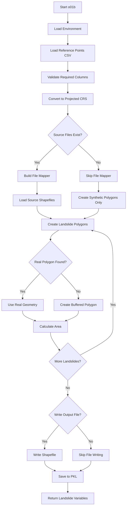

# o01b_landslides_dataset.py

## Purpose

This script creates a comprehensive landslide dataset by converting landslide reference points into polygon features. It handles both real landslide polygons from shapefiles and generates synthetic polygons by buffering point locations, creating a unified dataset for analysis.

## Overview

The script provides flexible landslide dataset creation with:

- **Multi-source integration**: Combines landslide data from multiple shapefiles
- **Point buffering**: Creates synthetic polygons for point-based landslide records
- **Coordinate transformation**: Handles projection to appropriate CRS for analysis
- **Area calculation**: Computes landslide areas in projected coordinates
- **Dataset unification**: Merges all sources into single GeoDataFrame

## Prerequisites

- **m00a_env_init.py**: Environment initialization (required)
- **m01a_study_area.py**: Study area definition (recommended for CRS consistency)

## Key Inputs

### Required Inputs

- **Reference points CSV**: Contains landslide locations with required columns
- **Source shapefiles**: Optional vector files with landslide polygons
- **File mapper**: Association between source files and their ID fields

### Optional Inputs

- **Point buffer**: Size of buffer for synthetic polygons (default: 10 meters)
- **Buffer type**: Shape of synthetic polygons (`circle` or `square`)
- **Output CRS**: Coordinate reference system for output files

## Outputs

### PKL File

- **`landslides_vars.pkl`**: Complete landslide dataset including:
  - `geodataframe`: GeoDataFrame with all landslide polygons
  - `current_epsg`: Internal EPSG code (4326)
  - `proj_epsg`: Projected EPSG code used for analysis
  - `point_buffer`: Buffer size used for synthetic polygons
  - `point_buffer_type`: Buffer shape used

### Vector Files

- **Shapefile**: `pslip_landslides_epsg_{epsg_code}.shp` (or custom filename)
  - All landslide polygons in specified CRS
  - Attributes: `lon`, `lat`, `id`, `src_file`, `area_in_sqm`, `fake_poly`, `geometry`

## CLI Usage

```bash
# Basic usage with interactive prompts
python o01b_landslides_dataset.py --base_dir /path/to/analysis

# Custom buffer settings
python o01b_landslides_dataset.py --base_dir /path/to/analysis --point_buffer 25 --point_buffer_type square

# Custom output filename and CRS
python o01b_landslides_dataset.py --base_dir /path/to/analysis --out_filename my_landslides.shp --out_epsg_code 32630

# Skip file writing (only save to PKL)
python o01b_landslides_dataset.py --base_dir /path/to/analysis --write_out_file False
```

## Detailed Description

This script creates a unified landslide dataset by combining multiple data sources. It handles both existing landslide polygons from shapefiles and point-based landslide records that need synthetic polygon generation through buffering.

For more on landslide data preparation, see [Analysis Structure Guide](../../analysis_structure/).

[← Scripts Guide](../../scripts_guide.md)

## Script Logic

### Main Function: `main()`

The main function orchestrates the complete landslide dataset creation:

1. **Environment Loading**:
   - Loads analysis environment with `get_or_create_analysis_environment()`
   - Allows environment creation if it doesn't exist

2. **Reference Points Loading**:
   - Prompts for reference points CSV file if not provided
   - Validates required columns: `['lon', 'lat', 'id', 'src_file']`
   - Reads and validates CSV data

3. **Coordinate Transformation**:
   - Calls `get_proj_epsg_and_add_prj_coords_to_df()` from m01a
   - Determines appropriate projected CRS based on data extent
   - Adds projected coordinates (`prj_x`, `prj_y`) to DataFrame

4. **File Mapper Construction**:
   - Identifies unique source files from reference points CSV
   - Prompts user to select each source shapefile
   - Prompts user to select ID field for each shapefile
   - Creates complete file mapper dictionary

5. **Source Geometry Loading**:
   - Loads all source shapefiles using `load_vectorials_w_mapper()`
   - Converts all geometries to geographic coordinates (EPSG:4326)

6. **Landslide Polygon Creation**:
   - Calls `create_landslides_polygons()` to generate unified dataset
   - Handles both real polygons from files and synthetic buffered polygons
   - Calculates areas in projected coordinates

7. **Output Generation**:
   - Writes vector file if requested
   - Saves complete dataset to PKL file
   - Returns landslide variables dictionary

### Helper Functions

#### `read_landslides_csv(landslide_points_csv_path)`
- **Purpose**: Validates and reads reference points CSV
- **Logic**:
  - Reads CSV using `read_generic_csv()`
  - Validates file is not empty
  - Validates required columns exist: `['lon', 'lat', 'id', 'src_file']`
- **Returns**: Validated DataFrame

#### `load_vectorials_w_mapper(file_mapper)`
- **Purpose**: Loads all source shapefiles with geometries
- **Logic**:
  - Iterates through file mapper entries
  - Loads each shapefile using `load_vectorial_file_geometry()`
  - Converts to geographic coordinates (EPSG:4326)
  - Stores in dictionary indexed by source filename
- **Returns**: Dictionary `{source_name: GeoDataFrame}`

#### `create_landslides_polygons(landslides_df, source_geometries_geo, file_mapper, point_buffer, point_buffer_type, proj_epsg)`
- **Purpose**: Creates unified landslide polygon dataset
- **Logic**:
  1. **Per-Landslide Processing**: For each landslide in reference points:
     - Checks if source file exists and contains landslide ID
     - **Real Polygons**: If found in source file, uses existing geometry
     - **Synthetic Polygons**: If not found, creates buffered polygon around point
  2. **Geometry Validation**: 
     - Handles non-polygon geometries by adding small buffer
     - Ensures all geometries are proper polygons
  3. **Area Calculation**: 
     - Converts to projected CRS for accurate area calculation
     - Stores area in square meters
  4. **Dataset Assembly**:
     - Creates GeoDataFrame with all polygons
     - Marks synthetic polygons with `fake_poly` flag
     - Sets CRS to EPSG:4326
- **Returns**: GeoDataFrame with complete landslide dataset

#### `write_vectorial_file(landslides_gdf, out_dir, out_filename, out_epsg_code)`
- **Purpose**: Writes landslide dataset to vector file
- **Logic**:
  - Handles filename defaults and extensions
  - Converts to specified output CRS
  - Writes to shapefile format
- **Returns**: None (writes file to disk)

### Flow Diagram



## Inputs and Parameters

### CLI Arguments

| Parameter | Description | Options/Format | Effect | Default |
|-----------|-------------|----------------|---------|---------|
| `--base_dir` | Base directory for analysis | Valid path string | Loads environment from this directory | Current directory |
| `--gui_mode` | Run in GUI mode | Flag (no value) | Not implemented yet | `False` |
| `--points_csv_path` | Path to reference points CSV | Valid file path | Uses custom reference points file | `REFERENCE_POINTS_FILENAME` |
| `--point_buffer` | Buffer size for synthetic polygons | Float (meters) | Sets radius for buffering point locations | `10.0` |
| `--point_buffer_type` | Shape of synthetic polygons | `circle`, `square` | Determines buffer shape | `circle` |
| `--file_mapper` | Source file associations | Space-separated strings | Maps source files to ID fields | Interactive prompts |
| `--write_out_file` | Write vector output file | Flag (no value) | Controls shapefile output | `True` |
| `--out_filename` | Custom output filename | String | Uses custom filename for output | `pslip_landslides_epsg_{code}.shp` |
| `--out_epsg_code` | Output CRS | Integer (EPSG code) | Sets output coordinate system | `4326` |

### Interactive Prompts

When CLI arguments are not provided:

- **Reference points file**: "Name or full path of the reference points csv (Default: ref_points.csv):"
  - User selects CSV file with landslide locations
  
- **Source shapefile selection**: For each unique source file in reference points:
  - "Name or full path of the {src_shp} shapefile (default: {path}):"
  - User selects corresponding shapefile
  
- **ID field selection**: For each source shapefile:
  - "Select the field containing the id for shapefile {file}:"
  - User selects field that matches landslide IDs

### Reference Points CSV Format

**Required columns**:
- `lon`: Longitude (WGS84, decimal degrees)
- `lat`: Latitude (WGS84, decimal degrees)  
- `id`: Unique landslide identifier
- `src_file`: Source shapefile name (empty/NaN for synthetic polygons)

**Example**:
```csv
lon,lat,id,src_file,optional_date,optional_group
-5.1234,40.5678,LS001,landslides_2010.shp,2010-01-15,rock_fall
-5.1456,40.5890,LS002,,2021-03-22,debris_flow
-5.1678,40.6012,LS003,field_survey.shp,2019-11-08,slide
```

## Effects and Behavior

### Landslide Dataset Creation

1. **Multi-Source Integration**:
   - Combines landslides from multiple shapefiles
   - Handles different CRS and formats automatically
   - Preserves original attributes when available

2. **Synthetic Polygon Generation**:
   - Creates circular or square buffers around point locations
   - Buffer size configurable (default: 10 meters)
   - Marks synthetic polygons with `fake_poly = True`

3. **Coordinate Management**:
   - All geometries stored in EPSG:4326 internally
   - Areas calculated in projected CRS (typically UTM)
   - Output files can be in any specified CRS

4. **Area Calculation**:
   - Calculates polygon areas in square meters
   - Uses projected CRS for accurate measurement
   - Stores in `area_in_sqm` column

### Error Handling

- **Missing IDs**: Logs warning and creates synthetic polygon
- **Multiple IDs**: Raises error for ambiguous matches
- **Invalid geometries**: Adds small buffer to fix issues
- **Missing files**: Prompts user to select correct files

### Data Quality

- **Synthetic vs. Real**: `fake_poly` flag distinguishes buffer-generated from real polygons
- **Area Accuracy**: Uses projected CRS for precise area calculation
- **Geometry Validation**: Ensures all geometries are valid polygons
- **Attribute Preservation**: Maintains original data when available

## Code Example

```python
from o01b_landslides_dataset import main
import geopandas as gpd

# Create landslide dataset
landslides_vars = main(
    base_dir="/path/to/analysis",
    points_csv_path="my_landslides.csv",
    point_buffer=15.0,
    point_buffer_type="square",
    out_epsg_code=32630
)

# Access results
landslides_gdf = landslides_vars['geodataframe']
print(f"Created {len(landslides_gdf)} landslide polygons")
print(f"Projected CRS: EPSG:{landslides_vars['proj_epsg']}")

# Analyze synthetic vs real polygons
synthetic = landslides_gdf[landslides_gdf['fake_poly'] == True]
real = landslides_gdf[landslides_gdf['fake_poly'] == False]
print(f"Synthetic polygons: {len(synthetic)}")
print(f"Real polygons: {len(real)}")

# Filter by area
large_landslides = landslides_gdf[landslides_gdf['area_in_sqm'] > 1000]
print(f"Large landslides (>1000 m²): {len(large_landslides)}")
```

## Integration with Workflow

### Position in Workflow

This script can run at any point after environment initialization:
- **Optional step**: Not required for main P-SLIP workflow
- **Use case**: Creating comprehensive landslide inventory for analysis
- **Timing**: Typically run before or after study area definition

### Use Cases

- **Landslide inventory creation**: Compile complete landslide dataset from multiple sources
- **Field survey integration**: Add field-measured landslide locations
- **Historical data compilation**: Combine historical records with recent surveys
- **Dataset standardization**: Create unified format from disparate sources

### Output Usage

The landslide dataset can be used for:
- **Susceptibility validation**: Compare predicted vs. actual landslide locations
- **Inventory analysis**: Statistical analysis of landslide characteristics
- **Model calibration**: Use real landslide data for model training
- **Visualization**: Create maps showing landslide distribution

## Troubleshooting

### Common Issues

1. **"Reference points CSV does not contain the required columns"**:
   - Solution: Ensure CSV has `lon`, `lat`, `id`, `src_file` columns
   - Check column names match exactly (case-sensitive)
   
2. **"ID {id} not found in file"**:
   - Solution: Verify landslide IDs match between CSV and shapefile
   - Check for leading zeros or formatting differences
   
3. **"Multiple IDs found in file"**:
   - Solution: Ensure each landslide ID is unique in source files
   - Check for duplicate records
   
4. **Small buffer created for invalid geometry**:
   - Solution: This is normal for non-polygon geometries
   - Original geometry preserved with small buffer added

### Debug Tips

- Check log file for detailed processing information
- Verify reference points CSV format and coordinate ranges
- Ensure source shapefiles have matching ID fields
- Test with small subset of landslides first
- Monitor coordinate system consistency

## Related Documentation

- [Analysis Structure Guide](../../analysis_structure/): Understanding landslide data structure
- [Configuration Guide](../../config_guide.md): Setting up data sources
- [m01a_study_area.md](../mains/m01a_study_area.md): Study area definition for CRS
- [psliptools geometries module](../../../src/psliptools/geometries/): Geometry handling functions

[← Scripts Guide](../../scripts_guide.md)