# o02a2_refine_study_area.py

## Purpose

This script refines the study area by removing specific regions based on property data (e.g., land use, soil types). It allows users to exclude certain areas from analysis by subtracting polygons of specified classes from the original study area boundary.

## Overview

The script provides precise study area refinement capabilities:

- **Polygon subtraction**: Removes specific regions from study area
- **Class-based selection**: Excludes areas based on property classifications
- **Multi-source refinement**: Works with various property types (land use, soil, etc.)
- **Configuration tracking**: Records refinement in environment configuration
- **Geometry validation**: Ensures resulting study area remains valid

## Prerequisites

- **m01a_study_area.py**: Must be completed (provides initial study area)
- **m02a1_import_properties_vectors.py**: Must be completed (provides property data)
- **m02a2_read_properties_association.py**: Must be completed (provides property associations)

## Key Inputs

### Required Inputs

- **Study area data**: Loaded from `study_area_vars.pkl`
- **Property data**: Loaded from `{source_type}_{source_subtype}_vars.pkl` or `{source_type}_vars.pkl`
- **Analysis environment**: Loaded from base directory

### Optional Inputs

- **Source type**: Type of property data to use for refinement (default: `land_use`)
- **Source subtype**: Subtype of property data (optional)

## Outputs

### Updated PKL File

- **`study_area_vars.pkl`**: Enhanced study area data including:
  - `study_area_cln_poly`: Refined study area polygon (with regions removed)
  - `study_area_rem_poly`: Updated DataFrame tracking removed polygons
  - All other original study area variables preserved

### Configuration Update

- **Environment configuration**: Sets `source_refined: True` in study area settings
- **Removed polygons tracking**: Adds removed regions to `study_area_rem_poly` DataFrame

## CLI Usage

```bash
# Basic usage with interactive class selection
python o02a2_refine_study_area.py --base_dir /path/to/analysis

# Use specific source type
python o02a2_refine_study_area.py --base_dir /path/to/analysis --source_type soil

# Use source with subtype
python o02a2_refine_study_area.py --base_dir /path/to/analysis --source_type land_use --source_subtype top
```

## Detailed Description

This script allows fine-tuning of the study area by excluding specific regions based on property classifications. For example, you can remove urban areas, water bodies, or specific soil types from the analysis to focus on areas of interest.

For more on study area refinement, see [Analysis Structure Guide](../../analysis_structure/).

[← Scripts Guide](../../scripts_guide.md)

## Script Logic

### Main Function: `main()`

The main function orchestrates the complete study area refinement process:

1. **Input Validation**:
   - Validates `source_type` against `KNOWN_OPTIONAL_STATIC_INPUT_TYPES`
   - Ensures valid source type is specified

2. **Environment and Data Loading**:
   - Loads analysis environment with `get_or_create_analysis_environment()`
   - Loads study area variables from `study_area_vars.pkl`

3. **Property Data File Selection**:
   - Constructs expected filename based on source type and subtype
   - Handles cases where exact filename doesn't exist:
     - If no matching files: Raises FileNotFoundError
     - If one matching file: Uses it automatically
     - If multiple matching files: Prompts user to select

4. **Class Selection**:
   - Loads property data variables
   - Prompts user to select which classes to remove from study area
   - Supports multiple class selection

5. **Study Area Refinement**:
   - Calls `subtract_polygons_from_study_area()` to perform polygon subtraction
   - Updates study area polygon by removing selected regions
   - Updates removed polygons tracking DataFrame

6. **Configuration and Saving**:
   - Updates environment configuration to mark study area as refined
   - Saves updated study area variables to PKL file
   - Returns refined study area variables

### Helper Functions

#### `subtract_polygons_from_study_area(study_area_dict, rem_poly_df, labels, type, subtype)`
- **Purpose**: Performs polygon subtraction and updates study area tracking
- **Logic**:
  1. **Polygon Selection**: 
     - Filters property DataFrame for selected class labels
     - Extracts geometries of polygons to remove
  
  2. **Polygon Subtraction**:
     - Calls `subtract_polygons()` to remove regions from study area
     - Validates result is single polygon (not multipart or empty)
  
  3. **Tracking Updates**:
     - For each removed class:
       - Checks if polygon already exists in `study_area_rem_poly`
       - If exists: Updates geometry
       - If new: Adds new entry to DataFrame
     - Updates `study_area_cln_poly` with refined polygon
  
  4. **Validation**:
     - Ensures polygon subtraction produces valid result
     - Logs information about each removed region
- **Returns**: Updated study area dictionary

### Flow Diagram

```mermaid
graph TD
    %% Study Area Refinement Flow
    A["Start o02a2<br/>🗺️ Refine Study Area"] --> B["Validate Source Type<br/>✅ soil/vegetation/land_use"]
    B --> C["Load Environment<br/>⚙️ Analysis config"]
    C --> D["Load Study Area Variables<br/>📦 study_area_vars.pkl"]
    D --> E["Construct Property Filename<br/>📂 {type}_vars.pkl"]
    E --> F{File Exists?}
    F -->|Yes| G["Load Property Data<br/>📐 GeoDataFrame"]
    F -->|No| H{Multiple Matches?}
    H -->|One| I["Use Matching File<br/>✅ Auto-select"]
    H -->|None| J["Raise FileNotFoundError<br/>❌ Missing data"]
    H -->|Multiple| K["Prompt User Selection<br/>💬 Choose file"]
    I --> G
    K --> G
    G --> L["Select Classes to Remove<br/>🏷️ Choose polygons"]
    L --> M["Subtract Polygons from Study Area<br/>✂️ Geometric operation"]
    M --> N{Valid Result?}
    N -->|Yes| O["Update Study Area Tracking<br/>📝 Log removed regions"]
    N -->|No| P["Raise Validation Error<br/>❌ Invalid geometry"]
    O --> Q["Update Configuration<br/>⚙️ Register changes"]
    Q --> R["Save Updated Variables<br/>💾 study_area_vars.pkl"]
    R --> S["Return Refined Study Area<br/>🗺️ Cleaned polygon"]
    
    %% Styling
    style A fill:#f3e5f5,stroke:#4a148c,stroke-width:2px
    style S fill:#f3e5f5,stroke:#4a148c,stroke-width:2px
```



## Inputs and Parameters

### CLI Arguments

| Parameter | Description | Options/Format | Effect | Default |
|-----------|-------------|----------------|---------|---------|
| `--base_dir` | Base directory for analysis | Valid path string | Loads environment from this directory | Current directory |
| `--gui_mode` | Run in GUI mode | Flag (no value) | Not implemented yet | `False` |
| `--source_type` | Type of property data | `land_use`, `soil`, etc. | Selects which property data to use for refinement | `land_use` |
| `--source_subtype` | Subtype of property data | String (optional) | Selects specific subtype of property data | `None` |

### Configuration Constants

```python
KNOWN_OPTIONAL_STATIC_INPUT_TYPES = [
    'land_use', 
    'soil', 
    'geology', 
    'vegetation'
]  # Extensible list
```

### Interactive Prompts

When CLI arguments are not provided:

- **Property file selection**: "Select the file containing polygons to remove from study area:"
  - Only appears if multiple matching files found
  - User selects from available property data files
  
- **Class selection**: "Select the classes to remove:"
  - User can select multiple classes
  - Shows available classes from property data

## Effects and Behavior

### Study Area Refinement Process

1. **Polygon Subtraction**:
   - Removes selected regions from study area boundary
   - Uses geometric difference operation
   - Preserves topological validity

2. **Area Reduction**:
   - Study area becomes smaller by removed regions
   - Subsequent analysis focuses on remaining areas
   - Maintains spatial relationships

3. **Tracking Updates**:
   - Records all removed regions in `study_area_rem_poly`
   - Tracks source type and subtype for each removal
   - Enables reconstruction of refinement history

4. **Configuration Marking**:
   - Sets `source_refined: True` in configuration
   - Indicates study area has been modified beyond initial definition
   - Prevents accidental re-refinement

### Data Integrity

- **Geometry Validation**: Ensures resulting study area is valid polygon
- **Single Polygon Constraint**: Requires result to be single contiguous polygon
- **Attribute Preservation**: Maintains all original study area attributes
- **CRS Consistency**: Preserves coordinate reference system

### Error Handling

- **Multiple Results**: Raises error if subtraction creates multiple polygons
- **No Results**: Raises error if subtraction eliminates entire study area
- **Missing Data**: Validates property data files exist
- **Invalid Classes**: Handles non-existent class selections

## Code Example

```python
from o02a2_refine_study_area import main

# Refine study area by removing urban areas
refined_study_area = main(
    base_dir="/path/to/analysis",
    source_type="land_use",
    source_subtype="top"
)

# During execution, user selects classes to remove:
# Example: ["urban_area", "water_bodies", "industrial_zones"]

# Access refined study area
study_area_poly = refined_study_area['study_area_cln_poly']
removed_polygons = refined_study_area['study_area_rem_poly']

print(f"Refined study area: {study_area_poly.area:.2f} m²")
print(f"Removed regions: {len(removed_polygons)}")

# Check what was removed
urban_removed = removed_polygons[removed_polygons['class_name'] == 'urban_area']
if not urban_removed.empty:
    print(f"Removed urban area: {urban_removed.iloc[0]['geometry'].area:.2f} m²")
```

## Integration with Workflow

### Position in Workflow

This script typically runs after:
1. **m01a_study_area.py**: Provides initial study area definition
2. **m02a1_import_properties_vectors.py**: Provides property data
3. **m02a2_read_properties_association.py**: Provides property associations

### Use Cases

- **Focus on natural areas**: Remove urban/developed regions from analysis
- **Exclude water bodies**: Focus on terrestrial landslide analysis
- **Soil-based filtering**: Remove unsuitable soil types for analysis
- **Geological refinement**: Focus on specific geological units
- **Vegetation filtering**: Exclude certain land cover types

### Output Usage

The refined study area affects all subsequent analysis:
- **Grid generation**: Only areas within refined boundary are processed
- **Parameter indexing**: Excluded regions don't receive parameter values
- **Susceptibility mapping**: Analysis focused on areas of interest
- **Validation**: Results more relevant to specific conditions

## Troubleshooting

### Common Issues

1. **"Polygon subtraction resulted in multiple or no polygons"**:
   - Solution: Ensure selected regions don't split study area into multiple parts
   - Check that some area remains after subtraction
   
2. **"No existing variable files found for source type"**:
   - Solution: Run prerequisite scripts (m02a1, m02a2) first
   - Verify property data was imported successfully
   
3. **"Multiple polygon matches found for replace_index"**:
   - Solution: Check property data for duplicate class names
   - Ensure consistent data structure
   
4. **Study area becomes too small**:
   - Solution: Be selective about which classes to remove
   - Consider using smaller regions or different criteria

### Debug Tips

- Check log file for detailed processing information
- Verify property data contains expected classes
- Test with small number of classes first
- Visualize study area before and after refinement
- Monitor study area area changes

## Related Documentation

- [Analysis Structure Guide](../../analysis_structure/): Understanding study area structure
- [Configuration Guide](../../config_guide.md): Setting up property data sources
- [m01a_study_area.md](../mains/m01a_study_area.md): Initial study area definition
- [m02a1_import_properties_vectors.md](../mains/m02a1_import_properties_vectors.md): Property data import
- [psliptools geometries module](../../../src/psliptools/geometries/): Polygon operations

[← Scripts Guide](../../scripts_guide.md)