# 🔄 Scripts Guide

This guide provides a comprehensive overview of the P-SLIP workflow, dependency graph, and execution order. Scripts are organized sequentially as `mNNyn_[name].py` (m=main, o=optional) and use PKL files for data persistence across runs.

## 🎯 Quick Start

### Basic Execution Pattern
```bash
# Navigate to scripts directory
cd src/scripts

# Initialize environment
python m00a_env_init.py --base_dir /path/to/your/analysis

# Run sequential workflow
python m01a_study_area.py --base_dir /path/to/your/analysis --source_mode geo_file
python m02a1_import_properties_vectors.py --base_dir /path/to/your/analysis --source_type land_use
# ... continue with remaining scripts
```

## 📊 Main Workflow Overview

Run scripts **in sequential order** from `m00a` to `m07a`. Each script loads prerequisites from previous PKL files in `variables/` and saves new results for subsequent scripts.

### 🔗 Complete Dependency Graph

```mermaid
graph TB
    %% Initialization Phase
    m00a["m00a_env_init.py<br/>🏗️ Environment Initialization<br/>Outputs: analysis_environment.json"] --> m01a
    
    %% Study Area Definition
    m01a["m01a_study_area.py<br/>🗺️ Study Area Definition<br/>Outputs: study_area_vars.pkl<br/>Geometry, bounds, CRS"] --> m02a1
    m01a --> m03a
    
    %% Property Import Phase
    m02a1["m02a1_import_properties_vectors.py<br/>📦 Import Property Vectors<br/>Outputs: {source_type}_vars.pkl<br/>Soil, vegetation, land use"] --> m02a2
    m02a2["m02a2_read_properties_association.py<br/>🏷️ Property Association<br/>Outputs: updated {source_type}_vars.pkl<br/>Class mappings"] --> m04a
    
    %% DTM Processing Phase
    m03a["m03a_dtm_base_grid.py<br/>⛰️ DTM Base Grid Setup<br/>Outputs: dtm_vars.pkl<br/>Elevation, grids, profile"] --> m04a
    m03a --> m04b
    m03a --> m04c
    m03a --> m04d
    
    %% Analysis Phase
    m04a["m04a_parameter_indexing.py<br/>🏷️ Parameter Indexing<br/>Outputs: parameter_vars.pkl<br/>Soil/veg classes per pixel"] --> m05a
    
    m04b["m04b_morphological_grids.py<br/>📐 Morphological Analysis<br/>Outputs: morphology_vars.pkl<br/>Slopes, aspects, curvatures"] --> m05b
    
    m04c["m04c_import_time_sensitive_data.py<br/>⏰ Time-Sensitive Data<br/>Outputs: {ts_type}_vars.pkl<br/>Rainfall, temperature"] --> m05b
    
    m04d["m04d_landslides_paths.py<br/>🛤️ Flow Path Generation<br/>Outputs: landslide_paths_vars.pkl<br/>Upstream/downstream routing"] --> m07a
    
    %% Final Analysis Phase
    m05a["m05a_reference_points_info.py<br/>📍 Reference Points Analysis<br/>Outputs: ref_points.csv<br/>Point-based parameter extraction"]
    
    m05b["m05b_time_sensitive_analysis.py<br/>📊 Time-Series Analysis<br/>Outputs: updated {ts_type}_vars.pkl<br/>Interpolation, events"]
    
    %% Alert Generation
    m04b --> m07a
    m05b --> m07a
    m07a["m07a_attention_pixels_alert.py<br/>⚠️ Attention Pixel Alerts<br/>Outputs: alerts.csv, risk_maps<br/>High-risk pixel identification"]
    
    %% Styling
    style m00a fill:#e1f5fe,stroke:#01579b,stroke-width:3px
    style m01a fill:#f3e5f5,stroke:#4a148c,stroke-width:2px
    style m02a1 fill:#e8f5e9,stroke:#1b5e20,stroke-width:2px
    style m02a2 fill:#e8f5e9,stroke:#1b5e20,stroke-width:2px
    style m03a fill:#fff3e0,stroke:#e65100,stroke-width:2px
    style m04a fill:#fce4ec,stroke:#880e4f,stroke-width:2px
    style m04b fill:#f3e5f5,stroke:#4a148c,stroke-width:2px
    style m04c fill:#e8f5e9,stroke:#1b5e20,stroke-width:2px
    style m04d fill:#fff3e0,stroke:#e65100,stroke-width:2px
    style m05a fill:#fce4ec,stroke:#880e4f,stroke-width:2px
    style m05b fill:#e1f5fe,stroke:#01579b,stroke-width:2px
    style m07a fill:#fff9c4,stroke:#f57f17,stroke-width:4px
```



### 🎨 Workflow Phase Legend

| Color | Phase | Purpose |
|-------|-------|---------|
| 🔵 Blue | **Initialization** | Environment setup, study area definition |
| 🟣 Purple | **Property Import** | Soil, vegetation, land use data |
| 🟠 Orange | **DTM Processing** | Elevation data, base grids |
| ❤️ Red | **Parameter Setup** | Indexing, morphological analysis |
| 🟢 Green | **Time Analysis** | Rainfall, temporal data processing |
| 🟡 Yellow | **Alert Generation** | Risk assessment, final outputs |

## 📋 Main Scripts Reference

### 🏗️ Initialization Phase

| Script | Purpose | Key Inputs | Prerequisites | Outputs |
|--------|---------|------------|---------------|---------|
| **[m00a_env_init](scripts/mains/m00a_env_init.md)** | Create analysis environment, folder structure, logger | `--base_dir`, `--gui_mode` | None | `analysis_environment.json`, folder tree |
| **[m01a_study_area](scripts/mains/m01a_study_area.md)** | Define study area polygon, bounds, CRS | `--source_mode` (geo_file/reference_points), boundary file/points | m00a | `study_area_vars.pkl` (geometry, bounds) |

### 📦 Data Import Phase

| Script | Purpose | Key Inputs | Prerequisites | Outputs |
|--------|---------|------------|---------------|---------|
| **[m02a1_import_properties_vectors](scripts/mains/m02a1_import_properties_vectors.md)** | Import and clip property vectors (soil, vegetation, land use) | `--source_type` (land_use/soil/vegetation), vector files | m01a | `{source_type}_vars.pkl` (clipped GeoDataFrames) |
| **[m02a2_read_properties_association](scripts/mains/m02a2_read_properties_association.md)** | Associate properties via CSV mappings | Association CSVs | m02a1 | Updated `{source_type}_vars.pkl` with class mappings |

### ⛰️ DTM Processing Phase

| Script | Purpose | Key Inputs | Prerequisites | Outputs |
|--------|---------|------------|---------------|---------|
| **[m03a_dtm_base_grid](scripts/mains/m03a_dtm_base_grid.md)** | Setup DTM grids, coordinate systems, masking | DTM raster file | m01a | `dtm_vars.pkl` (elevation, grids, profile) |

### 🔬 Analysis Phase

| Script | Purpose | Key Inputs | Prerequisites | Outputs |
|--------|---------|------------|---------------|---------|
| **[m04a_parameter_indexing](scripts/mains/m04a_parameter_indexing.md)** | Index soil/vegetation parameters to DTM pixels | Parameter CSVs, association files | m03a | `parameter_vars.pkl` (parameter grids) |
| **[m04b_morphological_grids](scripts/mains/m04b_morphological_grids.md)** | Compute slopes, aspects, curvatures | DTM grids | m03a | `morphology_vars.pkl` (slope, aspect, curvature) |
| **[m04c_import_time_sensitive_data](scripts/mains/m04c_import_time_sensitive_data.md)** | Load and interpolate time-series data (rainfall, temperature) | `--ts_type` (rain/temperature), CSV/NetCDF files | m01a | `{ts_type}_vars.pkl` (interpolated data) |
| **[m04d_landslides_paths](scripts/mains/m04d_landslides_paths.md)** | Generate flow paths, upstream/downstream routing | `--method` (gradient/D8), DTM | m03a | `landslide_paths_vars.pkl` (flow routing) |

### 📊 Final Analysis Phase

| Script | Purpose | Key Inputs | Prerequisites | Outputs |
|--------|---------|------------|---------------|---------|
| **[m05a_reference_points_info](scripts/mains/m05a_reference_points_info.md)** | Extract parameter values at reference points | `reference_points.csv` | m04a, m03a | `ref_points.csv` (point data) |
| **[m05b_time_sensitive_analysis](scripts/mains/m05b_time_sensitive_analysis.md)** | Time-series statistics, mobile averages, events | Time-series data | m04c | Updated `{ts_type}_vars.pkl` (processed) |
| **[m07a_attention_pixels_alert](scripts/mains/m07a_attention_pixels_alert.md)** | Identify high-risk pixels, generate alerts (rainfall/safety-factor) | Thresholds CSV, path data, rain data, parameters (for FS) | m04d, m04c, (m04a for FS mode) | `alert_vars.pkl`, multiple CSVs in subfolders |

## 🛠️ Optional Scripts

Run these after relevant main scripts for additional functionality.

| Script | Purpose | Prerequisites | Outputs |
|--------|---------|---------------|---------|
| **[o01b_landslides_dataset](scripts/optional/o01b_landslides_dataset.md)** | Create landslide polygons from points/shapefiles | m00a | Landslide polygons, updated input_files.csv |
| **[o02a2_refine_study_area](scripts/optional/o02a2_refine_study_area.md)** | Refine study area by subtracting exclusion zones | m01a, m02a1, m02a2 | Updated study_area_vars.pkl |

## 🚀 Execution Guide

### Sequential Execution Pattern

```bash
# 1. Initialize environment
python m00a_env_init.py --base_dir /path/to/analysis

# 2. Define study area
python m01a_study_area.py --base_dir /path/to/analysis --source_mode geo_file

# 3. Import property data
python m02a1_import_properties_vectors.py --base_dir /path/to/analysis --source_type land_use
python m02a1_import_properties_vectors.py --base_dir /path/to/analysis --source_type soil
python m02a1_import_properties_vectors.py --base_dir /path/to/analysis --source_type vegetation

# 4. Associate properties
python m02a2_read_properties_association.py --base_dir /path/to/analysis

# 5. Process DTM
python m03a_dtm_base_grid.py --base_dir /path/to/analysis

# 6. Run analyses
python m04a_parameter_indexing.py --base_dir /path/to/analysis
python m04b_morphological_grids.py --base_dir /path/to/analysis
python m04c_import_time_sensitive_data.py --base_dir /path/to/analysis --ts_type rain
python m04d_landslides_paths.py --base_dir /path/to/analysis --method gradient

# 7. Extract reference points
python m05a_reference_points_info.py --base_dir /path/to/analysis

# 8. Time-series analysis
python m05b_time_sensitive_analysis.py --base_dir /path/to/analysis

# 9. Generate alerts
python m07a_attention_pixels_alert.py --base_dir /path/to/analysis
```

### 🔄 Iterative Execution

Scripts can be re-run individually if inputs change:

```bash
# Example: Re-run morphological analysis after DTM update
python m04b_morphological_grids.py --base_dir /path/to/analysis

# Example: Update alerts with new thresholds
python m07a_attention_pixels_alert.py --base_dir /path/to/analysis --alert_thresholds new_thresholds.csv

# Example: Run alerts with safety-factor mode
python m07a_attention_pixels_alert.py --base_dir /path/to/analysis --trigger_mode safety-factor
```

### 📁 Input Data Requirements

#### Required Inputs (by script)

| Script | Required Files | Location |
|--------|----------------|----------|
| m01a | Study area boundary OR reference points | `inputs/study_area/` OR `inputs/reference_points.csv` |
| m02a1 | Property vectors (soil, vegetation, land use) | `inputs/soil/`, `inputs/vegetation/`, `inputs/land_use/` |
| m02a2 | Association CSVs | `user_control/` |
| m03a | DTM raster | `inputs/dtm/` |
| m04a | Parameter classes CSV | `user_control/parameter_classes.csv` |
| m04c | Time-series data (CSV/NetCDF) | `inputs/rain/recordings/`, `inputs/temperature/recordings/` |
| m04d | DTM (from m03a) | `variables/dtm_vars.pkl` |
| m05a | Reference points CSV | `user_control/reference_points.csv` |
| m07a | Thresholds CSV (optional) | `user_control/thresholds.csv` |

#### Input File Formats

**Reference Points CSV** (`reference_points.csv`):
```csv
lon,lat,id,date,info
12.4924,41.8902,ROME001,2023-06-15,"Colosseum monitoring point"
13.3615,43.7311,SIENA001,2023-06-16,"Siena historic center"
```

**Parameter Classes CSV** (`parameter_classes.csv`):
```csv
type,class_id,class_num,GS,gd,c,cr,phi,kt,beta,A,lambda,n,E,ni,info
soil,slp01,1,2.65,16.5,0,0,32,0.01,0,40,0.4,0.4,20,0.30,"Loose sandy soils"
vegetation,vgp01,1,0,0,0,2,0,0,0.5,0,0,0,0,0,"Grass - shallow roots"
```

## 💡 Best Practices

### 1. Execution Order
- ✅ **Always run scripts in sequential order** (m00a → m01a → m02a1 → ...)
- ✅ **Check prerequisites** before running each script
- ❌ **Don't skip scripts** unless you understand dependencies

### 2. Data Management
- ✅ **Organize inputs** in proper folders (`inputs/study_area/`, `inputs/dtm/`, etc.)
- ✅ **Validate file formats** before running scripts
- ✅ **Keep backup copies** of original input files

### 3. Error Handling
- ✅ **Check logs** in `logs/` directory for detailed error messages
- ✅ **Verify PKL outputs** after each script completes
- ✅ **Re-run failed scripts** after fixing issues

### 4. Performance Optimization
- ✅ **Monitor RAM usage** for large analyses (20+ GB recommended)
- ✅ **Use appropriate resolution** for DTM (balance detail vs. memory)
- ✅ **Consider parallel processing** for independent analyses

### 5. Quality Control
- ✅ **Visualize intermediate results** (study area, DTM, slopes)
- ✅ **Validate outputs** against known data points
- ✅ **Document parameters** used in each analysis

## 🔍 Troubleshooting Common Issues

### Missing PKL Files
**Problem**: Script fails with "FileNotFoundError: variables/xxx_vars.pkl"
**Solution**: Run prerequisite scripts first to generate required PKL files

### Memory Issues
**Problem**: Script crashes with memory errors
**Solution**: Reduce DTM resolution, increase system RAM, or process in smaller chunks

### CRS Mismatches
**Problem**: "CRSError: Invalid CRS" or coordinate system errors
**Solution**: Ensure all input files use consistent CRS, reproject if necessary

### Input File Not Found
**Problem**: "FileNotFoundError: inputs/xxx/file.xxx"
**Solution**: Check `input_files.csv`, verify file paths, use `collect_input_files()`

## 📚 Detailed Script Documentation

Each script has comprehensive documentation with:
- **Detailed logic** and step-by-step processing
- **Complete parameter lists** with options and effects
- **CLI usage examples** for all scenarios
- **Code snippets** for common operations
- **Troubleshooting tips** for specific issues

Access detailed documentation:
- **Main Scripts**: [scripts/mains/](scripts/mains/)
- **Optional Scripts**: [scripts/optional/](scripts/optional/)

---

**🎯 Next Steps**:
- 📖 Read [detailed script documentation](scripts/mains/) for specific workflows
- 🔧 Check [Configuration Guide](config_guide.md) for environment setup
- 🐛 See [Troubleshooting Guide](troubleshooting.md) for common issues

[← Back to Index](../index.md) | [🚀 Next: Troubleshooting Guide →](troubleshooting.md)